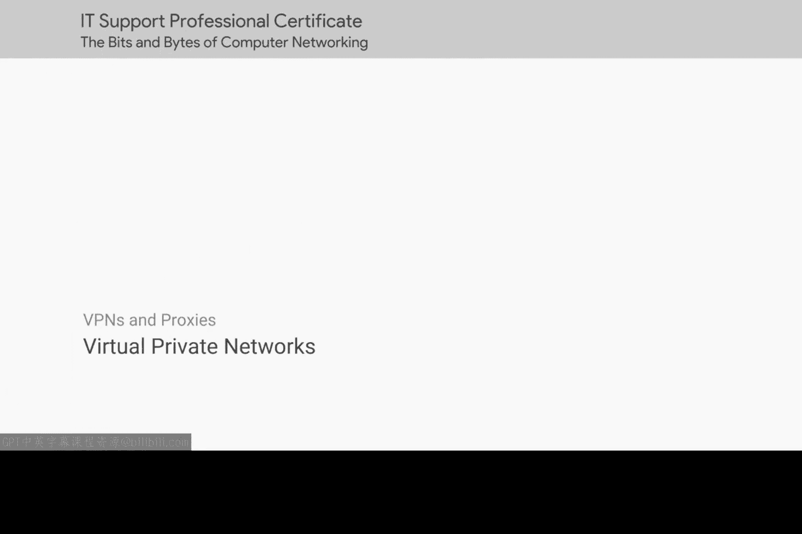
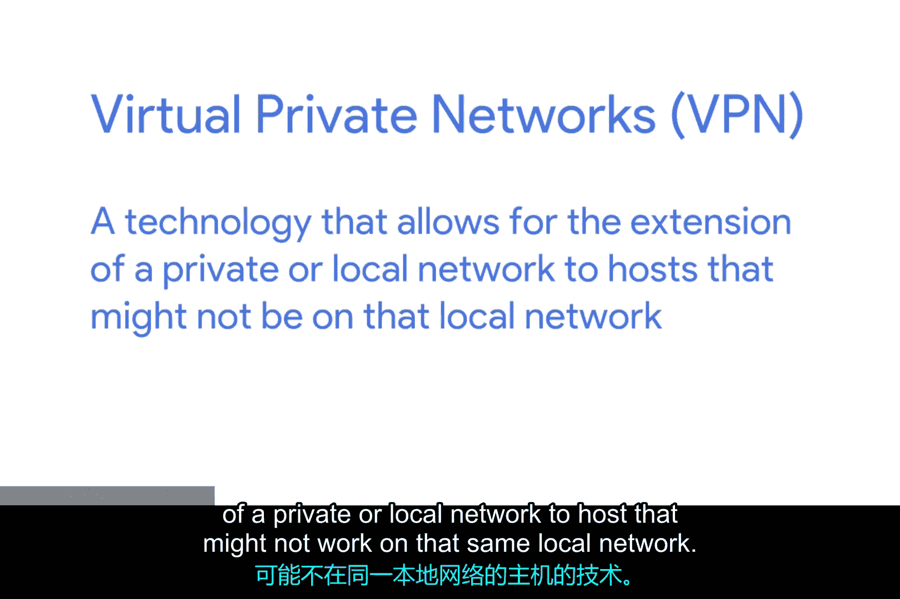
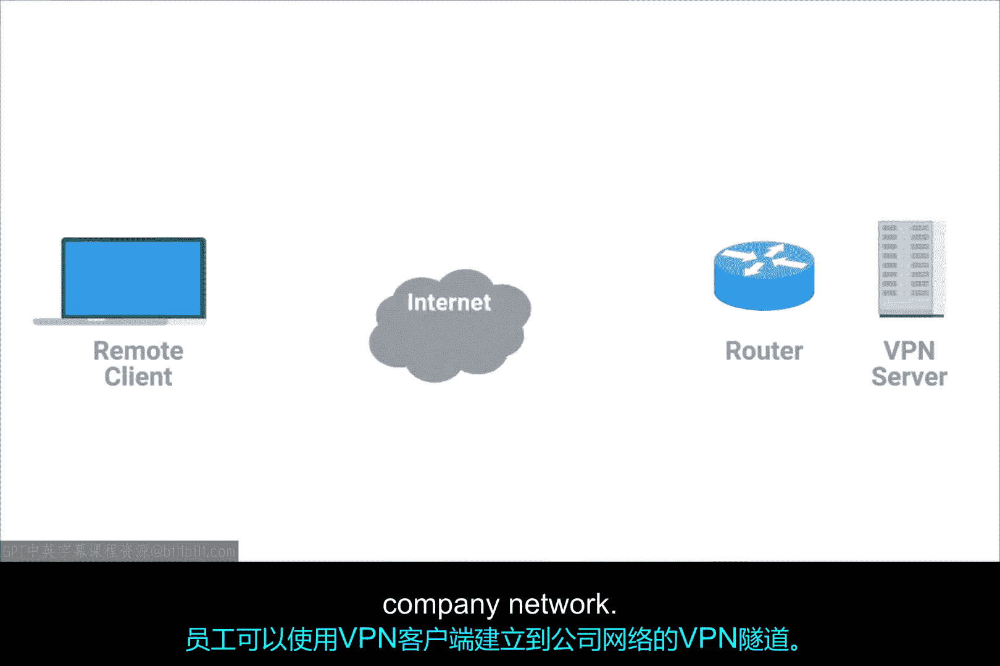
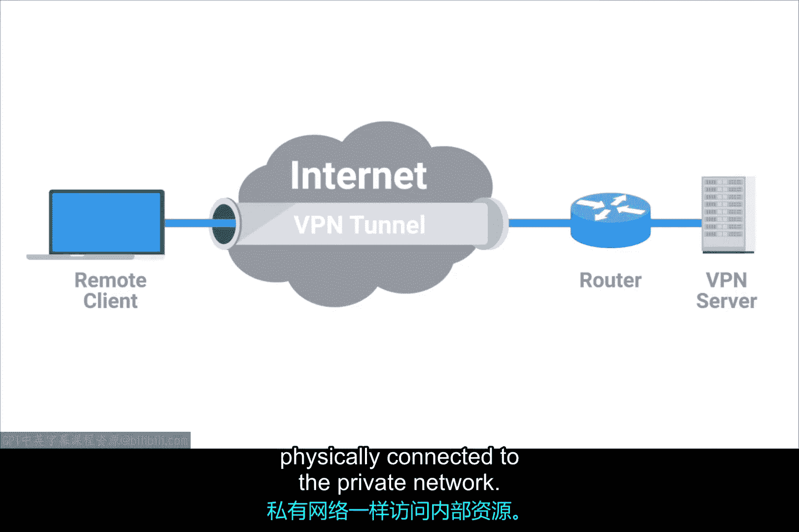
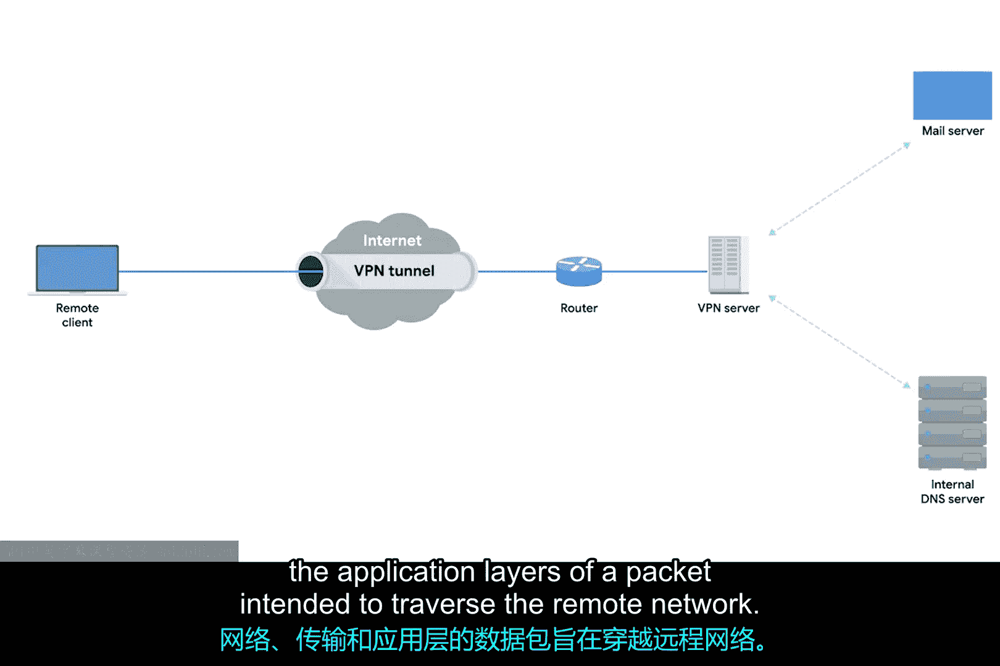
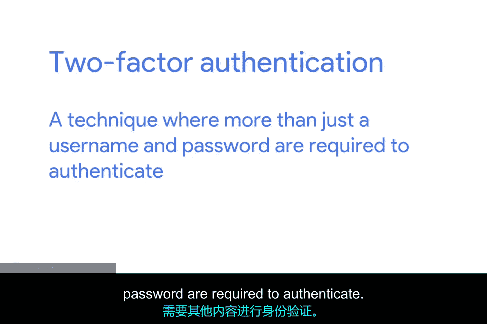
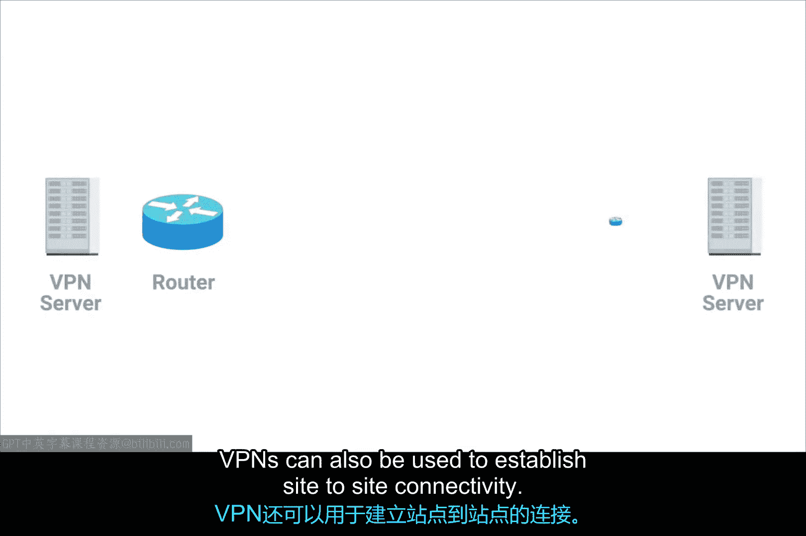
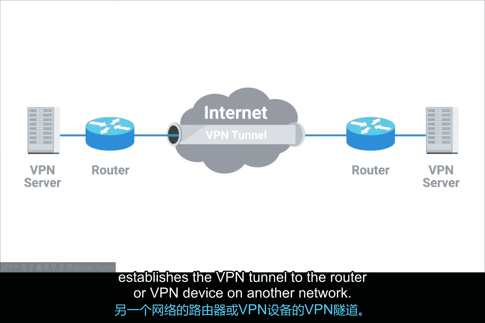
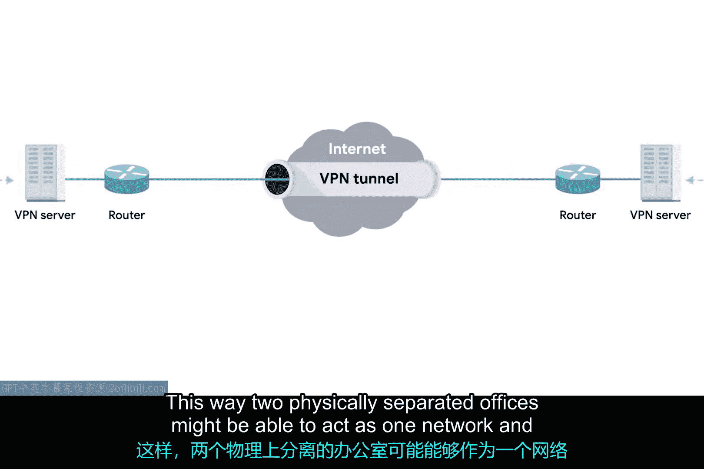
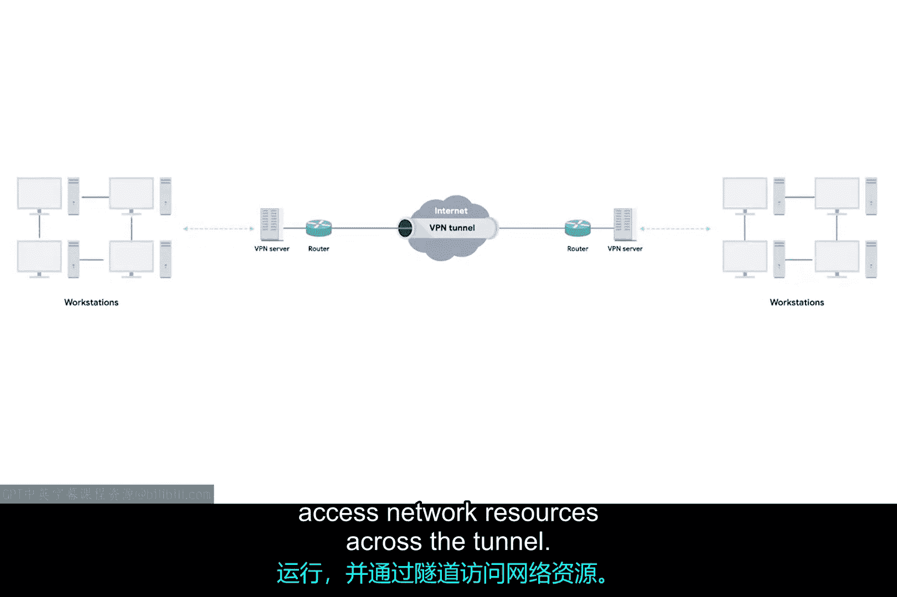

# 059：虚拟专用网络（VPN）🔒

在本节课中，我们将要学习**虚拟专用网络（VPN）**。VPN是一种允许远程用户或网络安全地访问私有网络资源的技术。我们将了解VPN的工作原理、常见用途以及它如何通过加密隧道保障数据传输的安全。

---

企业出于多种原因需要保障其网络安全。为此，它们会使用我们已经讨论过的一些技术，例如防火墙、网络地址转换（NAT）以及不可路由的地址空间等。组织通常拥有需要保密的专有信息、仅供员工访问的网络服务以及其他资源。

保障网络安全最直接的方法之一是使用各种安全技术，确保只有物理连接到其局域网的设备才能访问这些资源。然而，员工并非总在办公室。他们可能在家办公或出差，但仍需要访问这些资源来完成工作。

这正是VPN发挥作用的地方。**虚拟专用网络（VPN）** 是一种技术，它允许将私有或本地网络扩展到可能不在同一本地网络上的主机。

---

VPN有多种类型，可实现多种不同功能，但其最常见的用途是让员工在办公室外时能够访问其公司的网络。VPN是一种**隧道协议**，这意味着它能提供对本地不可用资源的访问。在建立VPN连接时，你也可以说建立了一条VPN隧道。

让我们回到员工需要在办公室外访问公司资源的例子。员工可以使用VPN客户端，建立一条通往其公司网络的VPN隧道。

---

这将为他们的计算机配置一个**虚拟接口**，该接口的IP地址与其建立VPN连接的网络地址空间相匹配。通过从这个虚拟接口发送数据，计算机可以访问内部资源，就像它物理连接到该私有网络一样。

---

大多数VPN的工作原理是：利用传输层数据包的**载荷部分**，来承载一个加密的载荷。这个加密载荷实际上包含了完整的一套第二组数据包——即打算穿越远程网络的数据包的网络层、传输层和应用层信息。

---

本质上，这个载荷被传送到VPN的端点。在那里，所有其他层（封装层）被剥离并丢弃。然后，载荷被解密，留下VPN服务器处理新数据包的上三层（网络、传输、应用层）。接着，这些层被封装上正确的数据链路层信息，并通过网络发送出去。相反方向的数据传输也以类似但逆向的过程完成。

VPN通常需要严格的身份验证程序，以确保只有经过授权的计算机和用户才能连接。事实上，VPN是最早广泛应用**双因素认证**的技术之一。双因素认证是一种要求提供不仅仅是用户名和密码的认证技术，通常用户还需要通过专门的硬件或软件生成一个短期有效的数字令牌。

---

VPN也可用于建立**站点到站点**的连接。

---

从概念上讲，这与我们之前讨论的远程员工场景的工作原理没有太大区别。区别在于，是一个网络上的路由器（有时是专门的VPN设备）与另一个网络上的路由器或VPN设备建立VPN隧道。

---

这样，两个物理上分离的办公室就可以像一个网络一样运作，并通过隧道访问对方的网络资源。

---

需要明确指出的是，就像NAT一样，VPN是一个通用的技术概念，而非严格定义的单一协议。VPN有许多独特的实现方式，其具体工作原理的细节可能千差万别。

最重要的结论是：**VPN是一种利用加密隧道技术，使得远程计算机或网络能够表现得如同它物理连接到了某个实际并未连接的网络一样的技术。**

---

本节课中，我们一起学习了虚拟专用网络（VPN）。我们了解到VPN通过创建加密隧道，使远程用户和网络能够安全地访问私有资源。我们探讨了VPN的两种主要应用场景：远程访问和站点到站点连接，并理解了其核心在于利用加密载荷在公共网络上安全地传输私有网络数据。