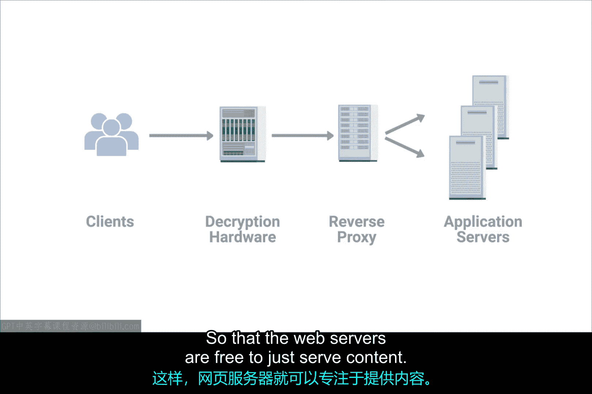

# 060：代理服务详解 🖥️

在本节课中，我们将要学习计算机网络中的一个重要概念——代理服务。代理服务是一种在网络通信中扮演中间人角色的服务器，它在客户端和其他服务器之间工作，提供多种功能。

## 什么是代理服务？

代理服务是一台代表客户端去访问其他服务的服务器。代理位于客户端和其他服务器之间，它能提供一些额外的好处，例如匿名性、安全性、内容过滤和性能提升等。

如果这些描述听起来有些熟悉，那很好。我们之前已经介绍过一些代理的具体例子，比如网关路由器。虽然通常不这么称呼它，但网关完全符合代理的定义和工作原理。

代理的概念本身只是一个概念或抽象，它并不特指某种具体的实现。代理几乎存在于我们网络模型的每一层。在你的职业生涯中，可能会遇到数十种代理的例子，但这里我们只介绍几种最常见的。

## 常见的代理类型：Web代理

最常听到的“代理”一词，通常指的是Web代理。顾名思义，这是专门为Web流量设计的代理。Web代理可以服务于多种目的。

许多年前，当大多数互联网连接速度比今天慢得多的时候，许多组织使用Web代理来提升性能。通过使用Web代理，组织会将所有Web流量导向它，让代理服务器本身从互联网上获取网页数据。然后，代理会缓存这些数据。这样，如果其他人请求同一个网页，代理就可以直接返回缓存的数据，而不必每次都重新获取一份新的副本。

这种代理已经相当古老，如今不常使用了。原因之一是，现在大多数组织的网络连接速度足够快，缓存单个网页带来的好处不大。此外，网络也变得更加动态。访问 `www.twitter.com` 对于每个拥有自己Twitter账户的人来说，看到的内容都是不同的，因此缓存这些数据没有太大意义。

如今，Web代理更常见的用途可能是完全阻止某人访问像Twitter这样的网站。公司可能认为在工作时间访问Twitter会降低工作效率。通过使用Web代理，他们可以将所有Web流量导向代理，允许代理检查正在请求的数据，然后根据正在访问的网站来允许或拒绝该请求。

以下是Web代理的两种主要用途：
*   **性能缓存（历史用途）**：`代理 -> 缓存网页 -> 返回给后续相同请求`
*   **内容过滤（现代用途）**：`代理 -> 检查请求（如 `www.twitter.com`） -> 根据规则允许/拒绝`

## 反向代理：负载均衡与解密

代理的另一个例子是反向代理。反向代理是一种服务，对于外部客户端来说，它看起来像是一台单一的服务器，但实际上它背后代表着多台服务器。

一个很好的例子是当今许多流行网站的架构。像Twitter这样非常受欢迎的网站，接收的流量如此之大，单台Web服务器根本不可能处理所有请求。如此受欢迎的网站可能需要很多很多台Web服务器，才能跟上处理所有传入请求的速度。

在这种情况下，反向代理可以作为其背后多台Web服务器的单一前端。从客户端的角度来看，他们似乎都连接到了同一台服务器。但在幕后，这台反向代理服务器实际上正在将这些传入的请求分发到许多不同的物理服务器上。这很像DNS轮询的概念，是一种**负载均衡**的形式。

反向代理被流行网站普遍使用的另一种方式是处理解密。现在，超过一半的网络流量都是加密的，而加密和解密数据是一个可能消耗大量处理能力的过程。你将在本项目的另一门课程中了解更多关于加密及其工作原理的知识。

现在部署反向代理，是为了使用专门为密码学构建的硬件来执行加密和解密工作，从而使Web服务器可以专注于提供内容。其过程可以概括为：
```plaintext
客户端 <--加密连接--> 反向代理（处理加/解密） <--内部网络--> 多台Web服务器（提供内容）
```



## 总结与回顾

本节课中我们一起学习了代理服务的核心概念。代理有多种形式，我们无法在这里全部涵盖，但最重要的要点是：**代理是任何在客户端和另一台服务器之间充当中间人的服务器**。


我们涵盖了很多内容，做得很好。在继续我们为你准备的测验和项目之前，请稍作休息。完成这些之后，再休息一下，然后回到这里学习下一个模块，我们将介绍互联网连接的历史。