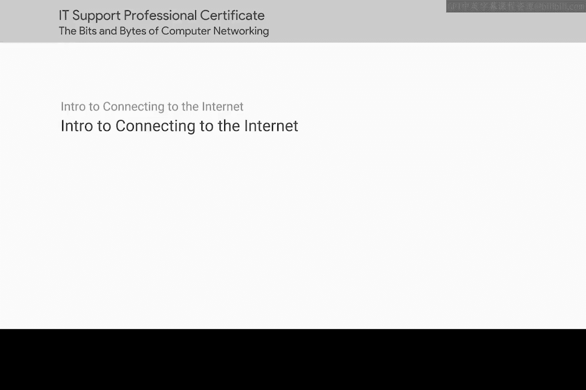
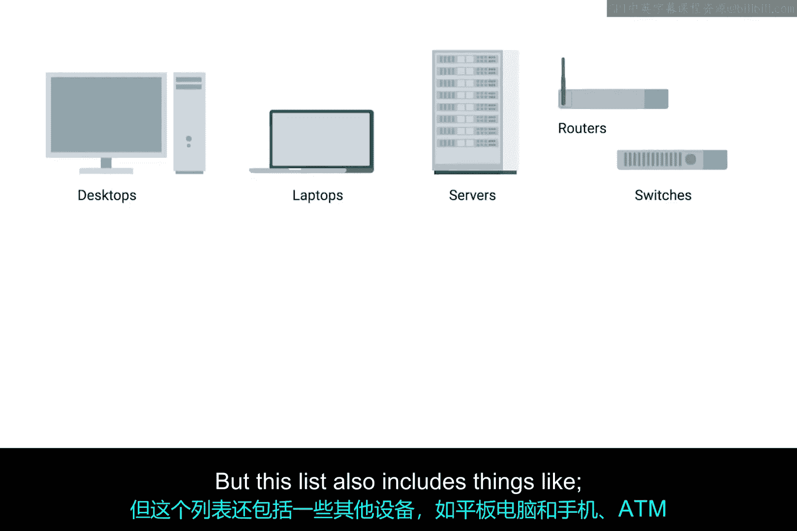
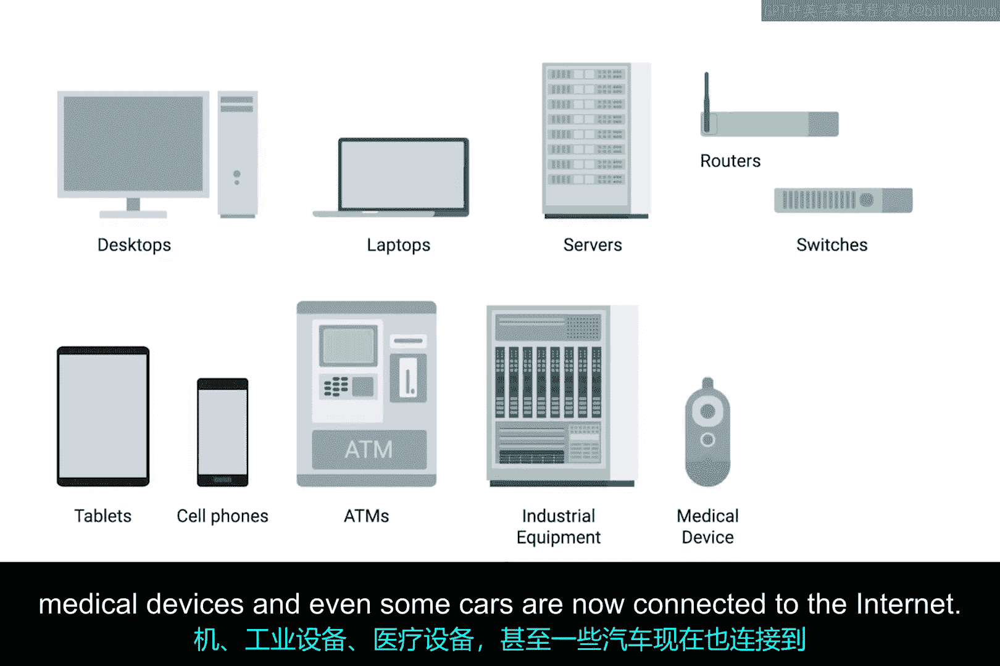

# 061：连接互联网介绍 🌐

在本节课中，我们将要学习互联网连接的基本概念，了解连接互联网的各种设备与技术，并掌握广域网、无线网络及蜂窝网络的基础知识。

---

互联网是一个广阔且多样化的空间。它不仅规模巨大，连接到互联网的不同设备数量也同样惊人。如果我们尝试描述所有这些设备，它们的功能几乎是无穷无尽的。

连接到互联网的设备可以分为几个熟悉的类别。例如，台式机和笔记本电脑、服务器和数据中心、用于引导网络流量的路由器和交换机等。但这个列表还包括平板电脑和手机、自动取款机、工业设备、医疗设备，甚至一些汽车现在也连接到互联网。这个列表还在不断扩展。

---

上一节我们介绍了连接到互联网的各类设备，本节中我们来看看连接技术本身。

用由Cat5或Cat6电缆组成的基本物理层和完全由以太网组成的数据链路层来讨论一切，既简洁又简单。但这并不是设备实际连接到互联网时的工作方式。

用于连接人和设备的技术，与人和设备本身一样多样化。在本模块结束时，你将能够描述各种互联网连接技术。

---

以下是本模块结束时你将掌握的核心技能：

*   描述各种互联网连接技术。
*   定义广域网的组成部分。
*   概述无线和蜂窝网络的基础知识。

这些技能对于IT支持专家来说非常重要，因为你工作的一个重要部分就是确保人们能够上网。

---

在本节课中，我们一起学习了互联网连接的多样性，了解了连接设备的不同类别，并明确了后续将学习的核心技能：互联网连接技术、广域网以及无线与蜂窝网络的基础知识。这些是确保用户顺利联网的关键。