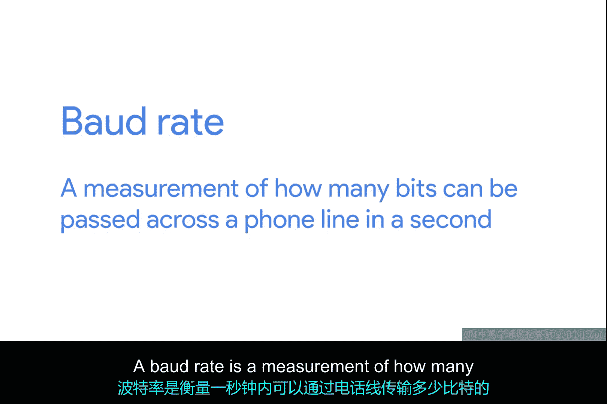
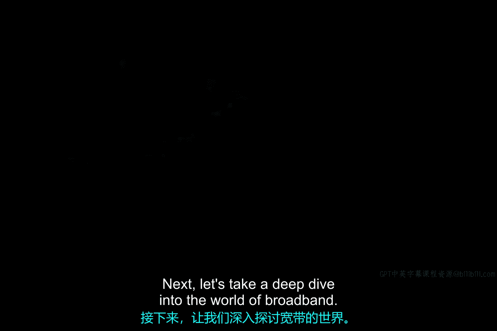

# 062：拨号调制解调器与点对点协议 📞

在本节课中，我们将要学习计算机网络发展早期的一种重要技术：拨号连接。我们将了解它如何利用电话网络进行数据传输，以及其核心设备——调制解调器的工作原理。

---

随着计算机在20世纪的使用日益增长，将计算机相互连接以共享数据的需求变得显而易见。在以太网、TCP或IP协议被发明之前的许多年里，计算机网络就已经由比我们讨论的模型更为原始的技术构成。

这些早期的网络技术主要专注于连接物理位置相近的设备。到了20世纪70年代末，杜克大学的两位研究生试图找到一种更好的方法来连接距离更远的计算机，他们希望共享类似于电子公告板的内容。这时，一个灵感闪现：他们意识到实现这一目标的基础设施已经存在，那就是**公共电话网络**。

公共电话网络，也称为公共交换电话网或POTS，到20世纪70年代末，即电话发明一百多年后，已经成为一个相当全球化和强大的系统。这两位研究生并非第一个想到使用电话线传输数据的人，但他们是第一个以某种永久性方式实现它的人，为后来的拨号网络奠定了基础。

## 拨号连接与Usenet系统

上一节我们提到了利用电话网络的初步构想，本节中我们来看看其具体实现。他们建立的系统被称为**Usenet**，其某种形式至今仍在使用。当时，像大学这样的不同地点使用一种非常原始的拨号连接形式来相互交换一系列消息。

**拨号连接**使用POTS进行数据传输，其名称来源于连接是通过实际拨打一个电话号码来建立的。如果你在过去使用过拨号上网，可能会对下面这种声音很熟悉。对一些人来说，在等待连接到互联网时，这声音就像粉笔划过黑板一样刺耳。

通过拨号连接传输数据是通过称为**调制解调器**的设备完成的。调制解调器将计算机能够理解的数据转换成可以通过POTS传输的音频波长。毕竟，电话系统最初就是为了将语音信息或声音从一个地方传输到另一个地方而开发的。这个概念类似于**线路编码**如何将1和0转换成以太网电缆上的调制电荷。

## 调制解调器与比特率

了解了拨号连接的基本原理后，我们来深入探讨其性能指标。早期调制解调器的**比特率**非常低。比特率是衡量每秒可以通过电话线传输多少比特数据的指标。

以下是调制解调器比特率的发展历程：
*   到20世纪50年代末，计算机通常只能以每秒约**110比特**的速度通过电话线相互发送数据。
*   到Usenet正在开发时，这个速率已提高到每秒约**300比特**。
*   到20世纪90年代初，拨号上网成为家庭普及商品时，速率已提高到每秒**14.4千比特**。

虽然技术持续改进，但我们在下一课将讨论的宽带技术的广泛采用，取代了许多这些改进。如今，拨号互联网连接已相当罕见，但并未完全消失。在一些农村地区，它可能仍然是唯一可用的选择。在你的IT职业生涯中，可能永远不会遇到拨号互联网连接，但了解这项技术在数十年间代表了计算机远距离通信的主要方式仍然很重要。

---

本节课中我们一起学习了计算机网络早期的拨号技术。我们了解了拨号连接如何利用现有的电话网络，认识了调制解调器的作用及其将数字信号转换为模拟信号的过程，并回顾了其比特率从每秒110比特到14.4千比特的发展历程。尽管这项技术已被更快的宽带所取代，但它是理解现代网络演进的重要基石。接下来，让我们深入探索宽带的世界。