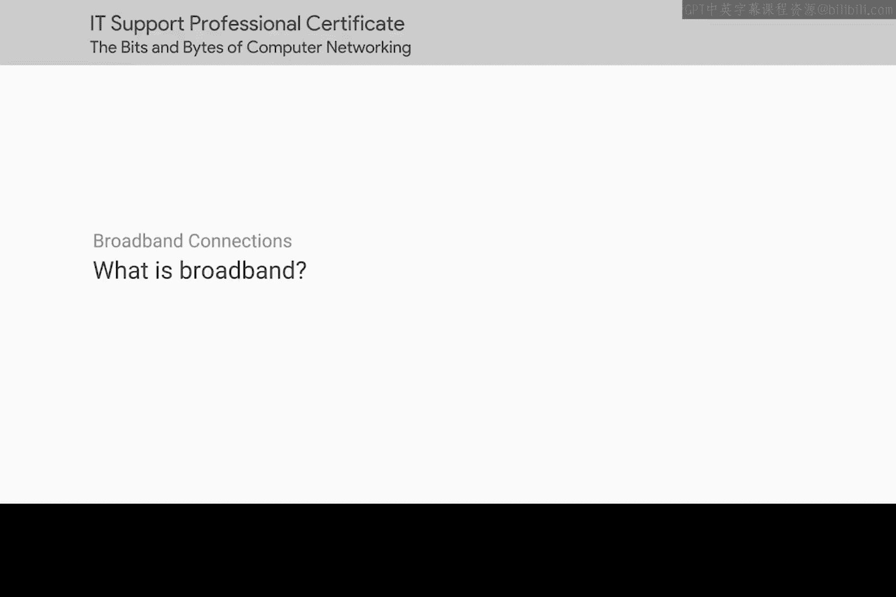
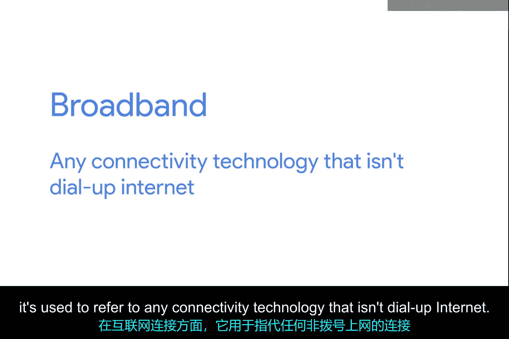
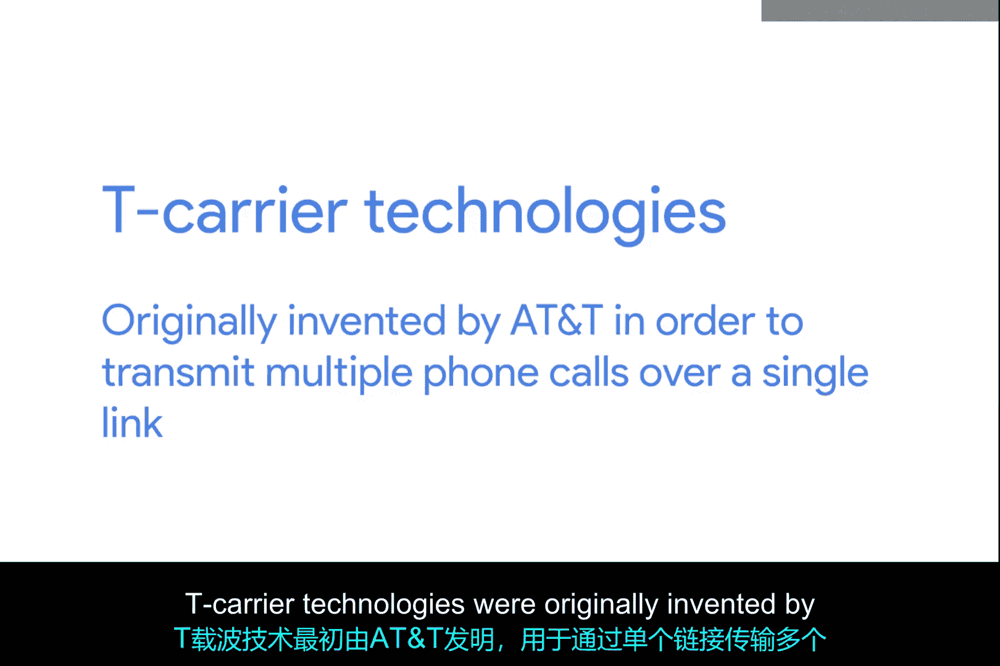
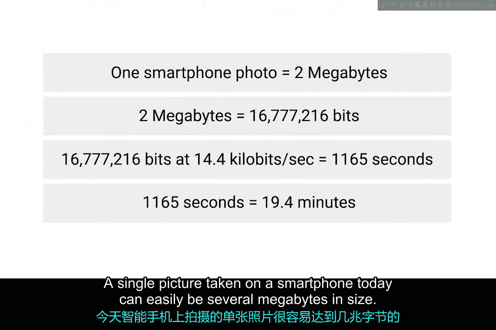
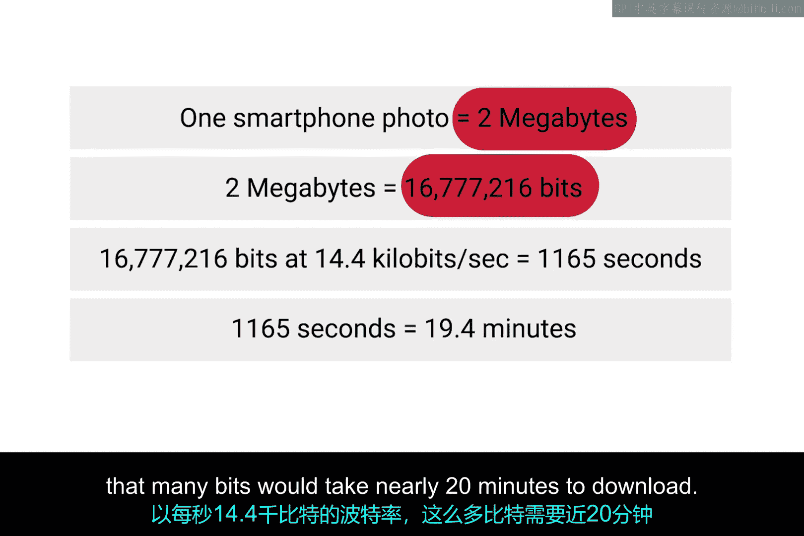

# 063：什么是宽带 🌐

在本节课中，我们将要学习“宽带”这一核心概念。我们将了解其定义、它如何改变了互联网的使用方式，以及它为何比早期的拨号连接更优越。

## 概述

“宽带”一词有多种定义。在互联网连接的语境下，它指的是**任何非拨号连接的互联网接入技术**。宽带互联网几乎总是比最快的拨号连接快得多，并且指的是**始终在线**的连接。这意味着它们是持久的连接，无需在每次使用时重新建立。本质上，它们是始终存在的链路。

宽带塑造了当今世界。虽然互联网本身是一项了不起的发明，但直到宽带技术出现后，其对于商业和家庭用户的真正潜力才得以实现。

## 宽带的发展历程

上一节我们介绍了宽带的定义，本节中我们来看看它的发展背景。

在人们在家中拥有宽带连接之前很久，企业就已经投入大量资源使用宽带，这通常是出于必要。如果一个办公室有超过几名员工，单个拨号连接提供的带宽很快就会被少数用户耗尽。

到了20世纪90年代中期，对于需要为员工提供互联网接入的企业来说，使用各种T载波技术已变得相当普遍。

## T载波技术简介

T载波技术最初由AT&T发明，目的是在单条链路上传输多个电话呼叫。最终，它们也成为常见的数据传输系统，其速度远超任何拨号连接所能处理。

我们将在后续课程中详细介绍T载波技术。

## 宽带对家庭用户的影响

在企业涉足宽带领域后，随着互联网的不同方面（如万维网）变得更加复杂，家庭使用也变得更加普遍。这些应用也需要不断提高的数据传输速率。

在拨号上网的时代，即使网页上的一张图片也可能需要很多秒才能下载和显示。如今用手机就能拍摄的高分辨率照片，在当时需要很长时间下载，并且考验用户的耐心。

以下是当时下载一张图片所需时间的估算：
*   如今智能手机拍摄的一张照片很容易达到几兆字节（MB）的大小。
*   2 MB相当于 `2 * 1024 * 1024 = 2097152` 字节。
*   在14.4 kbps（千比特每秒）的拨号速率下，下载这么多数据需要近20分钟。

如果没有宽带互联网连接技术，我们今天所知的互联网将不复存在。我们将无法流式播放音乐或电影，也无法轻松分享照片。你也肯定无法像现在这样参加在线课程。

## 常见的宽带解决方案

T载波技术需要专用线路，这使其成本更高。因此，通常只在企业中看到它们的使用。但也存在其他面向企业和消费者的宽带解决方案。

在接下来的几个视频中，我们将深入探讨当今四种最常见的宽带解决方案：
1.  **T载波技术**
2.  **数字用户线路（DSL）**
3.  **电缆宽带**
4.  **光纤连接**

你准备好了吗？让我们开始吧。

## 总结

本节课中我们一起学习了“宽带”的概念。我们了解到宽带是一种高速、始终在线的互联网连接技术，它从根本上推动了互联网的普及和应用发展，从企业必备逐渐走入千家万户，并催生了流媒体、高清内容共享等现代互联网体验。我们还简要了解了其发展历程和几种主要类型，为后续深入学习具体技术奠定了基础。