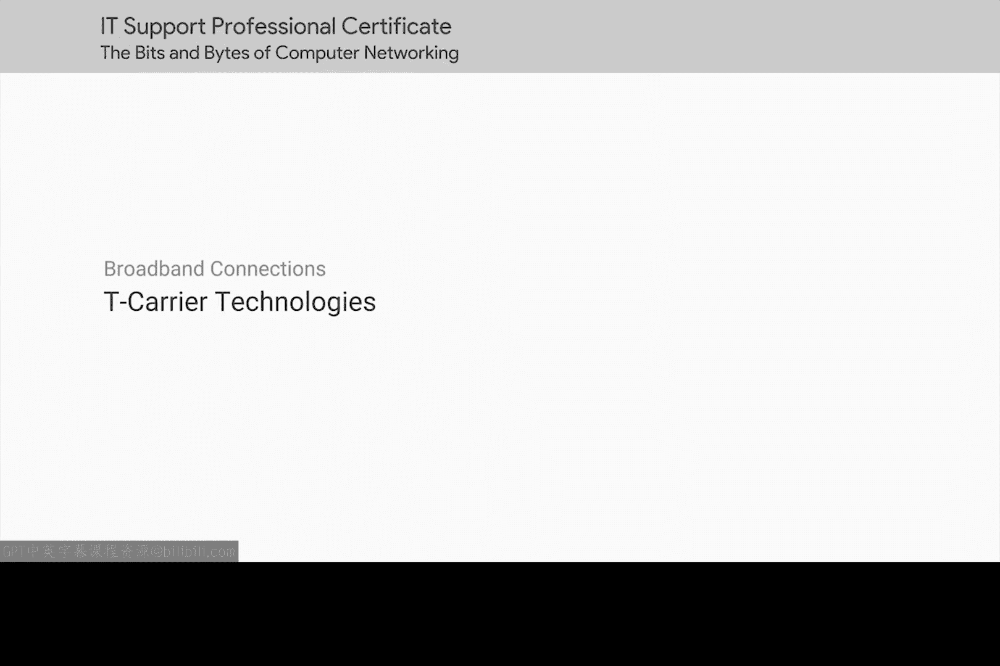
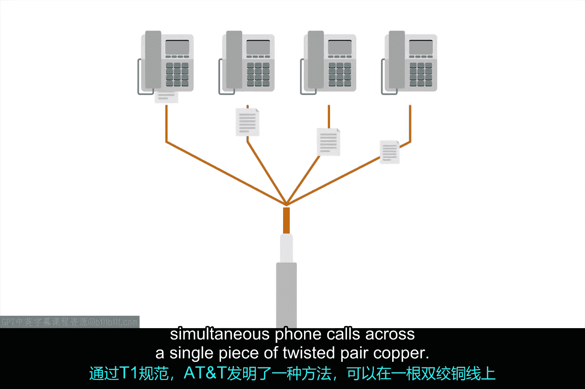
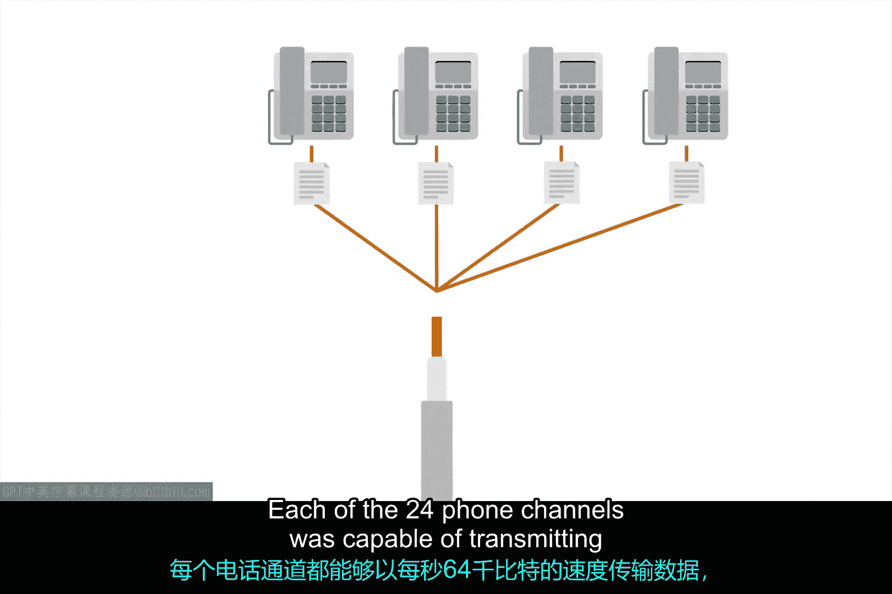
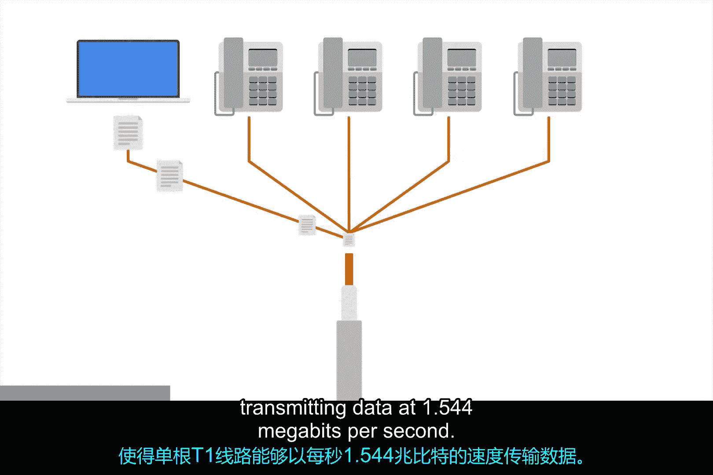

**计算机网络与操作系统：第2课：T载波技术**

在本节课中，我们将学习T载波技术。这是一种早期用于在单条线路上传输多路电话信号的技术，后来被广泛应用于数据传输，是现代宽带技术发展的重要基础。

---

### **T1技术的起源与原理**

上一节我们介绍了早期通信的背景，本节中我们来看看T1技术是如何解决线路复用问题的。

T载波技术最初由AT&T公司发明，旨在构建一个系统，允许大量电话呼叫通过单条电缆传输。

在T1规范出现之前，每个独立的电话呼叫都需要通过独立的铜线对进行。

通过首个T载波规范（简称T1），AT&T发明了一种方法，可以在单条双绞铜线上承载多达24路同时进行的电话呼叫。

---

### **从语音到数据的应用演进**

了解了T1的基本原理后，我们来看看这项技术是如何从语音通信扩展到数据领域的。

多年以后，这项技术被重新用于数据传输。

原来的24个电话信道中的每一个，都能够以每秒64千比特的速率传输数据。

这使得一条T1线路能够以每秒1.544兆比特的总速率传输数据。其总带宽计算公式为：
**总带宽 = 24 信道 × 64 kbit/s = 1.536 Mbit/s** （加上额外的控制开销后，标准速率为 **1.544 Mbit/s**）。

随着时间的推移，“T1”这个术语逐渐泛指任何能够达到1.544 Mbit/s速率的双绞铜线连接，即使它并未严格遵循最初的T1规范。

---

### **T1与T3线路的商业应用与发展**

在数据传输领域，对更高带宽的需求催生了更强大的技术。以下是T载波技术的主要应用和发展阶段。

最初，T1技术仅用于连接不同电信公司的站点，以及将这些公司与其他电信公司互联。

但随着互联网在20世纪90年代成为有用的商业工具，越来越多的企业开始付费在其办公室安装T1线路，以获得更快的互联网连接。

通过对T1线路的进一步改进，开发出了将多条T1线路捆绑为单一链路的方法。

因此，一条T3线路由28条T1线路复用而成，实现了每秒44.736兆比特的总吞吐速度。其带宽计算公式为：
**T3带宽 = 28 × T1带宽 = 28 × 1.544 Mbit/s ≈ 44.736 Mbit/s**

---

### **技术现状与更替**

尽管T载波技术曾广泛应用，但技术始终在进步。本节我们来看看它目前的地位。

如今你仍然能看到T载波技术在使用，但对于小型企业办公室而言，它通常已被其他宽带技术超越。

在内部ISP通信中，不同的光纤技术已经完全取代了旧的基于铜缆的技术。由于运营成本低得多，电缆宽带或光纤连接现在要常见得多。

---

### **总结**

本节课中我们一起学习了T载波技术。我们了解了T1技术如何通过复用技术在单条铜线上传输多路信号，以及它如何从语音通信演进到数据传输。我们还探讨了更高速的T3线路的形成，并认识到随着成本更低、性能更高的光纤等技术的普及，T载波技术已逐渐被取代。理解这些基础技术有助于我们把握网络技术发展的脉络。