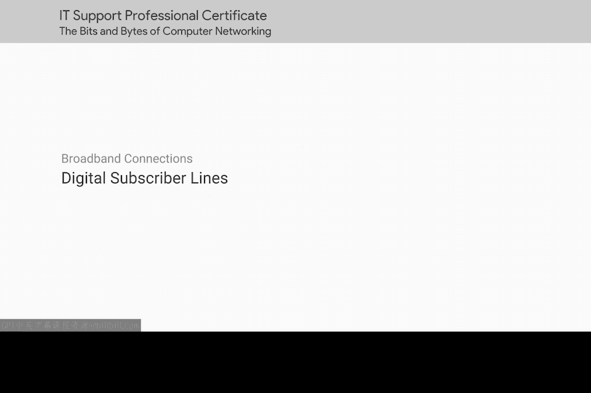
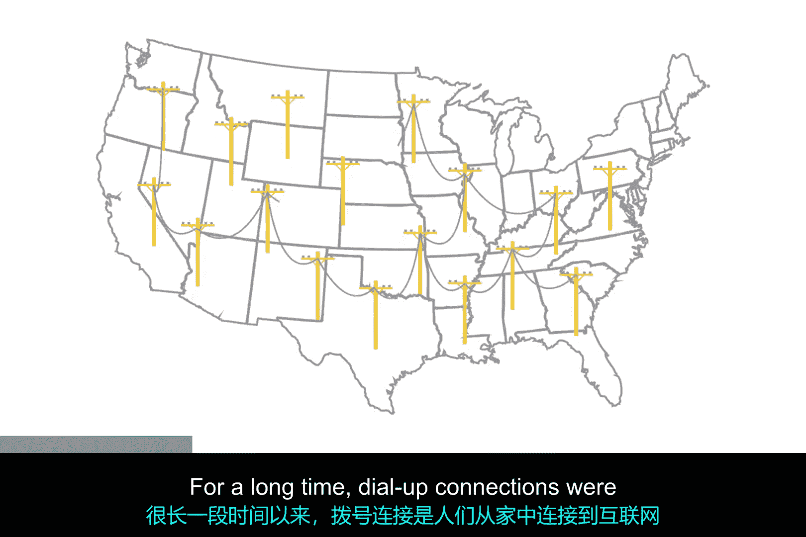
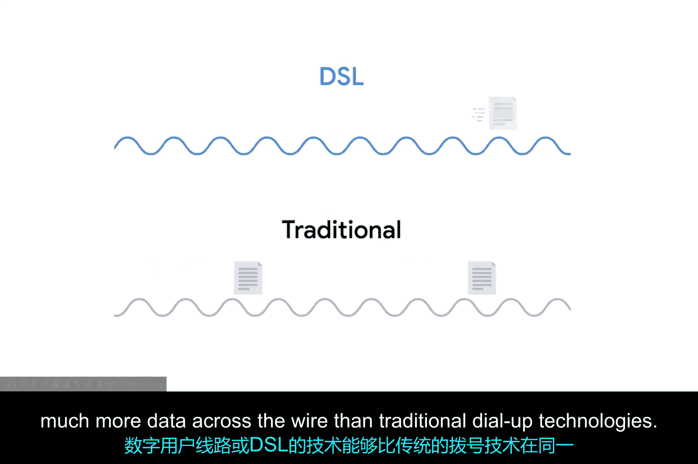
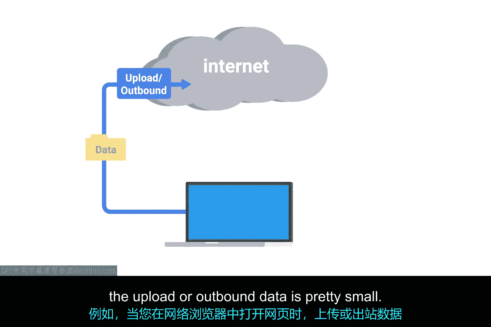
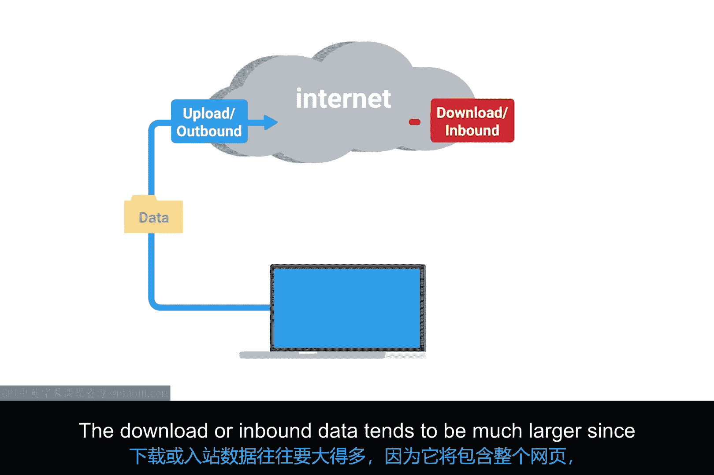

# 065：数字用户线路 (DSL) 🚀

在本节课中，我们将要学习数字用户线路技术。这是一种利用现有电话网络基础设施，实现更高速互联网接入的技术。我们将了解它的工作原理、主要类型以及它与传统拨号连接的区别。

## 概述

公共电话网络因其无处不在的基础设施，曾是连接人们上网的绝佳选择。在很长一段时间里，拨号连接是人们从家中接入互联网的主要方式。

然而，试图将数据作为本质上只是音频信号来传输存在某些限制。随着人们对更快互联网访问速度的需求日益增长，电话公司开始思考是否能以不同的方式利用相同的基础设施。

## DSL 技术的诞生

上一节我们提到了拨号连接的局限性，本节中我们来看看电话公司如何突破这些限制。

研究表明，现代电话线使用的双绞铜线能够传输的数据量远超语音通话所需。通过在一个不干扰正常电话通话的频率范围内运行，一种被称为**数字用户线路**或 **DSL** 的技术，能够比传统拨号技术在线上传输多得多的数据。

更棒的是，这允许正常的语音通话和数据传输在同一线路上同时进行。

## DSL 的工作原理

类似于拨号使用调制解调器，DSL 技术也使用自己的调制解调器。但更准确地说，它们被称为 **DSLAM** 或 **数字用户线路接入复用器**。

就像拨号调制解调器一样，这些设备通过电话线建立数据连接。但与拨号连接不同的是，DSL 连接通常是长期保持的。这意味着连接通常在 DSLAM 开机时建立，并在 DSLAM 关机前不会中断。

## DSL 的主要类型

市面上有多种不同类型的 DSL，但它们之间的差异相当微小。在很长一段时间里，两种最常见的 DSL 类型是 ADSL 和 SDSL。

以下是这两种主要类型的详细介绍：

*   **ADSL**
    *   **全称**：**A**symmetric **D**igital **S**ubscriber **L**ine
    *   **特点**：ADSL 连接的上行和下行数据速度不同。通常这意味着更快的下载速度和较慢的上传速度。
    *   **适用场景**：家庭用户很少需要上传与下载一样多的数据，因为家庭用户主要是客户端。例如，当你在网页浏览器中打开一个网页时，上传或出站数据非常小（你只是向网络服务器请求某个网页）。下载或入站数据往往要大得多，因为它包含整个网页，包括所有图像和其他媒体。因此，对于典型的家庭用户来说，非对称线路通常能以更低的成本提供相似的用户体验。

*   **SDSL**
    *   **全称**：**S**ymmetric **D**igital **S**ubscriber **L**ine
    *   **特点**：SDSL 技术与 ADSL 基本相同，只是上传和下载速度相同。
    *   **发展**：曾经，SDSL 主要用于托管需要向客户端发送数据的服务器的企业。随着互联网整体可用带宽的扩展，以及多年来运营成本的下降，SDSL 现在对企业和家庭用户都更为常见。

## 其他 DSL 变体

大多数 SDSL 技术的上限为 **1.544 Mbit/s**，与 T1 线路相同。DSL 技术的进一步发展产生了诸如 **HDSL** 或**高比特率数字用户线路**等技术。这些是提供高于每秒 1.544 兆比特速度的 DSL 技术。

市面上还有许多其他微小的 DSL 技术变体，提供不同的带宽选项和传输距离。这些变体数量繁多且差异细微，在此尝试全面覆盖并不实际。如果你需要了解特定 DSL 线路的更多信息，应联系提供该服务的 ISP 以获取更多细节。

## 总结

本节课中我们一起学习了数字用户线路技术。我们了解到，DSL 通过利用电话线中未用于语音通话的更高频率带宽，实现了比传统拨号更快的互联网连接，并且允许语音和数据同时传输。我们区分了**非对称的 ADSL**（下载快、上传慢，适合家庭用户）和**对称的 SDSL**（上下行速度相同，适合企业），并简要提及了更高速的 HDSL 等其他变体。DSL 是宽带技术发展中的重要一步，它基于现有电话网络，为更高速的互联网接入铺平了道路。