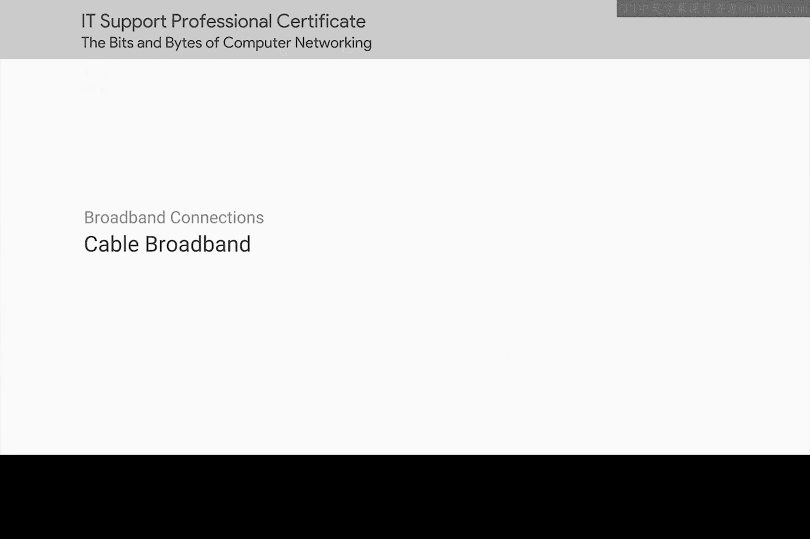
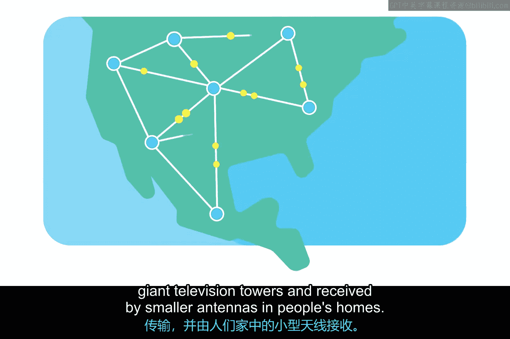
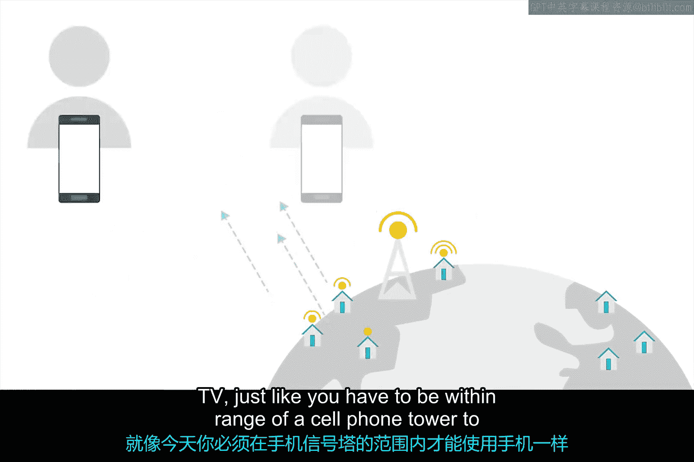
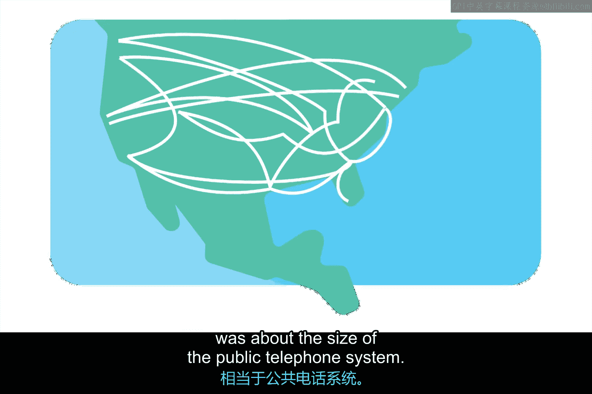
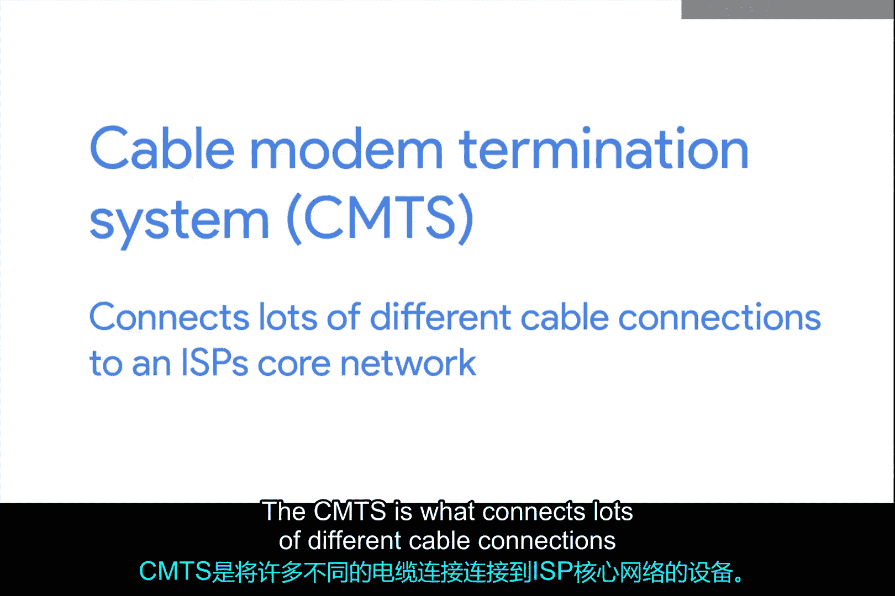

# 066：电缆宽带 📡

在本节课中，我们将要学习电缆宽带技术的发展历史、工作原理及其与DSL等其他宽带技术的核心区别。我们将从电视广播的无线起源开始，探讨有线电视如何演变为提供互联网接入的重要基础设施。

## 从无线到有线：电视广播的演变 📺

电话和计算机网络的历史都始于有线通信，但最近的趋势是越来越多的通信流量转向无线。电视的历史则遵循了相反的道路。

最初，所有电视广播都是无线传输，由巨大的电视塔发出信号，再由人们家中的小型天线接收。这意味着你必须位于这些电视塔的信号覆盖范围内才能看电视，就像今天你必须位于手机信号塔的覆盖范围内才能使用手机一样。

## 有线电视的兴起与发展 🏗️

从20世纪40年代末开始，美国开发了第一批有线电视技术。当时，它们主要是为了向偏远城镇和农村家庭提供电视接入，因为这些地方超出了当时电视塔的信号覆盖能力。

有线电视在随后的几十年里缓慢扩张。但在1984年，《有线通信政策法案》获得通过。这项法案解除了对美国有线电视业务的管制，引发了巨大的增长和普及热潮。全球其他国家也很快效仿。

到20世纪90年代初，美国的有线电视基础设施规模已与公共电话系统相当。不久之后，有线电视提供商开始尝试加入当时正在发生的互联网增长大潮。

## 电缆宽带技术的原理 🛠️

与DSL技术的发展类似，有线电视公司很快意识到，通常用于将有线电视信号送入家庭的同轴电缆能够传输比电视观看所需多得多的数据。通过使用不干扰电视广播的频率，基于电缆的互联网接入技术能够通过这些相同的电缆提供高速互联网接入。这就是我们所说的电缆宽带技术。

电缆互联网接入与其他宽带解决方案的一个主要区别在于，电缆通常被称为**共享带宽技术**。

在使用DSL甚至拨号等技术时，从家庭或企业到所谓的**中心局**的连接是点对点的。中心局是处理这些连接功能的自动化硬件节点。

## 共享带宽模型与中心局模型的对比 ⚖️

以下是两种模型的对比：

*   **中心局模型**：如DSL。连接是点对点的，可以保证该连接上可用的特定带宽。
*   **共享带宽模型**：如电缆互联网。在此模型下，许多用户共享一定量的带宽，直到传输到达ISP的核心网络。共享范围可能从一个城市街区到整个郊区，具体取决于该区域最初的有线电视布线方式。

如今，大多数有线电视运营商已尝试升级其网络，以使终端用户可能不会总是注意到这种共享带宽。但在使用高峰期，例如同一地区的许多人在同一时间使用互联网连接时，电缆互联网连接速度减慢的情况仍然很常见。

## 电缆宽带的关键设备：调制解调器与终端系统 🔌

电缆互联网连接通常由所谓的**电缆调制解调器**管理。这是一个位于用户网络边缘的设备，将其连接到**电缆调制解调器终端系统**。

电缆调制解调器终端系统负责将许多不同的电缆连接连接到ISP的核心网络。

---

本节课中我们一起学习了电缆宽带的历史，了解了它如何从有线电视技术演变而来。我们探讨了其共享带宽的核心工作原理，并将其与DSL的点对点模型进行了对比。最后，我们认识了实现电缆宽带连接的关键设备：电缆调制解调器和电缆调制解调器终端系统。