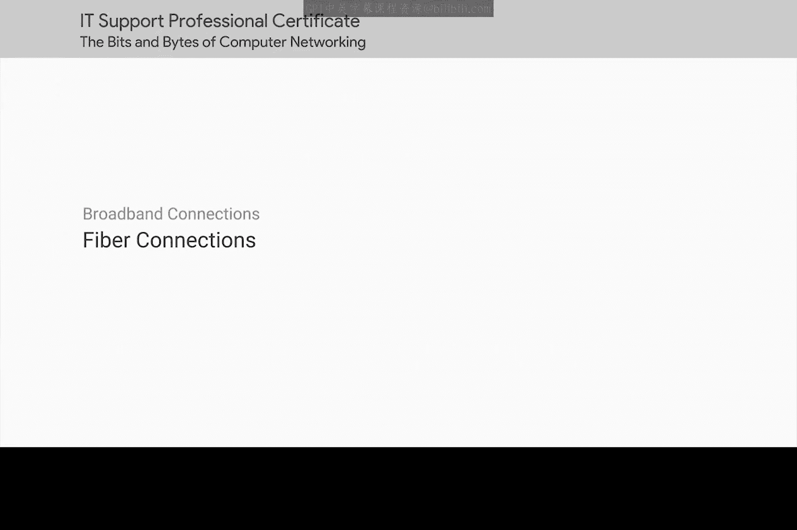
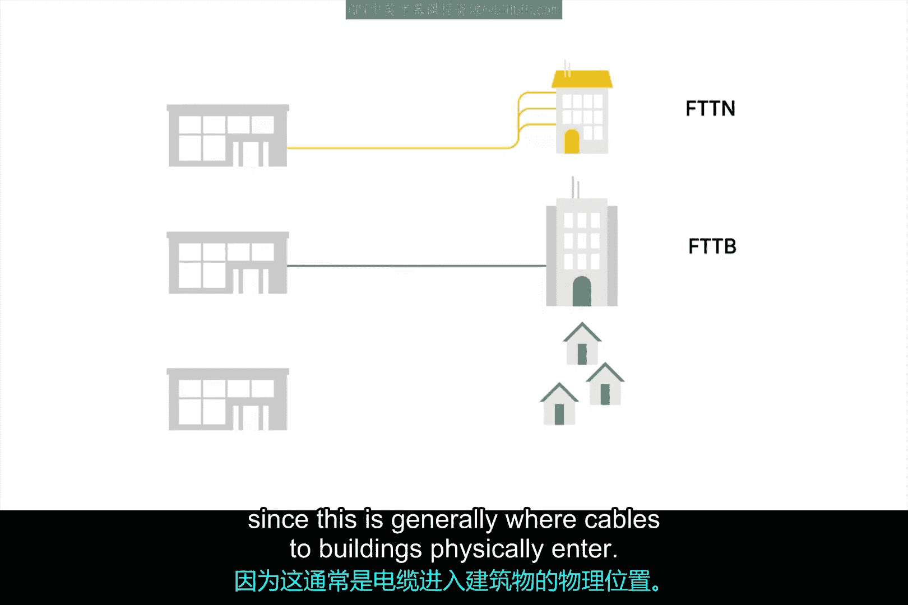
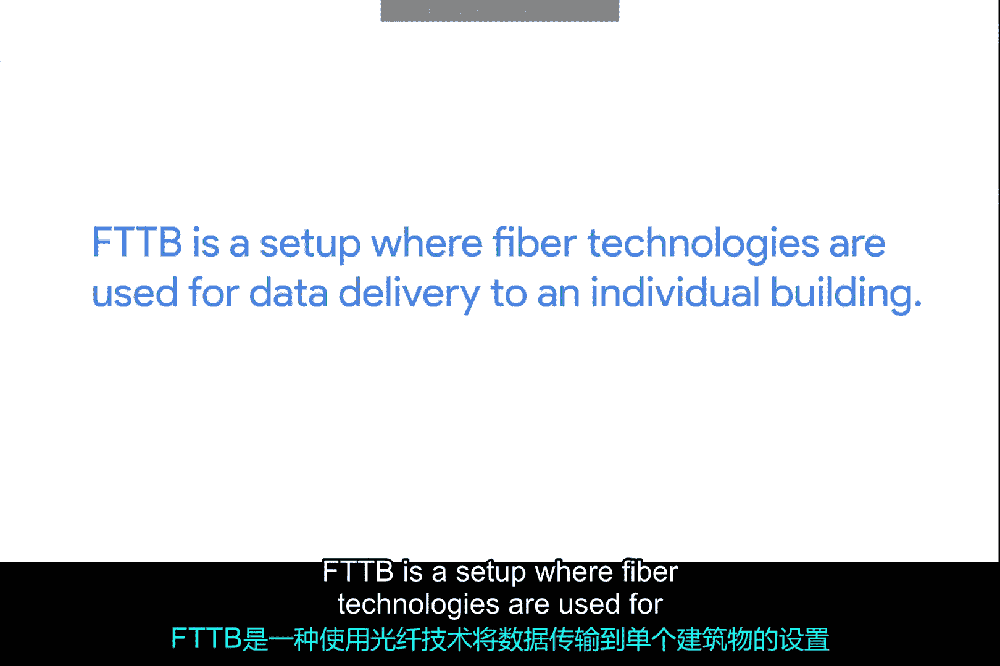
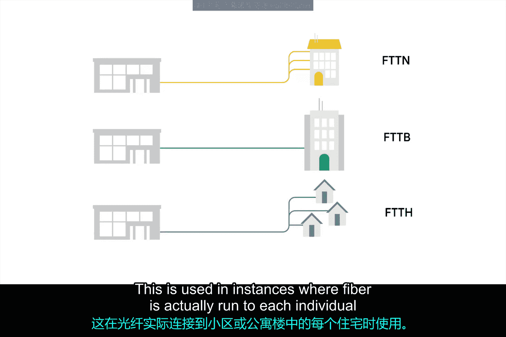
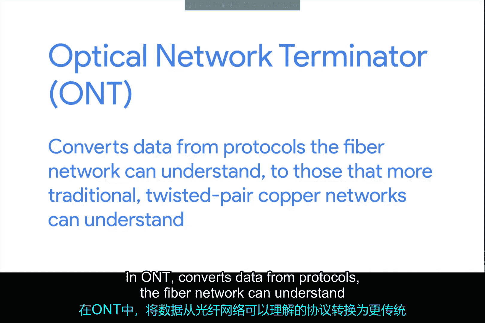
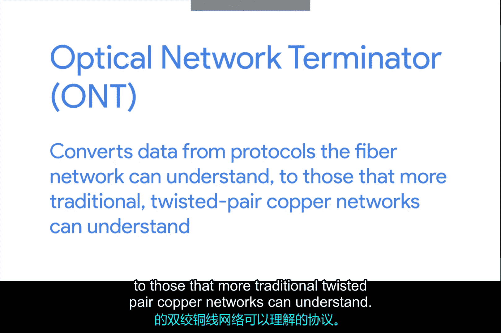

# 067：光纤连接 🌐

在本节课中，我们将要学习光纤连接技术。光纤是互联网骨干网络的核心传输介质，它正越来越多地被用于将数据传输到离终端用户更近的地方。我们将了解光纤的基本原理、优势以及几种常见的光纤到户部署模式。

---

互联网的核心网络长期使用光纤进行连接。这既是因为光纤能提供更高的速度，也是因为光纤允许信号在远距离传输时不会显著衰减。

回忆一下，光纤连接使用光进行数据传输，而非电流。电信号在铜缆中传输的最大距离在数千英尺后就会因衰减过多而需要中继器。但某些光纤连接的实现方案，其信号在传输许多英里后才会衰减。

生产和铺设光纤比使用铜缆昂贵得多。因此长期以来，光纤技术主要见于互联网服务提供商（ISP）的核心网络内部，或者可能用于数据中心内部。但近年来，使用光纤将数据传输到越来越接近终端用户的做法变得流行起来。

光纤具体铺设到离终端用户多近的距离，在不同的实施方案中差异很大。因此，业界发展出了“FTTX”这个短语。

---

## FTTX：光纤到X 🚀

FTTX代表“光纤到X”，其中“X”可以是多种场景之一。以下是几种常见的可能性。

### 光纤到邻里（FTTN）

你可能会听到的第一个术语是FTTN，意为“光纤到邻里”。这意味着光纤技术被用于将数据传输到一个服务特定区域人口的物理机柜。从这个机柜开始，最后一段距离可能使用双绞线铜缆或同轴电缆。

### 光纤到楼宇（FTTB）

下一个你可能遇到的版本是FTTB。它代表“光纤到楼宇”、“光纤到企业”或“光纤到地下室”（因为电缆通常从这里物理接入建筑物）。FTTB是一种部署方案，其中光纤技术用于将数据传输到单个建筑物。之后，通常使用双绞线铜缆来连接建筑物内的用户。

### 光纤到户（FTTH）与光纤到驻地（FTTP）

你可能听到的第三个版本是FTTH，代表“光纤到户”。这用于光纤实际铺设到邻里或公寓楼中每个独立住宅的情况。FTTH和FTTB有时也可能统称为FTTP，即“光纤到驻地”。

---

## 光纤网络的终端设备 🔌

与调制解调器不同，光纤技术的分界点被称为**光网络终端**或**ONT**。ONT将数据从光纤网络能够理解的协议，转换为更传统的双绞线铜缆网络能够理解的协议。

---

本节课中我们一起学习了光纤连接技术。我们了解到光纤因其高速和远距离低衰减的特性，成为互联网骨干网的核心。虽然成本较高，但它正逐渐向终端用户延伸。我们介绍了FTTX系列概念，包括**FTTN**（光纤到邻里）、**FTTB**（光纤到楼宇）和**FTTH/FTTP**（光纤到户/驻地）。最后，我们认识了光纤网络的终端设备——**光网络终端（ONT）**，它负责在不同网络介质间进行协议转换。