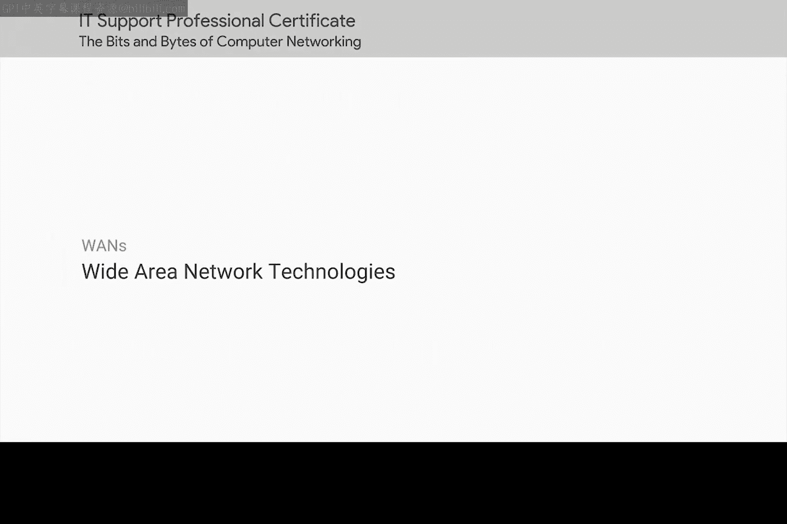
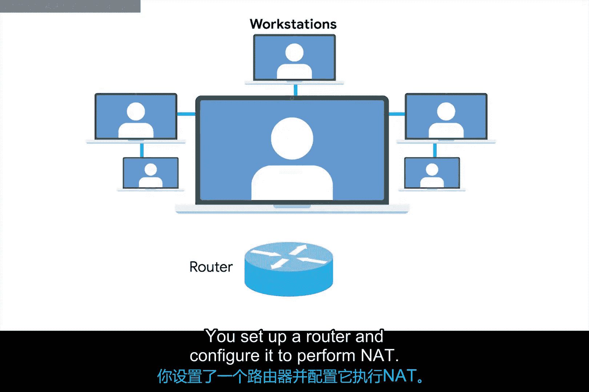
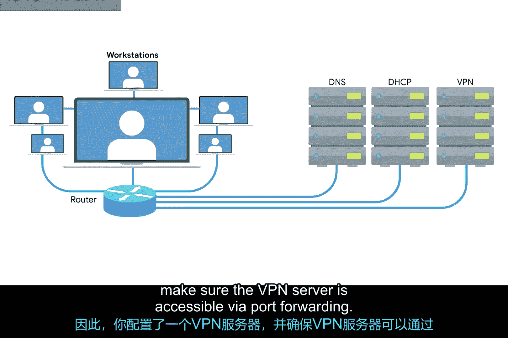
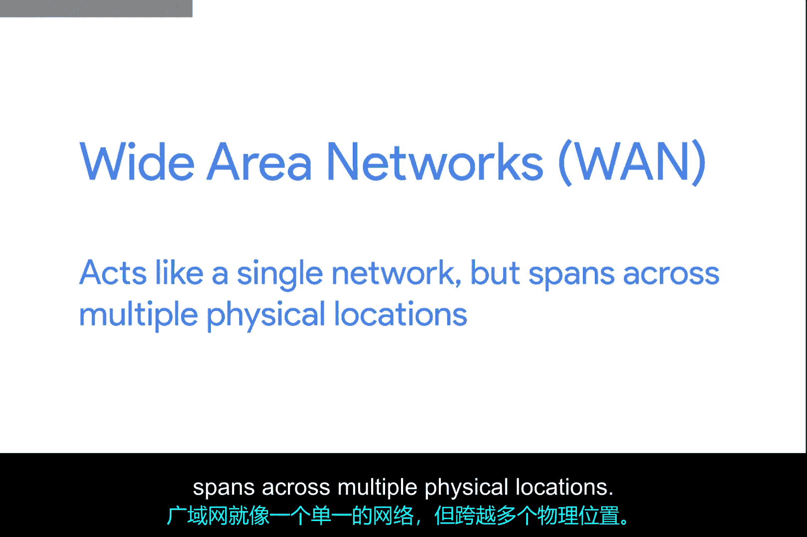
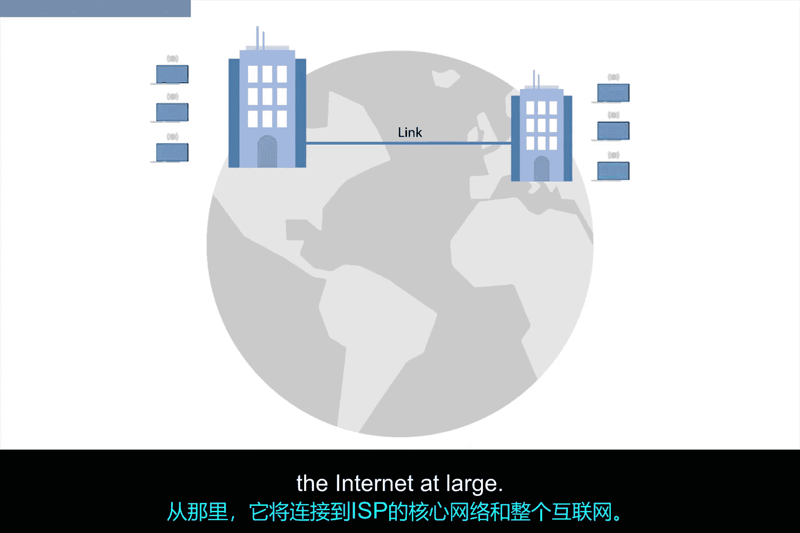

# 068：广域网技术

在本节课中，我们将学习广域网（WAN）的基本概念、应用场景及其工作原理。我们将从一个公司网络从小到大的发展过程入手，理解局域网（LAN）如何扩展为广域网，并介绍相关的核心技术和协议。

## 小型公司网络的初始搭建

假设你是一家小型公司的唯一IT支持专家，负责管理网络。

最初，公司只有几名员工，在一个办公室里有几台电脑。

你决定为内部IP地址使用**不可路由的地址空间**，因为IP地址稀缺且昂贵。

你设置了一台路由器，并将其配置为执行网络地址转换（NAT）。

你配置了一台本地DNS服务器和一台DHCP服务器，以简化网络配置。

当然，为了让这一切真正运作起来，你需要与一家互联网服务提供商（ISP）签订合同，为该办公室提供互联网接入链路，以便你的用户可以访问网络。

## 公司发展带来的网络扩展

现在，想象一下公司发展了。你正在为内部IP使用不可路由的地址空间。

因此，你拥有充足的扩展空间。也许一些销售人员在外出时需要连接到你所设置的局域网资源。

为此，你可以设置一台VPN服务器，并通过端口转发确保VPN服务器可被访问。

现在，你可以让来自世界各地的员工连接到办公室的局域网。

业务进展顺利，公司持续发展。CEO决定是时候在全国另一个城市开设一个新办公室了。

突然间，不再只是少数销售人员需要远程访问你的网络资源，而是整个第二个办公室都需要这种访问。

## 广域网技术的引入

这正是广域网（WAN）技术发挥作用的地方。

与局域网（LAN）不同，WAN代表广域网。

广域网就像一个单一的网络，但跨越多个物理位置。

广域网技术通常要求你与ISP签订合同，通过互联网建立一条链路。

这家ISP负责将你的数据从一个站点发送到另一个站点。

因此，感觉就像你所有的计算机都在同一个物理位置一样。

## 广域网的典型架构

一个典型的广域网设置包含几个部分。想象一下，国家一端有一个计算机网络，另一端有另一个计算机网络。

每个网络都在一个**分界点**结束，这是ISP网络开始接管的地方。

每个分界点和ISP实际核心网络之间的区域称为**本地环路**。

这个本地环路可能是像T载波线路或高速光纤连接到提供商本地区域办公室的链路。

从那里，它将连接到ISP的核心网络以及整个互联网。

## 广域网的工作原理

广域网通过在数据链路层使用一系列不同的协议，将你的数据从一个站点传输到另一个站点。

事实上，这些相同的协议有时也工作在互联网的核心部分，而不是我们更熟悉的以太网协议。

详细介绍所有这些协议超出了本课程的范围。

但在接下来的课程中，我们将为你提供一些最流行的广域网协议的链接。

## 总结

本节课中，我们一起学习了广域网技术。我们从一个小型办公室网络的搭建开始，看到了随着公司发展，网络需求如何从简单的局域网扩展到需要连接多个物理位置的广域网。我们了解了广域网的基本概念、典型架构（包括分界点和本地环路），以及它如何通过数据链路层协议在ISP的帮助下实现跨地域连接。广域网技术是支撑现代企业分布式运营的关键基础设施。