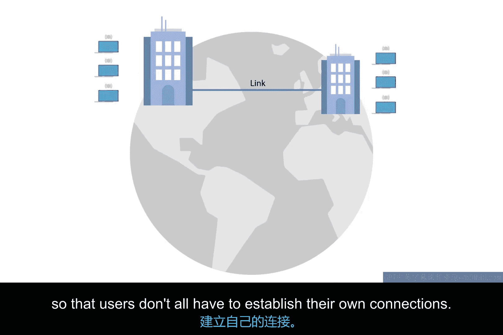

# 069：点对点VPN详解 🌐

在本节课中，我们将学习广域网技术的一种流行替代方案——点对点VPN。我们将探讨其产生背景、工作原理、与广域网技术的对比，以及它在现代云计算环境中的应用。

## 概述

广域网技术适用于需要在多个站点间传输大量数据的场景，因为其设计初衷就是实现超高速传输。然而，广域网技术的成本可能非常高昂。相比之下，商业电缆或DSL线路可能便宜得多，但在某些情况下无法满足所需的负载要求。

## 点对点VPN的兴起

近年来，越来越多的公司将其内部服务迁移到云端。这意味着公司可以将全部或部分基础设施外包给其他公司进行管理。我们以电子邮件为例进行说明。

过去，公司若想拥有电子邮件服务，必须自行运行电子邮件服务器。如今，公司可以选择云托管提供商来为其托管电子邮件服务器。公司甚至可以更进一步，使用“电子邮件即服务”提供商。这样，公司就完全不需要拥有电子邮件服务器，只需付费让另一家公司处理电子邮件服务的一切事宜。

随着此类云解决方案的普及，许多企业不再需要其站点间具备极高的连接速度。这使得昂贵的广域网技术变得完全没有必要。取而代之，公司可以使用点对点VPN来确保其不同站点之间仍能相互通信。

## 点对点VPN的工作原理

点对点VPN，也称为站点到站点VPN，它在两个站点之间建立一条VPN隧道。

其运作方式与传统VPN设置让单个用户表现得如同连接到了目标网络非常相似。不同之处在于，VPN隧道逻辑由两端的网络设备处理，因此用户无需各自建立自己的连接。

以下是点对点VPN的核心逻辑示意：

```
站点A [网络设备] <--- VPN隧道 ---> [网络设备] 站点B
          |                              |
      （处理隧道逻辑）               （处理隧道逻辑）
          |                              |
      内部用户                       内部用户
```



## 总结


本节课我们一起学习了点对点VPN。我们了解到，在云计算时代，企业对于站点间超高速连接的需求降低，使得成本较低的点对点VPN成为一种理想的广域网替代方案。点对点VPN通过在两个站点的网络设备间建立隧道，实现了站点间安全、高效的通信，而无需终端用户进行复杂的配置。