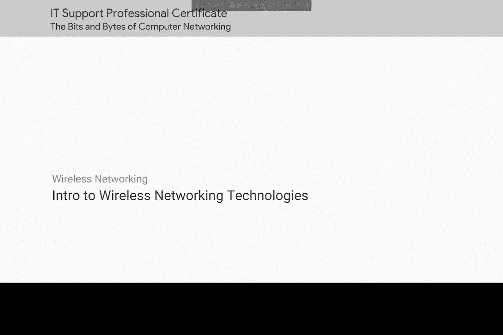
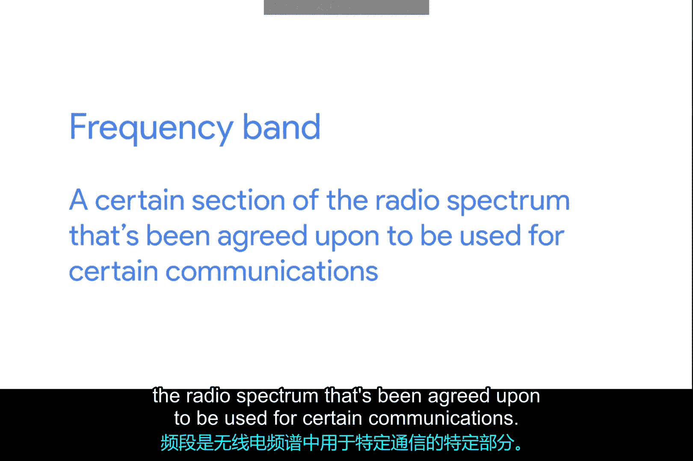
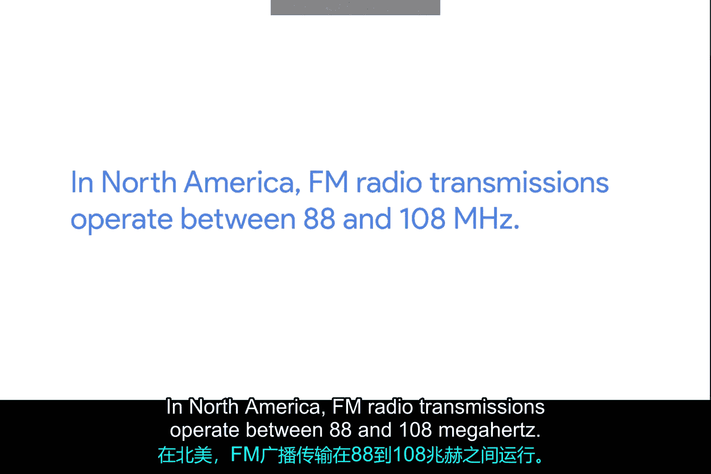
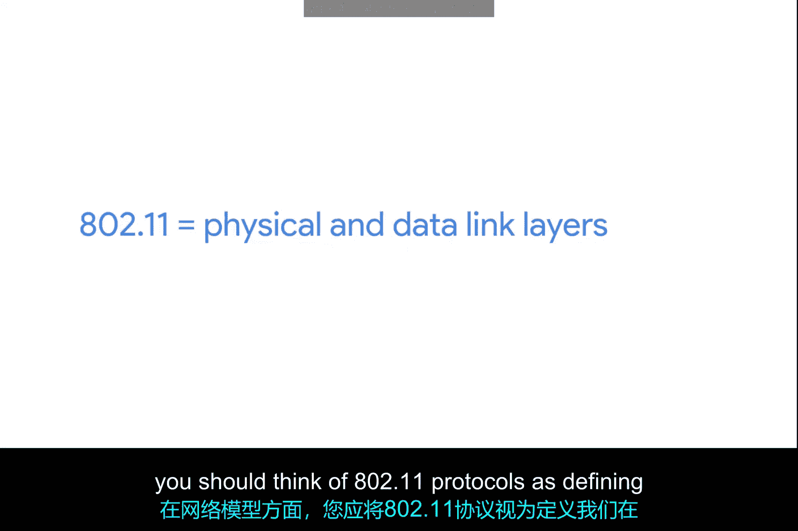
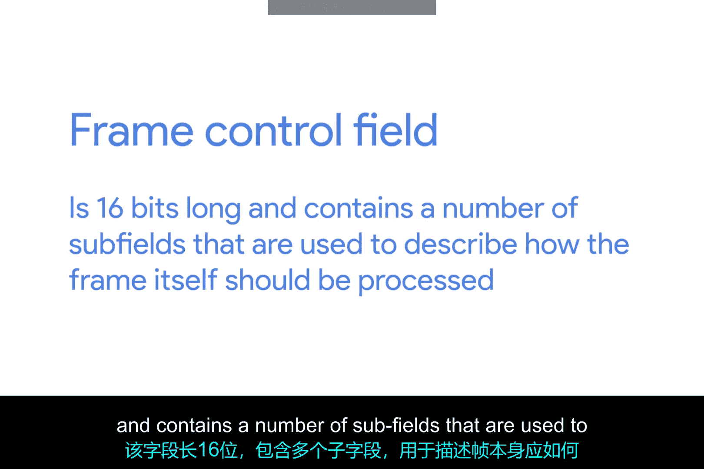
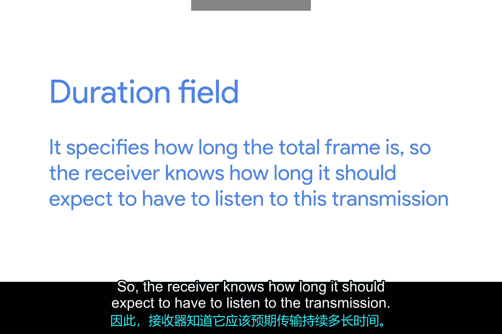
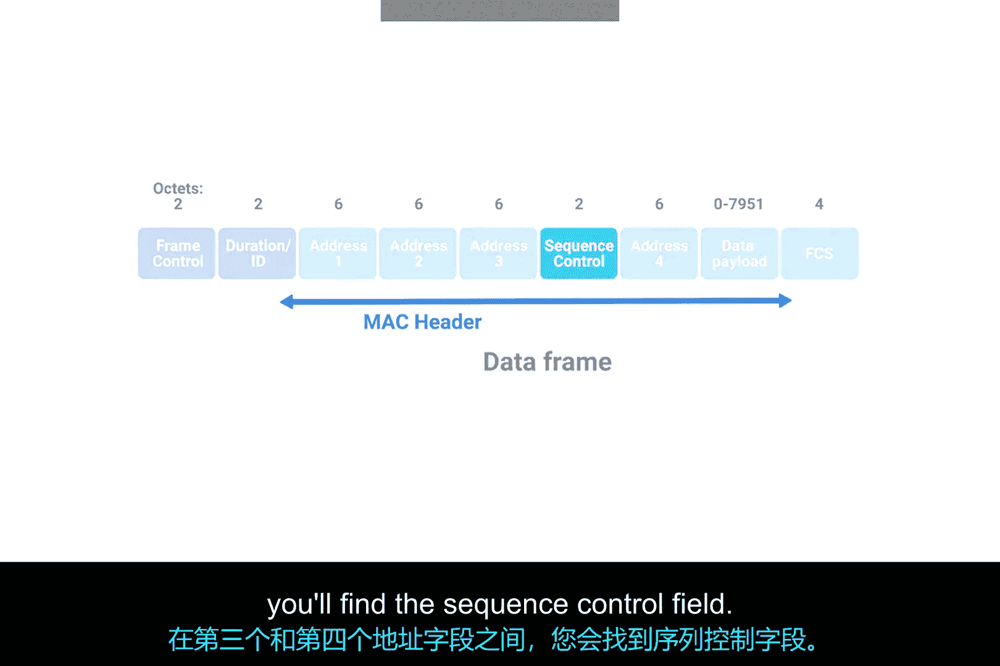
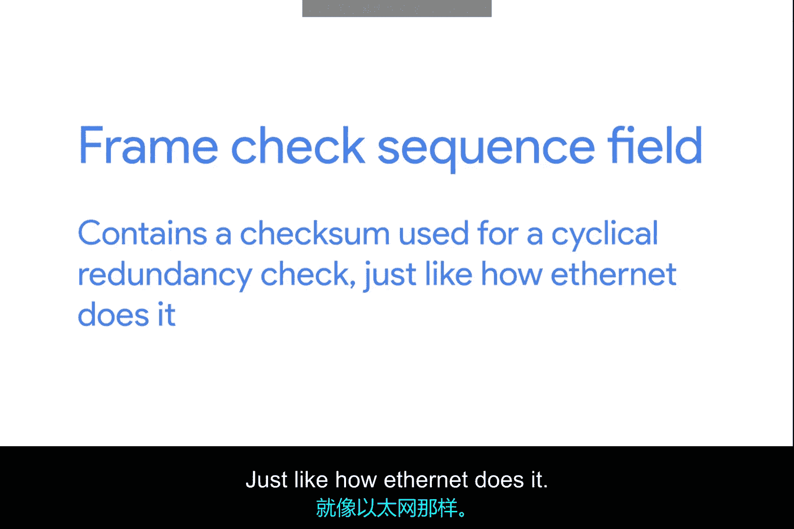

# 070：无线网络技术介绍 🛰️

在本节课中，我们将要学习无线网络技术的基础知识。随着笔记本电脑、平板电脑和智能手机等便携式计算设备的普及，无线网络变得越来越重要。通过本节内容，你将能够描述无线通信的基本工作原理，区分基础设施网络和自组织网络，解释无线信道如何帮助无线网络运行，并理解无线安全协议的基础知识。这些技能对于IT支持专家来说非常宝贵，因为无线网络在工作场所中正变得越来越普遍。

## 无线网络标准与频率

无线网络设备通过无线电波进行通信。最常见的无线网络通信规范由IEEE 802.11标准定义。这套规范也被称为802.11系列，构成了我们称之为Wi-Fi的技术集合。

不同的802.11标准通常使用相同的基本协议，但可能在不同的频段上运行。频段是无线电频谱中特定的一部分，被约定用于特定的通信。在北美，FM无线电传输在88至108 MHz之间运行，这个特定的频段被称为FM广播频段。

Wi-Fi网络在几个不同的频段上运行，最常见的是2.4 GHz和5 GHz频段。存在许多802.11规范，包括一些仅用于实验或测试的规范。你可能遇到的最常见规范包括802.11b、802.11a、802.11g、802.11n和802.11ac。我们目前不会详细讨论每一个，只需知道我们按它们被采用的顺序列出了这些规范。每个较新版本的802.11规范通常都有一些改进，无论是更高的接入速度还是更多设备能够同时使用网络的能力。

在网络模型中，你应该将802.11协议视为定义了我们在物理层和数据链路层的操作方式。

## 802.11帧结构

802.11帧包含多个字段。第一个字段称为帧控制字段。这个字段长16位，包含许多子字段，用于描述帧本身应如何处理。这包括诸如使用了哪个版本的802.11等信息。

下一个字段称为持续时间字段。它指定了总帧的长度，因此接收方知道它需要监听传输的时间长度。在此之后，是四个地址字段。让我们花点时间讨论为什么有四个地址字段，而不是通常的两个。我们将在本课后面更详细地讨论不同类型的无线网络架构，但最常见的设置包括称为接入点的设备。

无线接入点是桥接网络无线和有线部分的设备。一个无线网络可能有多个不同的接入点来覆盖大面积区域。无线网络上的设备将与某个接入点关联。这通常是它们物理上最接近的那个，但也可以由许多其他因素决定，例如总体信号强度和无线干扰。

关联不仅对于无线设备与特定接入点通信很重要，它还允许发送到无线设备的传入传输由正确的接入点发送。有四个地址字段是因为需要空间来指示哪个无线接入点应处理该帧。因此，我们有正常的源地址字段，它代表发送设备的MAC地址，但我们也有网络上的预期目的地，以及接收地址和发送器地址。

接收地址应该是接收帧的接入点的MAC地址，发送器地址是刚刚发送帧的设备的MAC地址。在许多情况下，目的地和接收地址可能相同。通常，源地址和发送器地址也相同。但根据特定无线网络的具体架构方式，情况并非总是如此。有时无线接入点会相互中继这些帧。由于802.11帧中的所有地址都是MAC地址，这四个字段中的每一个都是6字节长。

在第三和第四地址字段之间，你会发现序列控制字段。序列控制字段长16位，主要包含一个用于跟踪帧顺序的序列号。在此之后是数据有效载荷部分，它包含协议栈上层所有协议的数据。

最后，我们有一个帧检查序列字段，它包含一个用于循环冗余校验的校验和，就像以太网所做的那样。

## 无线网络架构类型

上一节我们介绍了802.11帧的结构，本节中我们来看看无线网络的两种主要架构类型：基础设施网络和自组织网络。

基础设施网络是最常见的无线网络设置。在这种架构中，无线设备通过一个中央接入点（AP）进行通信，该接入点连接到有线网络。接入点充当无线设备和有线网络之间的桥梁。设备必须与接入点关联才能访问网络资源。这种设置提供了更好的管理和安全性控制。

自组织网络是一种点对点网络，设备直接相互通信，无需中央接入点。这种网络设置简单快捷，适用于临时连接，如文件共享或多人游戏。然而，它的覆盖范围有限，并且缺乏基础设施网络中的集中管理功能。

## 无线信道与操作

无线信道是无线网络运行的基本单位。它们帮助无线网络在共享的频段内避免干扰并提高效率。

以下是无线信道的一些关键点：

*   **信道划分**：2.4 GHz和5 GHz频段被进一步划分为多个信道。每个信道是一个特定频率范围的子带。
*   **避免干扰**：通过使用不同的信道，相邻的无线网络可以减少相互干扰。例如，在密集的办公环境中，为不同的接入点分配非重叠的信道可以显著提高网络性能。
*   **信道绑定**：一些较新的802.11标准（如802.11n和802.11ac）支持信道绑定，即将多个信道组合在一起使用，以提供更高的数据传输速率。

## 无线安全协议基础

无线网络的安全性至关重要，因为无线电波可以在物理空间内传播，可能被未经授权的设备接收。为了保护无线通信，发展了几种安全协议。

以下是主要的无线安全协议：

*   **WEP**：有线等效保密是最早的安全协议，但已被证明存在严重漏洞，不再安全，不应使用。
*   **WPA**：Wi-Fi保护访问是为了替代WEP而开发的。它比WEP更安全，但仍存在一些弱点。
*   **WPA2**：这是目前最广泛使用的安全协议。它使用AES加密算法，提供了强大的安全性。对于大多数家庭和企业网络，WPA2是推荐的选择。
*   **WPA3**：这是最新的安全协议，进一步增强了安全性，特别是针对离线字典攻击提供了更好的保护。随着新设备的普及，WPA3正逐渐成为新的标准。

配置无线网络时，务必使用强密码（或预共享密钥）并启用最新的可用安全协议（如WPA2或WPA3）。

## 总结

本节课中我们一起学习了无线网络技术的基础知识。我们了解了定义Wi-Fi的IEEE 802.11标准系列，以及无线网络使用的2.4 GHz和5 GHz频段。我们详细剖析了802.11帧的结构，包括其各个字段的作用。我们区分了需要中央接入点的**基础设施网络**和设备直接通信的**自组织网络**。我们还探讨了无线信道如何帮助网络避免干扰，并概述了从**WEP**、**WPA**到**WPA2**和**WPA3**的无线安全协议演进。掌握这些概念对于在现代工作环境中提供有效的IT支持至关重要。