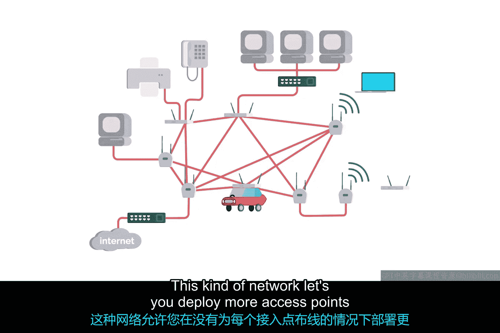

# 071：无线网络配置 🛜

在本节课中，我们将学习无线网络的几种主要配置方式。理解这些不同的网络类型，有助于我们根据实际需求选择和搭建合适的无线环境。

无线网络主要有三种配置方式：**自组织网络**、**无线局域网**和**网状网络**。每种方式都有其独特的结构和应用场景。

## 自组织网络 (Ad Hoc Networks)

上一节我们介绍了无线网络的三种主要类型，本节中我们首先来看看最简单的一种：自组织网络。

在自组织网络中，没有中心化的网络基础设施支持。网络中的每个设备都在通信范围内直接与其他设备对话，并且所有节点都协助传递消息。

尽管自组织网络结构最简单，但它并非最常见的无线网络类型。不过，它在某些场景下具有实际应用价值。

以下是自组织网络的一些应用实例：
*   一些智能手机可以与区域内的其他手机建立自组织网络，以便人们交换照片、视频或联系人信息。
*   在工业或仓库环境中，有时会使用自组织网络，让单个设备之间相互通信，而不需要与其他网络连接。
*   在灾难情况下，自组织网络可以成为强大的工具。如果地震或飓风等自然灾害摧毁了某个区域的所有现有基础设施，救灾专业人员可以利用自组织网络在执行搜救任务时相互通信。

## 无线局域网 (Wireless LANs / WLANs)

了解了自组织网络后，我们来看看在商业领域中最常见的类型：无线局域网。

无线局域网由一个或多个**接入点**组成，这些接入点充当无线网络和有线网络之间的桥梁。有线网络部分像我们之前讨论过的类型一样，作为一个普通的局域网运行。

为了访问无线局域网之外的资源，有线局域网中包含出站的互联网链路。无线设备会与接入点通信，接入点随后将流量转发到网关路由器，之后的过程就和普通网络一样了。

## 网状网络 (Mesh Networks)

最后，我们来看看所谓的网状网络。网状网络在某种程度上类似于自组织网络，因为许多设备之间通过无线方式相互通信。

如果你为所有节点之间的所有链路画线，它们会形成一个网状结构。你遇到的大多数网状网络仅由无线接入点组成，并且仍然会连接到有线网络。

这种网络允许你向网状结构中部署更多接入点，而无需为每个接入点单独铺设网线。通过这种设置，你可以显著提高无线网络的性能和覆盖范围。

以下是网状网络的拓扑示意图，展示了节点间多路径连接的特点：

作为对比，下图展示了传统无线局域网的星型拓扑结构，其中所有设备都通过一个中心接入点连接：

---

本节课中我们一起学习了无线网络的三种主要配置方式：**自组织网络**、**无线局域网**和**网状网络**。我们了解了每种网络的基本原理、结构特点以及典型的应用场景，这为我们设计和维护不同的无线网络环境打下了基础。