# 072：无线信道 📡

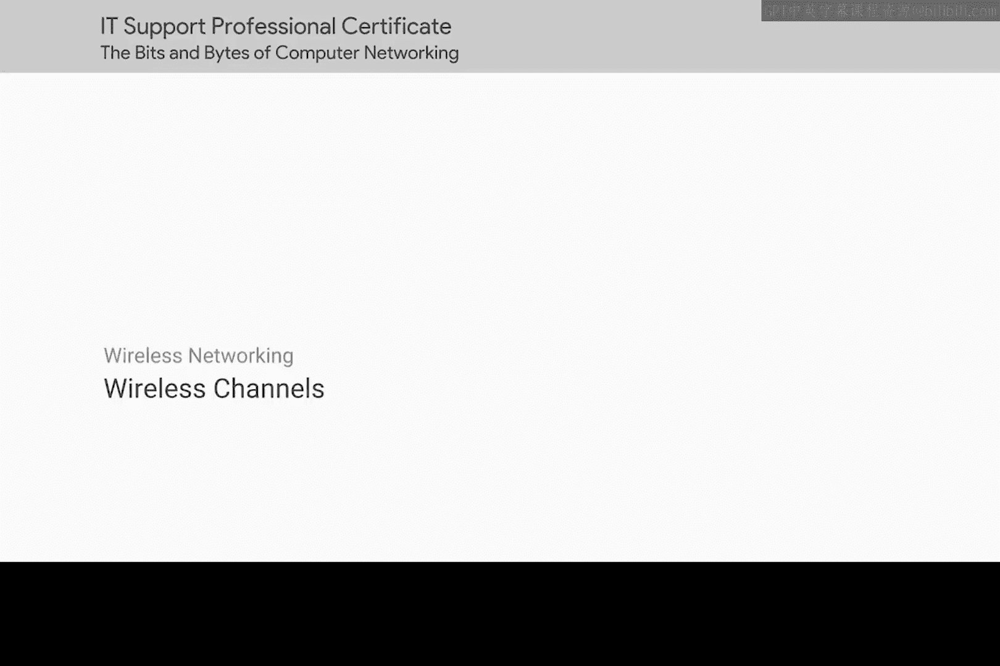

在本节课中，我们将要学习无线网络中的一个核心概念：信道。理解信道对于掌握无线通信的工作原理至关重要，它能帮助我们解决网络拥堵和信号干扰等问题。

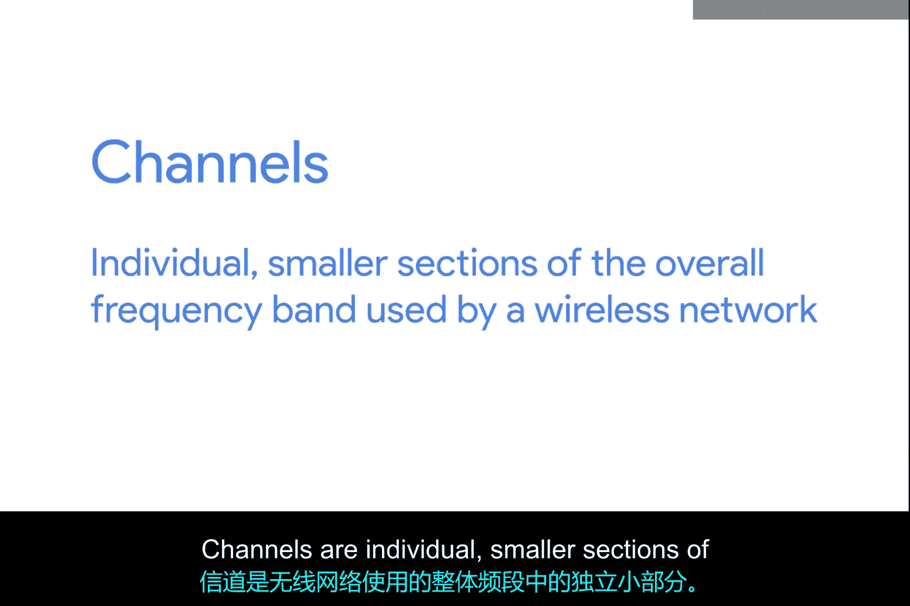

## 概述

信道是无线网络所使用的整个频段中，划分出的一个个独立且较小的部分。理解信道如何工作，是解决无线网络性能问题的关键。

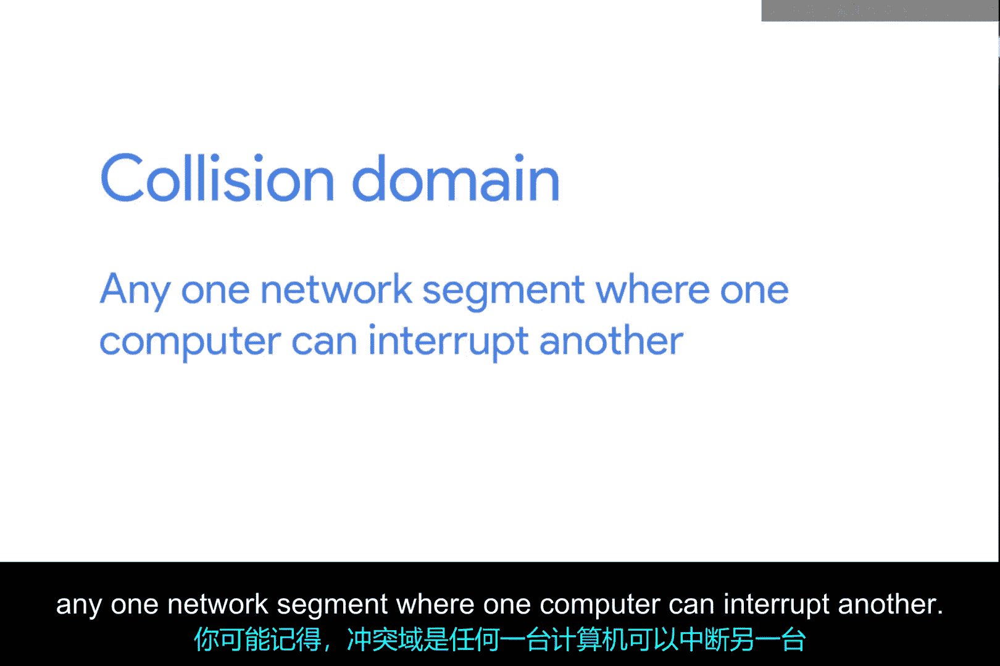

## 信道的重要性

上一节我们介绍了无线网络的基本概念，本节中我们来看看信道为何如此重要。信道主要用来解决一个古老的网络问题：冲突域。

你可能还记得，冲突域是指一个网络段中，一台计算机的传输可能中断另一台计算机的传输。当两个或多个传输同时发生时，接收端无法正确理解这些重叠的信号，这种情况被称为冲突。发生冲突时，所有相关设备都必须停止传输。

## 无线网络中的冲突域

在有线网络中，交换机这类设备已经极大地减少了冲突域问题。交换机记录了哪台计算机连接在哪个物理接口上，因此数据只会发送给目标节点。然而，无线网络没有线缆，也就没有供无线设备连接的物理接口。这意味着我们无法拥有类似“无线交换机”的设备，无线设备注定会互相干扰。

信道在一定程度上帮助解决了这个问题。

## 频段与信道详解

当我们讨论频段概念时，曾提到北美的FM广播电台工作在88 MHz到108 MHz之间。但讨论Wi-Fi使用的频段时，我们只提到了2.4 GHz和5 GHz。这是因为这仅仅是这些频段实际起点的简写。

对于工作在2.4 GHz频段的无线网络，其实际工作频段大约是从2.4 GHz到2.5 GHz。在这两个频率之间，存在着许多信道，每个信道都有特定的宽度（例如以兆赫MHz为单位）。由于不同国家和地区对无线电频率的使用有不同的监管规定，因此可用信道的具体数量取决于你所在的位置。

以下是关于信道的一个具体例子：
*   以802.11b网络为例，信道1的中心频率是2412 MHz。
*   但由于信道宽度是22 MHz，信号实际占用的频率范围是2401 MHz到2423 MHz。

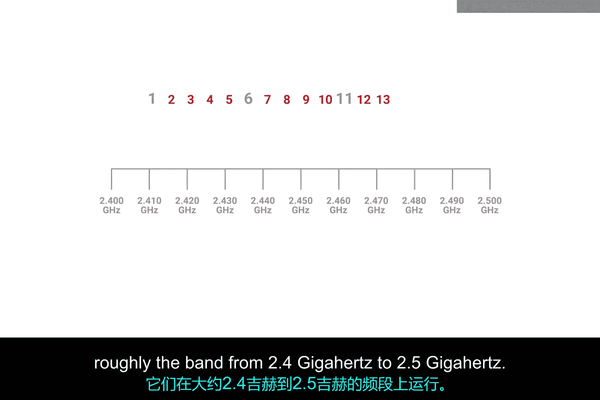

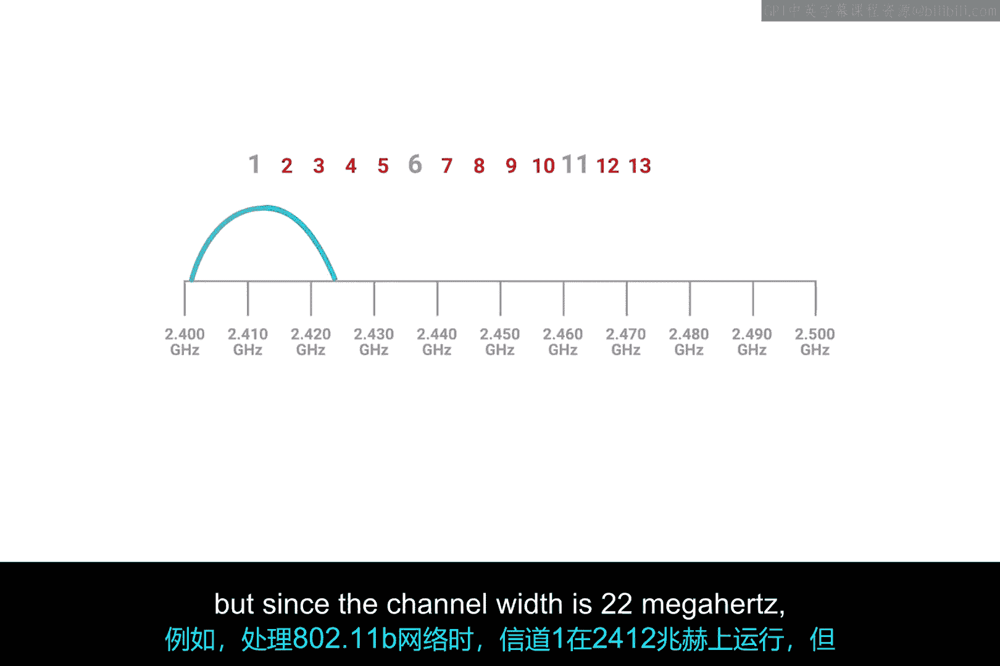

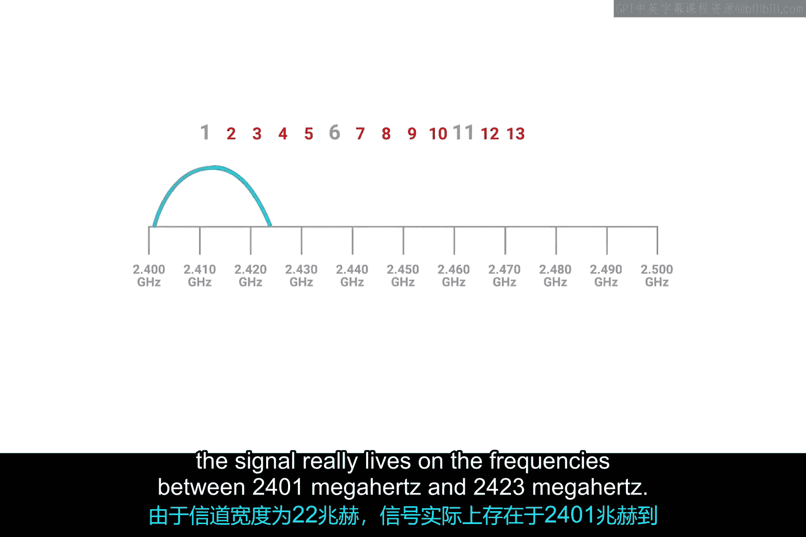

这是因为无线电波本身并不精确，所以需要在传输可能到达的确切频率周围留有一些缓冲空间。

## 信道的重叠与隔离

有些信道会相互重叠，但有些信道间隔足够远，完全不会相互干扰。让我们再次以运行在2.4 GHz频段的802.11b网络为例，因为它最简单，其概念也适用于所有其他802.11规范。

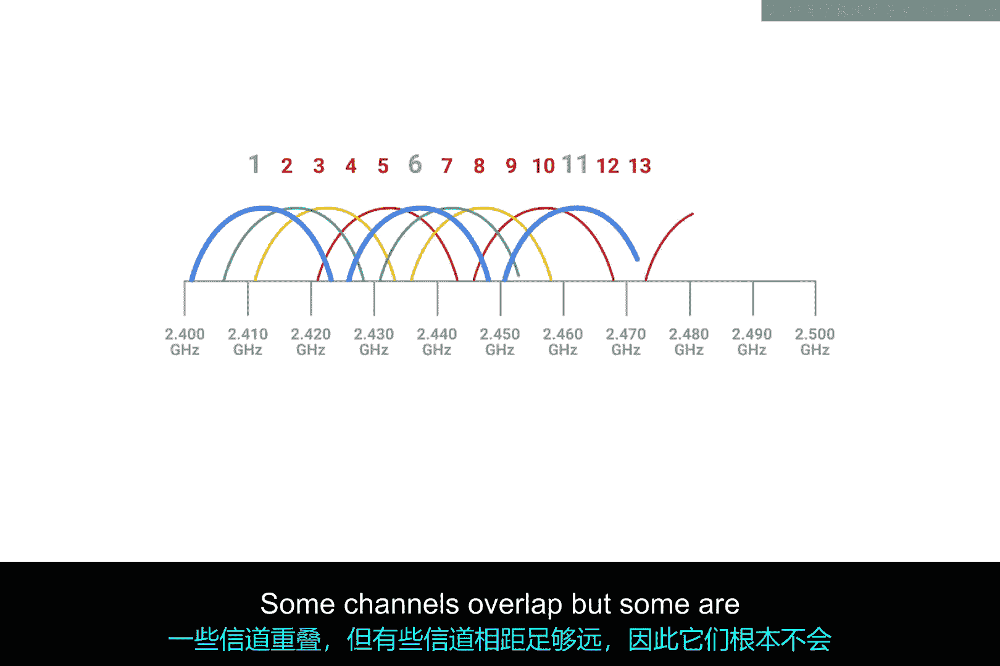

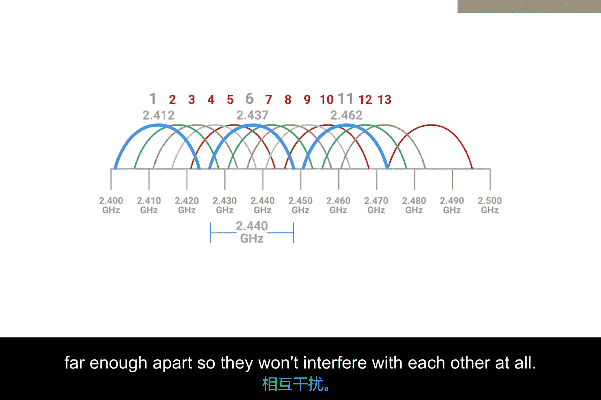

在22 MHz的信道宽度下，中心频率为2412 MHz的信道1与中心频率为2437 MHz的信道6是完全隔离的。

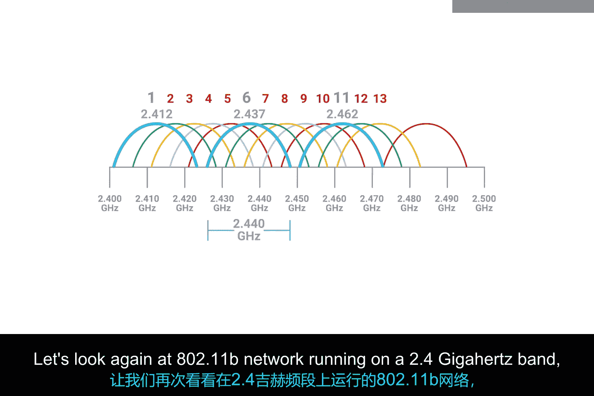

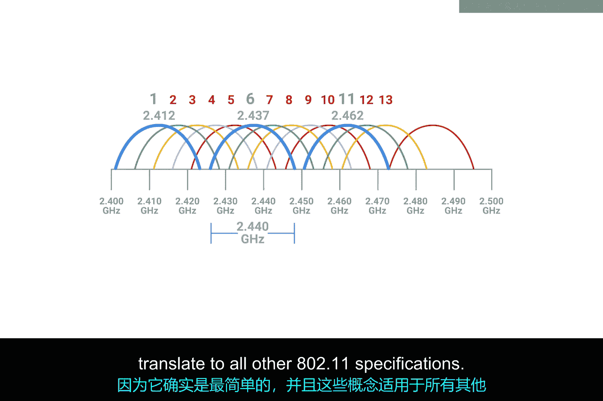

对于802.11b网络，这意味着信道1、6和11是仅有的几个完全互不重叠的信道。

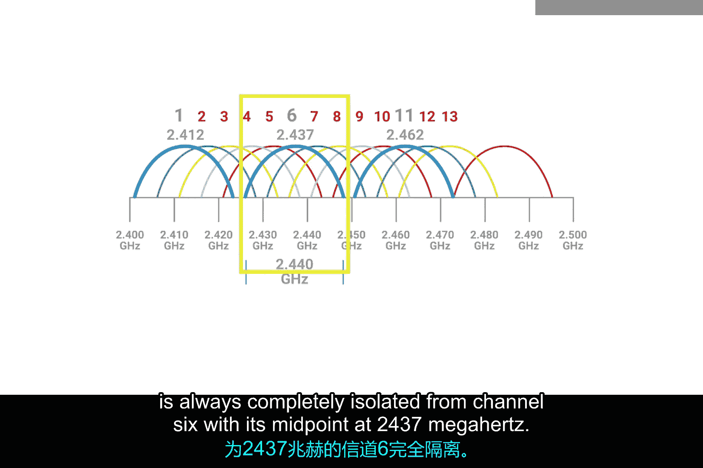

## 信道选择与拥堵

然而，这并非事情的全部。如今，大多数无线网络设备都内置了自动感知功能，以判断哪些信道最拥堵。

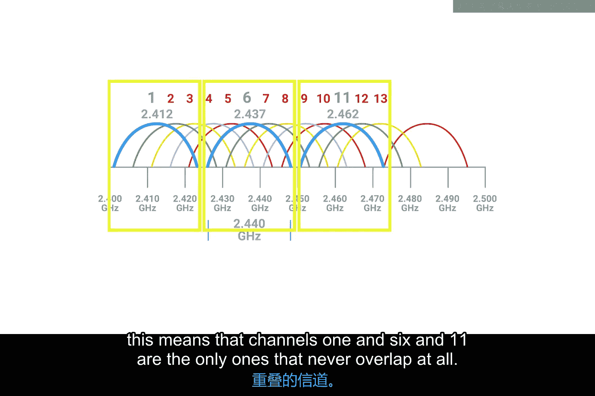

以下是常见的信道选择策略：
*   有些接入点仅在启动时执行一次信道分析。
*   有些则会根据需要动态地更改信道。
*   此外，用户也可以手动指定信道。

即便如此，你仍可能遇到信道严重拥堵的情况。这在无线网络密集的都市区域尤其常见。

## 对IT支持的意义

那么，为什么理解这些对IT支持工作很重要呢？理解所有802.11规范中信道如何重叠，是帮助你排查无线连接故障或网络速度变慢问题的一种方法。你应该尽可能地避免冲突域。

需要指出的是，记住我们讨论过的所有具体数字并不重要。重点在于理解冲突域是所有无线网络必然存在的问题，以及你如何运用这方面的知识来优化无线网络部署。你需要确保你自己的接入点以及邻近商业机构的接入点，所使用的信道尽可能少地重叠。

## 总结

本节课中我们一起学习了无线网络中的信道概念。我们了解到信道是频段的细分，用于减少信号冲突（冲突域）。关键点在于，某些信道（如2.4 GHz频段中的1、6、11信道）互不重叠，选择这些信道可以优化网络性能、减少干扰。对于IT支持人员来说，理解信道原理是诊断和改善无线网络连接质量的重要工具。