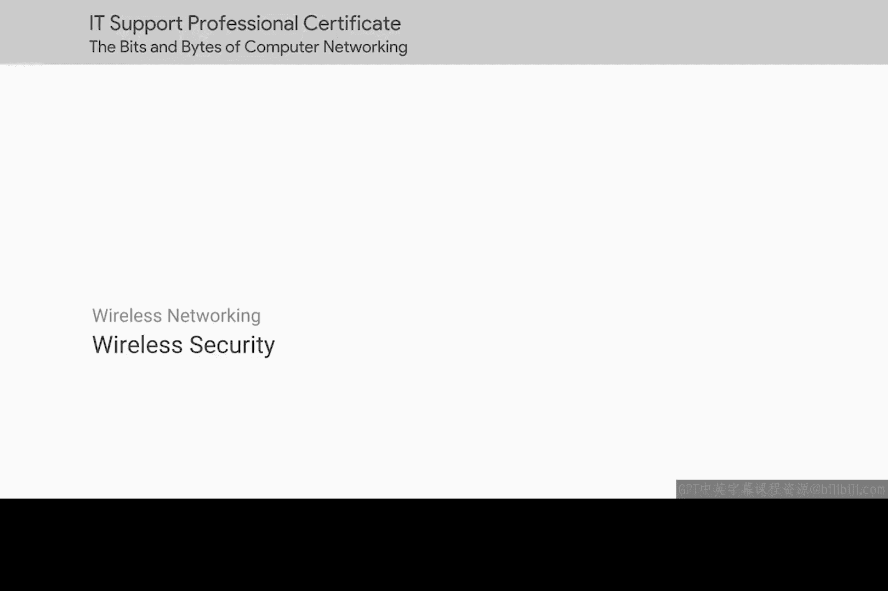
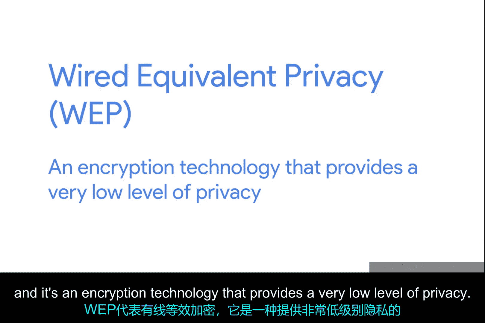
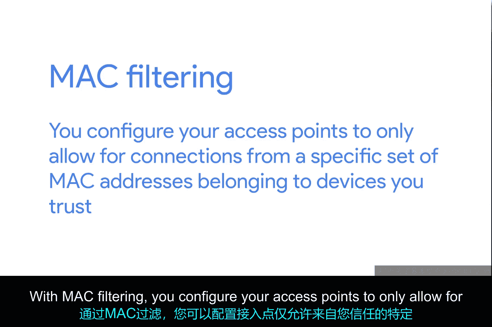
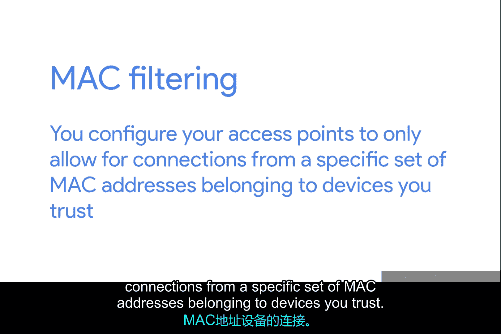

# 073：无线安全 🔐

在本节课中，我们将要学习无线网络面临的安全挑战，以及用于保护无线数据传输的几种主要技术。我们将探讨WEP、WPA、WPA2等加密协议的原理与差异，并了解MAC地址过滤这一附加安全措施。

## 有线与无线通信的隐私差异

当您通过有线链路发送数据时，您的通信具有一定程度的固有隐私性。真正知道正在传输什么数据的设备，只有链路两端的两个节点。恰好处于近距离的某人或某个设备无法直接读取数据。

然而，对于无线网络而言，情况并非如此。因为无线网络没有电缆，只有通过空气广播的无线电传输。理论上，任何在信号范围内的人都可以拦截传输，无论这些传输是否意图发送给他们。

为了解决这个问题，WEP被发明出来。

## WEP：有线等效隐私

WEP代表**有线等效隐私**。它是一种提供非常低级别隐私的加密技术。实际上，从其名称即可看出：**Wired Equivalent Privacy**。使用WEP可以稍微保护您的数据，但它实际上只应被视为与在有线连接上发送未加密数据一样安全。

WEP标准是一种非常弱的加密算法。恶意行为者不需要很长时间就能破解这种加密并读取您的数据。您将在后续课程中了解更多关于密钥长度和加密的知识。但现在，重要的是要知道加密密钥中的位数与其安全性相对应。密钥中的位数越多，某人破解加密所需的时间就越长。

WEP仅使用**40位**作为其加密密钥。以现代计算机的速度，通常只需几分钟即可破解。

因此，WEP在大多数地方很快被WPA所取代。

## WPA与WPA2：Wi-Fi保护访问

WPA，即**Wi-Fi保护访问**，默认使用**128位**密钥，这使得它比WEP难破解得多。

如今，无线网络最常用的加密算法是**WPA2**，这是对原始WPA的更新。WPA2使用**256位**密钥，使其更加难以破解。

除了加密协议，还有另一种常见的方法来帮助保护无线网络。

## MAC地址过滤

这种方法是通过**MAC过滤**来实现的。通过MAC过滤，您可以将接入点配置为仅允许来自一组特定MAC地址的连接，这些地址属于您信任的设备。

MAC过滤本身并不能为通过空气发送的无线流量提供额外的加密帮助，但它确实提供了一个额外的屏障，防止未经授权的设备连接到无线网络本身。

## 总结

本节课中，我们一起学习了无线安全的基础知识。我们了解到，与有线连接不同，无线传输容易被拦截，因此需要加密保护。我们介绍了从脆弱的**WEP**（40位密钥）到更安全的**WPA**（128位密钥），再到目前主流的**WPA2**（256位密钥）的演进过程。此外，我们还探讨了**MAC地址过滤**作为一种补充性的访问控制手段。理解这些安全措施是管理和保护无线网络的重要基础。