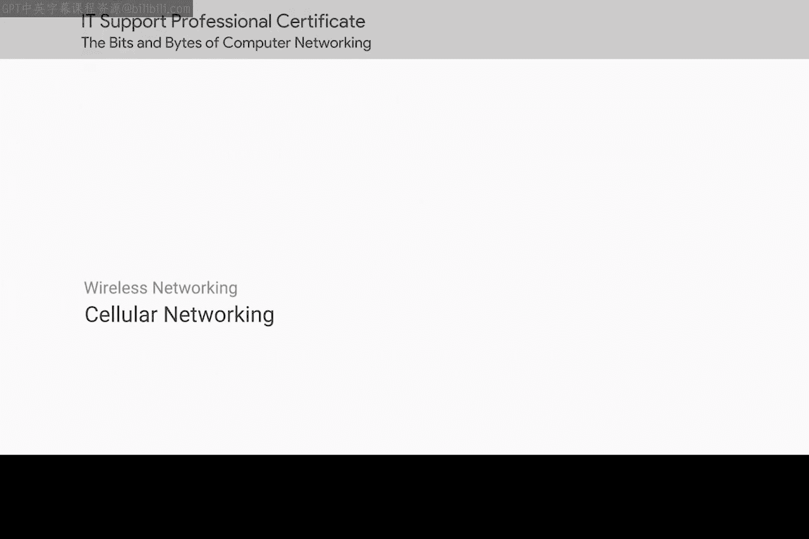
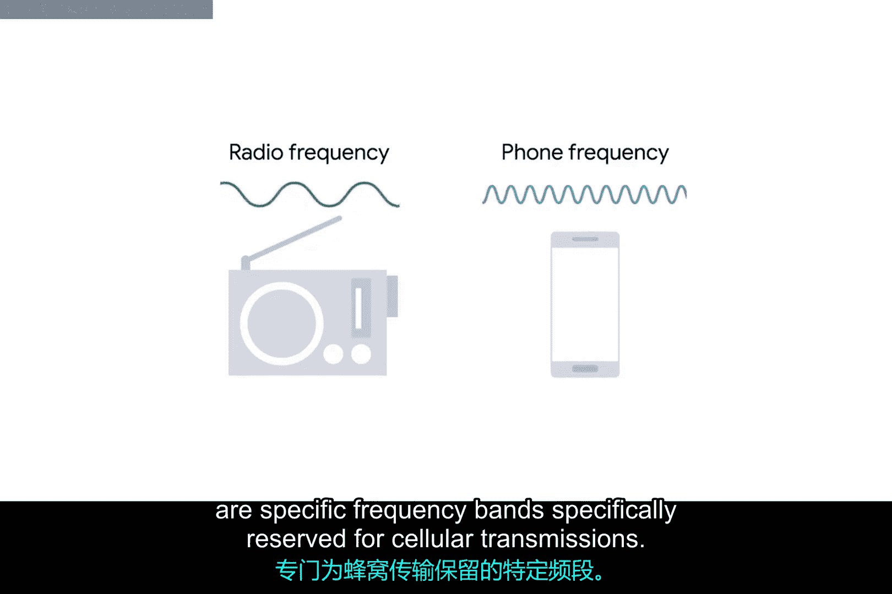
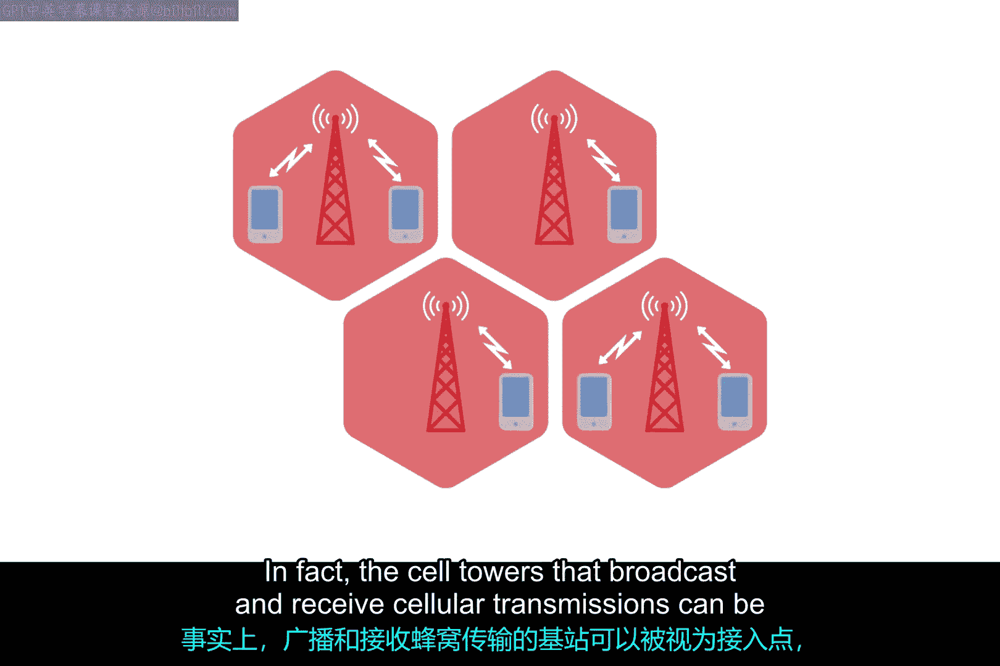

# 074：蜂窝网络 📶

在本节课中，我们将要学习一种非常流行的无线网络形式——蜂窝网络。我们将了解它的基本工作原理、与Wi-Fi网络的异同，以及它在现代设备中的应用。

---

另一种极其流行的无线网络形式是蜂窝网络，也称为移动网络。如今，蜂窝网络在世界各地都很普遍。在某些地区，使用蜂窝网络接入互联网是最常见的连接方式。

从宏观层面看，蜂窝网络与我们之前讨论过的802.11网络有许多共同之处。

正如存在许多不同的802.11规范一样，也存在许多不同的蜂窝网络规范。与Wi-Fi类似，蜂窝网络也通过无线电波运行，并且有专门为蜂窝传输保留的特定频段。

最大的区别之一是，这些频率的信号能够更容易地进行长距离传输，通常可达数公里或数英里。

上一节我们介绍了蜂窝网络的基本概念，本节中我们来看看它的核心架构。

蜂窝网络是围绕“蜂窝”的概念构建的。每个蜂窝被分配一个特定的频段供其使用。相邻的蜂窝被设置为使用互不重叠的频段，这类似于我们讨论的具有多个接入点的无线局域网（WLAN）的最佳设置方式。

实际上，广播和接收蜂窝传输信号的基站塔可以被视为类似于接入点，只是其覆盖范围要大得多。

了解了蜂窝网络的架构后，我们来看看它的应用。

如今，许多设备使用蜂窝网络进行通信。不仅仅是手机，平板电脑和一些笔记本电脑也配备了蜂窝天线。高端汽车内置蜂窝接入模块也变得越来越普遍。

---

本节课中我们一起学习了蜂窝网络。我们了解到，蜂窝网络是一种基于“蜂窝”架构的移动网络，它使用特定的无线电频段，能够实现远距离通信。它与Wi-Fi有相似之处，但覆盖范围更广。这种技术不仅应用于手机，也广泛集成于平板电脑、笔记本电脑甚至汽车等多种现代设备中。