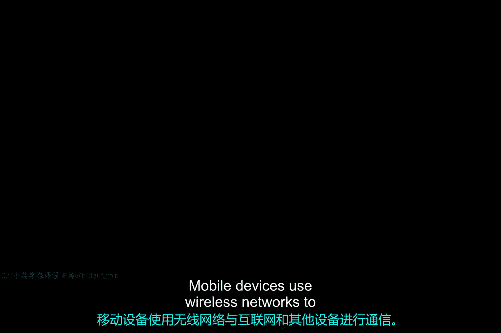
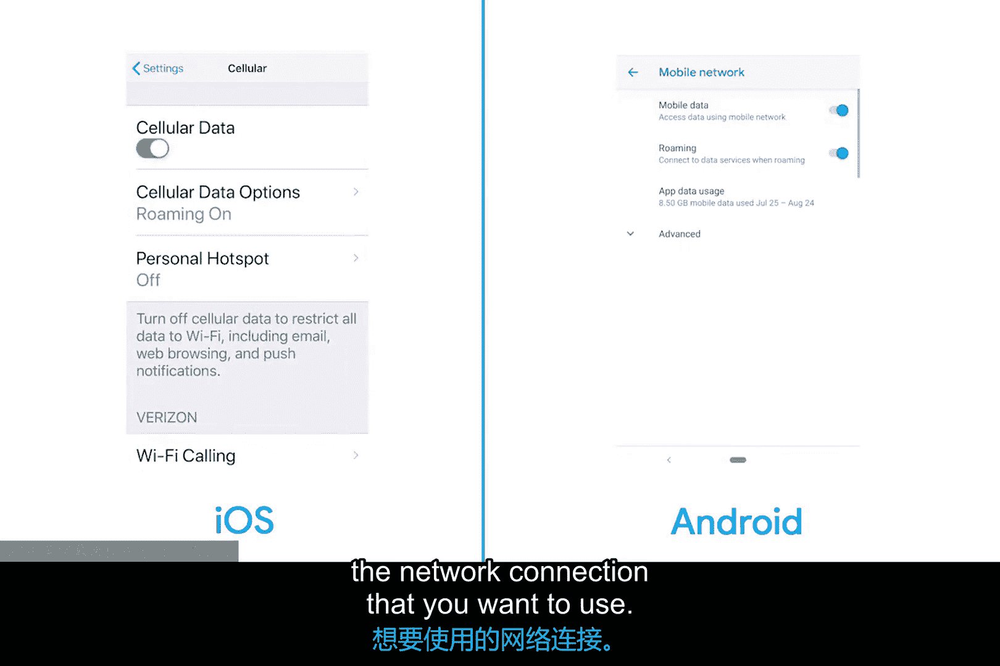

# 075：移动设备网络 📱

在本节课中，我们将学习移动设备如何利用不同类型的无线网络进行通信，以及作为IT支持专家，如何诊断和解决常见的网络连接问题。

移动设备使用无线网络与互联网及其他设备通信。根据设备的不同，它可能使用蜂窝网络、Wi-Fi、蓝牙和/或多种物联网（IoT）网络协议中的一种。

作为IT支持专家，您经常需要帮助终端用户排查网络或连接问题。您需要确定设备应连接到哪个网络，并确保设备已正确配置以实现连接。

## 网络连接的管理与切换 🔄

上一节我们介绍了移动设备使用的网络类型，本节中我们来看看如何管理这些连接。移动设备通常具备开启或关闭单个组件和系统的功能，这有时会让终端用户感到困惑。

电池续航至关重要，人们会关闭这些网络无线电以节省电量。如果有人因为设备无法连接到无线网络而向您求助，您应首先检查无线无线电是否已被禁用。是的，解决方案有时就是这么简单。

您可以在设备的设置中开启或关闭Wi-Fi、蓝牙和蜂窝网络。许多移动设备还设有“飞行模式”，可一次性禁用所有无线网络。

同时，移动设备同时保持多个网络连接的情况也很常见，例如同时连接Wi-Fi和蜂窝数据。移动设备会尝试使用可用连接中最可靠且成本最低的方式接入互联网。没错，我说的是“成本最低”。

许多移动操作系统理解“计量连接”的概念。如果您的手机套餐对每月数据使用量有限制，或根据数据使用量收费，那么通过该手机套餐建立的连接就是计量连接。移动设备会优先使用其他非计量连接（如Wi-Fi），以避免耗尽您有限的数据套餐。

以下是您作为IT支持专家可能提供帮助的另一个例子：假设您有一位远程员工有时在咖啡店工作，但咖啡店的Wi-Fi网络限制访问某些网站。该员工可能会选择断开Wi-Fi连接，转而使用蜂窝网络（即使可能更昂贵），以便访问所需网站。通过切换Wi-Fi和蜂窝数据连接，您可以强制设备使用您希望使用的网络连接。

## 无线信号与故障排除 📶

如果您正在排查一个不稳定的无线网络连接，请记住，无线网络通过两个天线之间发送无线电信号来工作。您可能看不到天线，但您的设备确实有一个。它可能印刷在电路板上，也可能是一根贯穿设备的导线或排线。

无线电信号传输距离越远，信号就越弱，尤其是在信号需要穿透或在两个天线之间的物体上反射时。移动设备可能会被带到距离过远或干扰过强导致无线信号不可靠的地方。甚至手持或佩戴移动设备的方式也会影响信号强度。

因此，Wi-Fi和蜂窝数据网络用于将您的移动设备连接到互联网。

## 短距离无线网络与蓝牙配对 🎧

但还有一种无线网络需要讨论。移动设备使用短距离无线网络连接其外围设备。最常见的短距离无线网络称为蓝牙。您可能以前使用过蓝牙耳机、键盘或鼠标。

当您将无线外围设备连接到移动设备时，我们称之为“配对”设备。两个设备会交换信息，有时包括PIN码或密码，以便此后能记住彼此。当两个设备都开机且在有效范围内时，它们会自动连接。

像这样的设备配对有时可能会失败，您可能需要让您的设备“忘记”该外围设备，以便重新进行配对。请查阅下一篇补充阅读材料，了解如何在iOS和Android系统中进行此操作。请记住，蓝牙可以非常容易地被关闭。在排查蓝牙外围设备故障时，务必确保蓝牙已开启。

## 总结 ✨

本节课中我们一起学习了移动设备网络的基础知识。我们了解了移动设备使用的各种无线网络类型（蜂窝网络、Wi-Fi、蓝牙），学习了如何管理和切换这些连接以优化电池使用和数据成本。我们还探讨了无线信号强度的影响因素，并掌握了诊断常见连接问题（如检查无线电开关状态、处理计量连接、进行蓝牙配对）的基本步骤。作为IT支持专家，理解这些概念对于有效帮助用户解决连接问题至关重要。