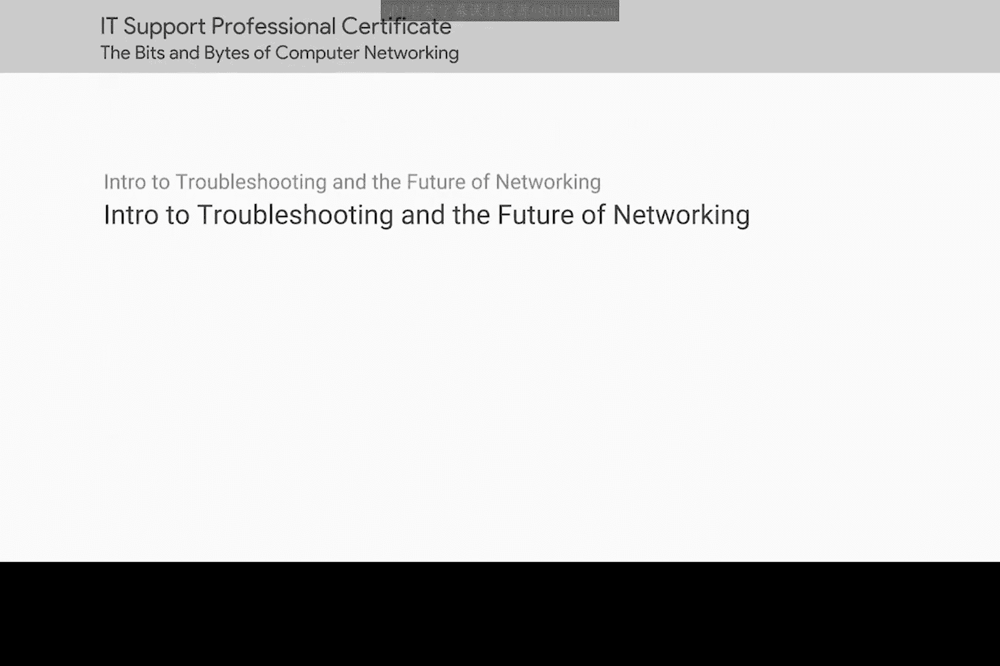
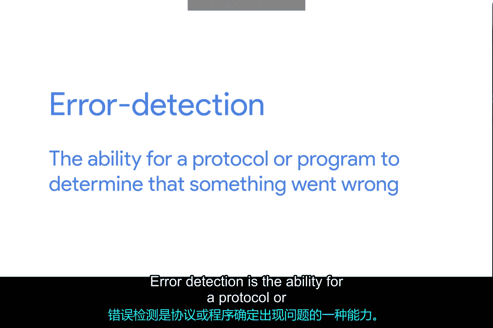
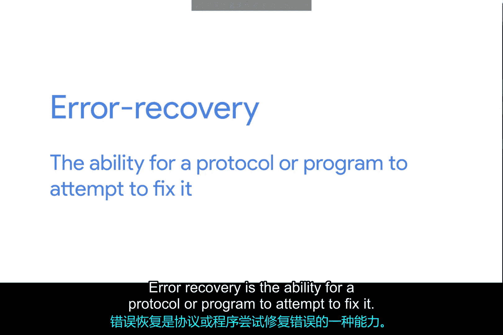
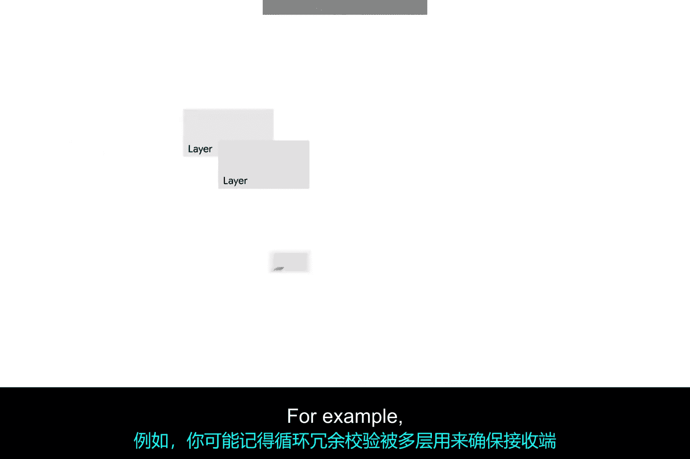
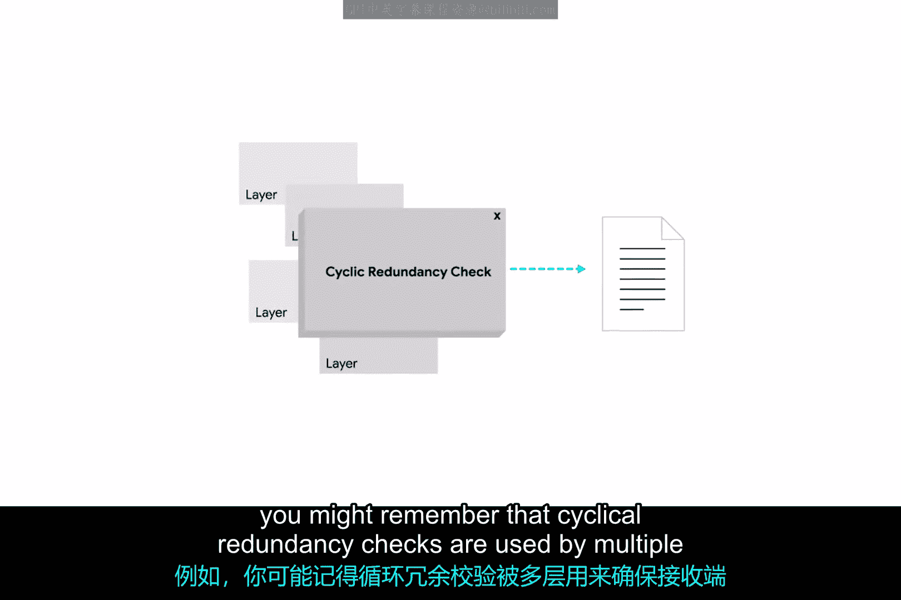

# 076：故障排除与网络未来介绍 🛠️



在本节课中，我们将学习计算机网络中故障排除的基本概念、常用工具与技术，并初步了解影响网络未来的重要技术，如云计算与IPv6。

## 概述

正如你所见，计算机网络可能极其复杂。其中涉及众多层次、协议和设备，这有时意味着事情无法正常运行。这并不令人意外。

我们已介绍的许多协议和设备都内置了功能，以帮助防范其中一些问题。这些功能被称为**错误检测**与**错误恢复**。

## 错误检测与错误恢复



上一节我们提到了网络问题的普遍性，本节中我们来看看网络协议如何应对这些问题。



*   **错误检测**是指协议或程序能够**确定**出现了问题。
*   **错误恢复**是指协议或程序能够**尝试修复**该问题。

例如，你可能记得，多个网络层都使用**循环冗余校验**来确保接收端收到了正确的数据。





**CRC校验公式（概念性描述）**：
```
发送方：对数据执行特定计算，生成CRC值，附加在数据后一同发送。
接收方：对收到的数据执行相同计算，将结果与附带的CRC值比较。
```
如果CRC值与数据载荷不匹配，数据将被丢弃。此时，传输层将决定是否需要重新发送数据。

## 故障排除的必要性与学习目标

然而，即使有所有这些防护措施，错误仍会出现。错误配置会发生，硬件会损坏，系统不兼容性也会显现。

在本模块中，你将学习作为IT支持专家在排除网络故障时最常用的技术和工具。到本模块结束时，你将能够使用三种最常见操作系统（Microsoft Windows、Mac和Linux）上的可用工具，来检测和修复许多常见的网络连接问题。

## 网络未来展望

最后，在本模块的结尾，我们将介绍一些对网络未来至关重要的概念：**云计算**与**IPv6**。

## 总结

本节课中我们一起学习了网络故障排除的核心概念——错误检测与错误恢复，明确了本模块的学习目标，即掌握跨平台的网络问题诊断与修复技能，并预告了即将探讨的、塑造网络未来的云计算与IPv6技术。