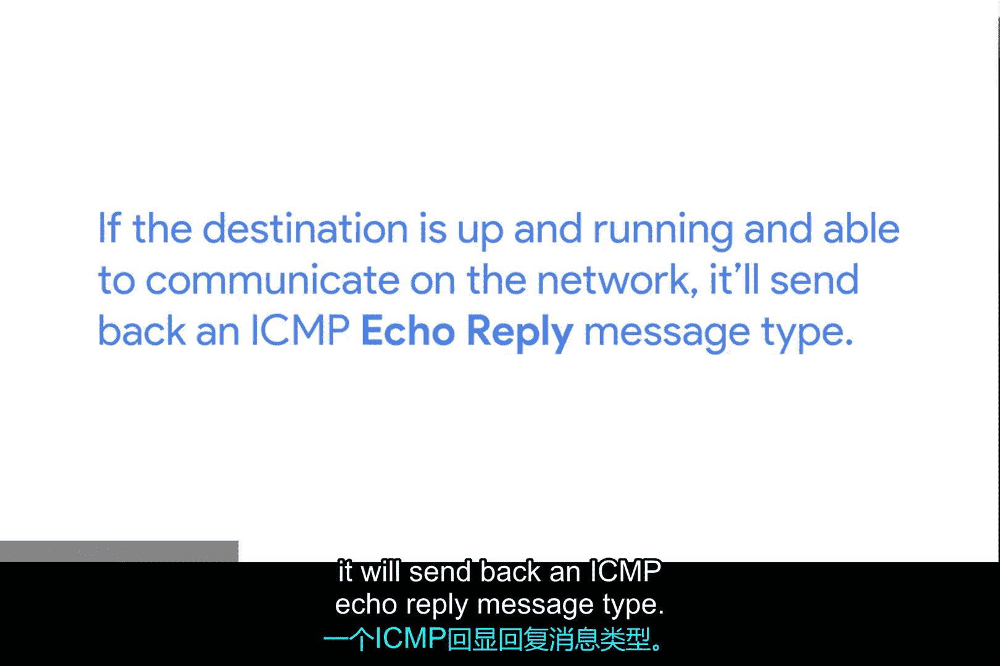
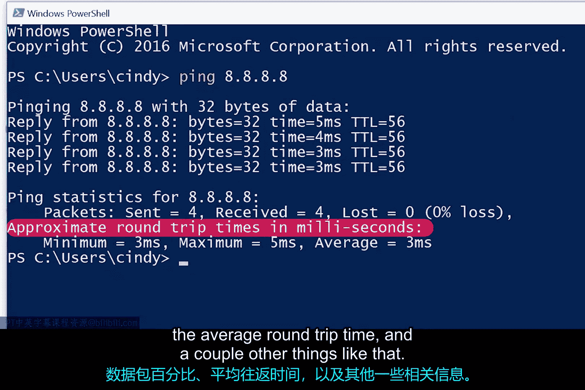
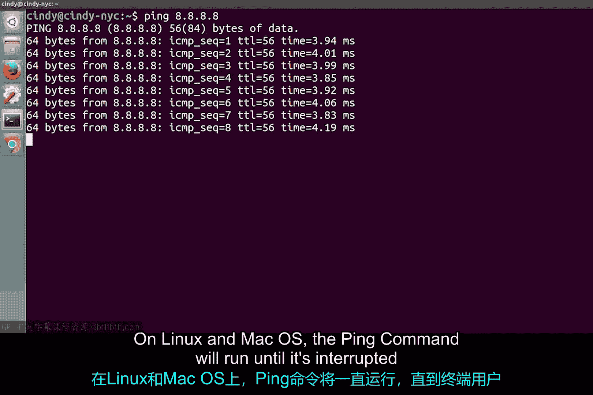
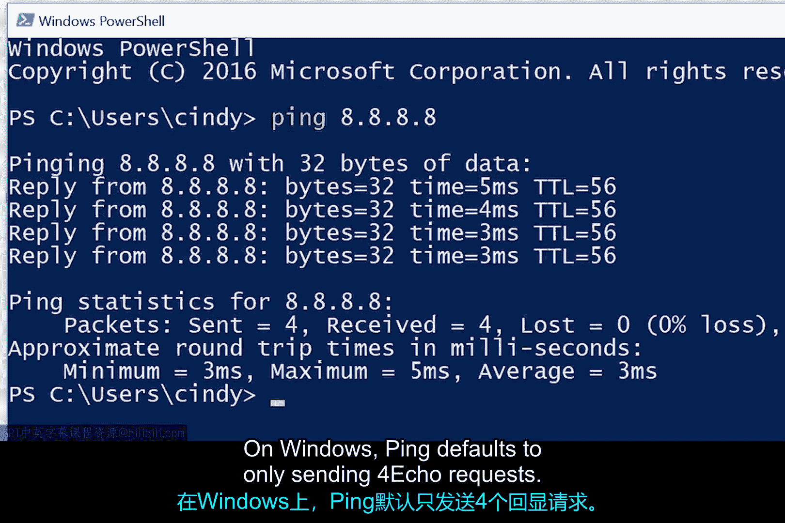

# 077：Ping与互联网控制消息协议 (ICMP) 🛠️

在本节课中，我们将要学习网络故障诊断的基础知识。当网络连接出现问题时，掌握有效的诊断工具至关重要。我们将重点介绍一个核心协议——互联网控制消息协议（ICMP），以及一个基于它的、最常用的网络连通性测试工具——Ping。

## 网络连通性问题概述

网络问题出现时，最常见的情况是无法与目标建立连接。这可能表现为完全无法访问某个服务器、网站无法加载，或者只能在局域网内访问资源而无法连接互联网。无论具体问题是什么，能够诊断连通性问题是网络故障排除的重要环节。学完本课后，你将能够使用多个重要的故障排除工具来帮助解决这些问题。

## 错误信息的传递：ICMP协议

当网络发生错误时，检测到错误的设备需要某种方式将此信息告知问题流量的源头。例如，路由器可能不知道如何路由到目的地，或者某个端口无法访问，甚至可能是IP数据报的生存时间（TTL）到期，导致不再尝试路由跳转。对于所有这些情况以及更多其他情况，都会使用**互联网控制消息协议（ICMP）**来传递这些错误信息。

ICMP主要由路由器或远程主机使用，目的是将传输失败的原因回传给传输的发起方。

## ICMP数据包结构

ICMP数据包的构成相当简单，它包含一个有几个字段的头部和一个数据部分，主机利用数据部分来查明是哪次传输引发了错误。

以下是ICMP数据包的主要字段：

*   **类型字段**：8位长，指定所传递消息的类型。例如，“目的地不可达”或“超时”。
*   **代码字段**：紧接在类型字段之后，用于提供比类型更具体的消息原因。例如，对于“目的地不可达”类型，有单独的代码表示“目的网络不可达”和“目的端口不可达”。
*   **校验和字段**：16位，其功能与我们目前介绍过的所有其他校验和字段相同。
*   **Rest of Header字段**：一个32位的字段，某些特定的类型和代码会可选地使用此字段来发送更多数据。
*   **数据载荷**：ICMP数据包的数据载荷完全是为了让消息接收方知道是他们的哪次传输导致了所报告的错误。它包含整个IP头部以及问题数据包数据载荷部分的前8个字节。

## 面向用户的ICMP工具：Ping

ICMP的初衷并非供人类直接交互，而是为了让这类错误信息能在联网计算机之间自动传递。但是，存在一个特定的工具和两种消息类型对人类操作员非常有用，这个工具就是**Ping**。

Ping几乎存在于所有操作系统中，并且历史悠久。它是一个非常简单的程序，无论你使用哪种操作系统，其基本原理都是相同的。

Ping允许你发送一种特殊的ICMP消息，称为**回显请求**。ICMP回显请求本质上就是询问目的地：“你好，你在吗？”如果目的地处于运行状态且能够在网络上通信，它将发回一个**ICMP回显应答**消息。

### 如何使用Ping命令

你可以在任何现代操作系统的命令行中调用`ping`命令。其最基本的用法是键入`ping`加上一个目标IP地址或完全限定域名。

不同操作系统的`ping`命令输出非常相似。输出的每一行通常会显示发送ICMP回显应答的地址以及往返通信所花费的时间。它还会显示剩余的TTL值以及ICMP消息的大小（以字节为单位）。命令结束后，还会显示一些统计信息，例如发送和接收的数据包百分比、平均往返时间等。

不同操作系统下Ping命令的默认行为略有不同：

*   在**Linux和Mac OS**上，`ping`命令会持续运行，直到终端用户发送中断事件（通常通过同时按下`Control`键和`C`键）来停止它。
*   在**Windows**上，`ping`命令默认只发送4个回显请求。

### Ping的高级选项

在所有环境中，`ping`都支持许多命令行标志（参数）来改变其行为，例如要发送的回显请求数量、数据包大小以及发送速度。你可以查阅所用操作系统的文档以了解更多信息。

## 课程总结

本节课中，我们一起学习了网络故障诊断的基础。我们了解了当网络通信失败时，**ICMP协议**如何负责在设备间传递错误信息。我们详细剖析了ICMP数据包的结构，包括类型、代码、校验和等字段。更重要的是，我们掌握了最实用的网络连通性测试工具——**Ping**。我们学习了它的工作原理（发送ICMP回显请求/应答），如何在命令行中使用它进行基本的连通性测试，以及不同操作系统下其默认行为的差异。理解并熟练使用Ping是每位IT支持人员诊断网络问题的第一步。