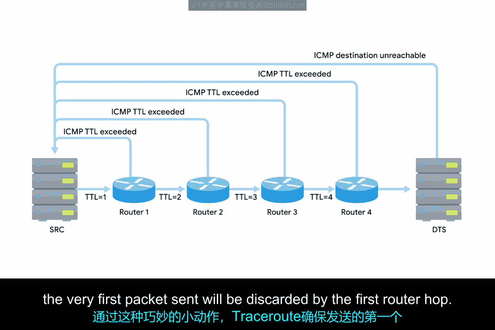
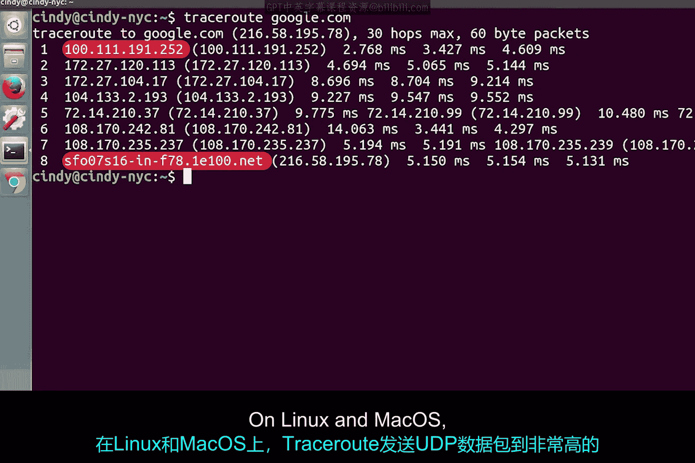
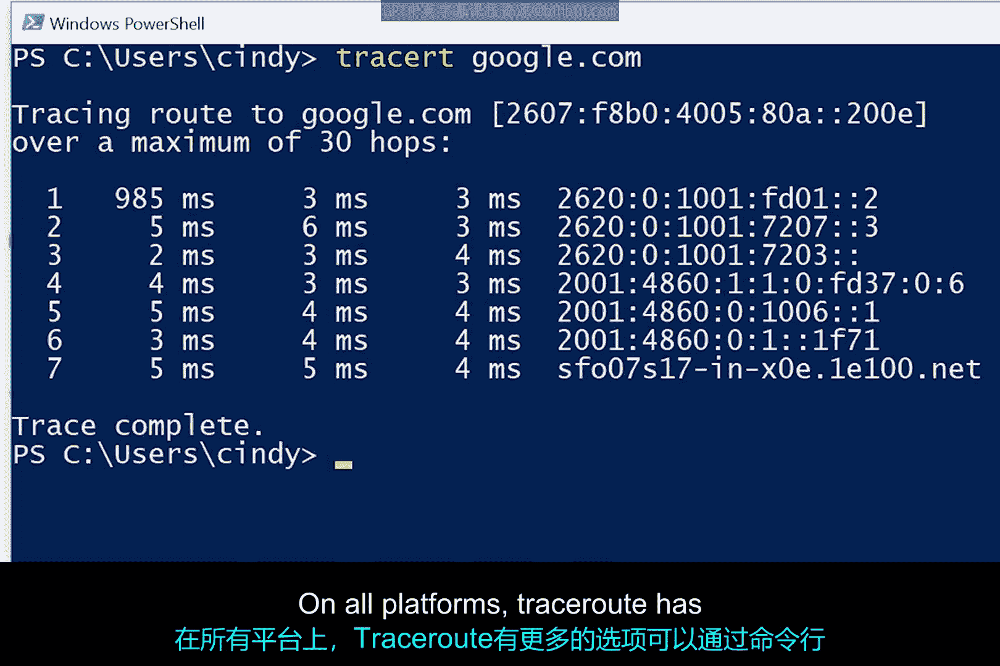

**计算机网络基础：第2课：Traceroute 命令详解 🕵️♂️**

在本节课中，我们将学习一个强大的网络诊断工具——Traceroute。它不仅能帮助我们确认两台计算机之间是否连通，还能揭示数据包在网络中传输的完整路径，并定位路径上可能出现问题的节点。

上一节我们介绍了 `ping` 命令，它可以测试网络连通性和延迟。本节中我们来看看 `traceroute` 如何提供更深入的路径信息。

**Traceroute 的工作原理**

`traceroute` 的核心原理在于巧妙地操纵 IP 数据包中的 **TTL（生存时间）** 字段。我们之前学过，数据包每经过一个路由器，其 TTL 值就会减 1。当 TTL 值减至 0 时，该数据包会被丢弃，同时路由器会向源主机发送一个 **ICMP 超时** 消息。

`traceroute` 正是利用了这一机制。它首先发送一个 TTL 设为 1 的数据包。这个数据包到达第一个路由器后，TTL 减为 0 并被丢弃，同时第一个路由器会返回 ICMP 超时消息。接着，`traceroute` 发送 TTL 设为 2 的数据包，它会到达第二个路由器后才被丢弃并返回消息。以此类推，TTL 值逐步增加。

```
数据包1: TTL=1 -> 到达第1跳路由器 -> 返回ICMP超时
数据包2: TTL=2 -> 到达第2跳路由器 -> 返回ICMP超时
数据包3: TTL=3 -> 到达第3跳路由器 -> 返回ICMP超时
...
```

这个过程会持续进行，直到数据包最终到达目标主机。对于路径上的每一跳（hop），`traceroute` 通常会发送三个相同的数据包，以获取更稳定的往返时间（RTT）数据。

**解读 Traceroute 输出结果**

`traceroute` 命令的输出格式清晰易懂。以下是输出的关键部分：

1.  **跳数**：表示这是路径上的第几个路由器。
2.  **往返时间**：显示三个数据包到达该路由器并返回的耗时（通常以毫秒为单位）。如果出现星号 `*`，表示在该次探测中没有收到响应。
3.  **设备信息**：显示该跳路由器的 IP 地址。如果 `traceroute` 能解析出其主机名，也会一并显示。



例如，一行输出可能看起来像这样：
```
3  10.0.0.1 (10.0.0.1)  5.123 ms  5.456 ms  5.789 ms
```

**不同操作系统下的命令差异**

需要注意的是，`traceroute` 命令在不同操作系统上存在一些差异：

*   **Linux 和 macOS**：命令为 `traceroute`，默认发送 **UDP** 数据包到高端口号。
*   **Windows**：命令为 `tracert`（注意缩写），默认使用 **ICMP Echo Request**（即 `ping` 使用的协议）数据包。



所有平台上的 `traceroute` 工具都支持通过命令行参数来指定更多选项。

**进阶工具：MTR 与 PathPing**



除了标准的 `traceroute`，还有两个功能更强大的类似工具：

*   **MTR**：常用于 Linux 和 macOS。它将 `ping` 和 `traceroute` 的功能结合，并**实时持续运行**，不断更新到每一跳的统计信息（如丢包率、延迟变化），便于观察网络状况随时间的变化。
*   **PathPing**：Windows 系统下的工具。它首先运行一个类似 `traceroute` 的路径发现，然后针对路径上的每个节点进行一段时间的**统计分析**（默认约50秒），最后一次性输出包含丢包率和延迟的聚合数据报告。

你可以将 MTR 理解为实时监控仪表盘，而 PathPing 则是一份详细的阶段性诊断报告。

**总结**

本节课中我们一起学习了 `traceroute` 命令。我们了解了它如何通过操纵 TTL 字段来探测网络路径，学会了解读其输出结果中的跳数、延迟和节点信息。我们还比较了它在不同操作系统（`traceroute`/`tracert`）上的区别，并介绍了更强大的长期路径监控工具 MTR 和 PathPing。掌握这些工具，将极大地提升你诊断和排查网络路径问题的能力。