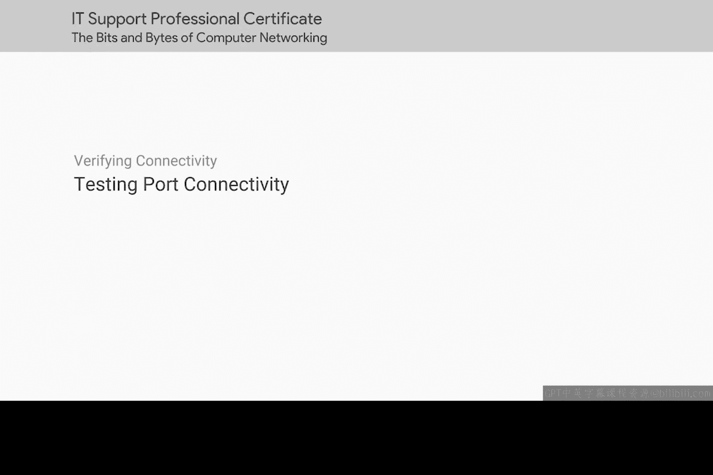
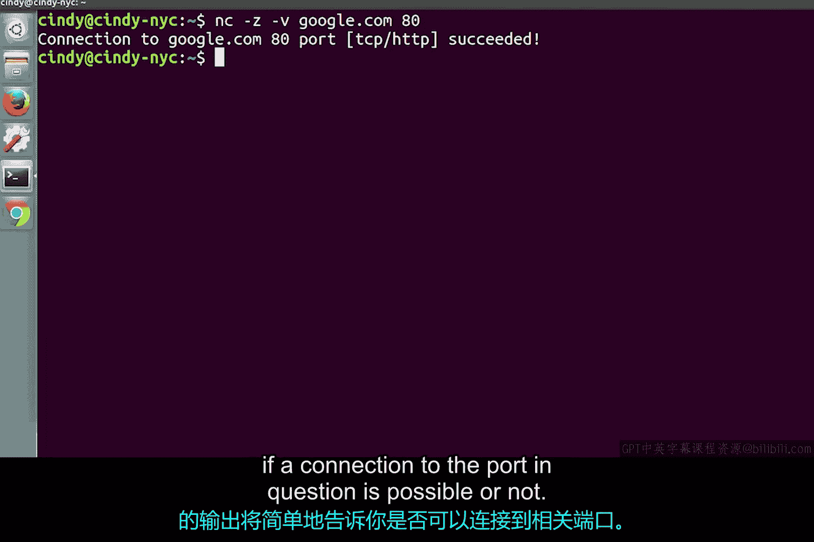
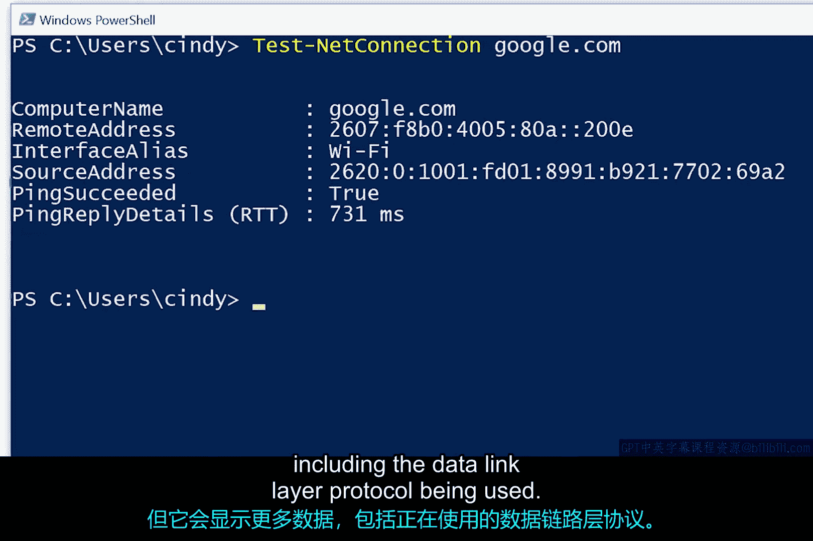

# 079：测试端口连通性 🖧



在本节课中，我们将学习如何测试传输层的连通性。之前我们已经介绍了在网络层测试机器间连通性的多种方法，本节中我们来看看如何检查特定端口是否开放并可访问。

## 传输层连通性测试工具概述

有时，你需要知道网络连接在传输层是否正常工作。为此，你可以使用两个功能强大的工具：在Linux和Mac OS上的Netcat，以及在Windows上的Test-NetConnection。

## 使用Netcat测试端口

Netcat工具可以通过命令 `nc` 运行，它需要两个必需参数：主机和端口。

以下是Netcat的基本用法：
```bash
nc google.com 80
```
此命令会尝试在端口80上连接到google.com。如果连接失败，命令将退出；如果成功，你将看到一个闪烁的光标，等待你从键盘输入更多数据。这实际上是一种让你向监听服务发送应用层数据的方式。

如果你只关心某个端口的状态，可以使用 `-z` 标志（代表零输入/输出模式）和 `-v` 标志（代表详细输出）来执行命令。详细输出使命令的输出对人类更友好，而非详细输出则更适合在脚本中使用。

以下是带标志的命令示例：
```bash
nc -zv google.com 80
```
通过使用 `-z` 和 `-v` 标志，命令的输出将简单地告诉你是否可以连接到指定的端口。

## 在Windows上使用Test-NetConnection

在Windows系统上，`Test-NetConnection` 命令提供了一些类似的功能。



如果你只指定主机来运行 `Test-NetConnection`，它将默认使用ICMP Echo请求，类似于 `ping` 程序，但会显示更多的数据，包括所使用的数据链路层协议。

当你使用 `-Port` 标志执行 `Test-NetConnection` 时，可以要求它测试到特定端口的连通性。

以下是测试特定端口的命令示例：
```powershell
Test-NetConnection google.com -Port 80
```



## 工具的强大功能与深入学习

需要指出的是，Netcat和Test-NetConnection的功能远比我们这里介绍的简单端口连通性测试示例要强大得多。事实上，它们是如此复杂的工具，要在一个视频中涵盖其所有功能是不现实的。

你应该阅读相关资料，了解这些超级强大的工具还能做些什么。我们在补充阅读材料中提供了一些链接。在你阅读完这些材料后，我们将进行一个小测验。

## 总结

本节课中我们一起学习了如何测试传输层的端口连通性。我们介绍了在Linux/Mac上使用Netcat（`nc`）命令，以及在Windows上使用Test-NetConnection命令来检查特定端口是否开放。这两个工具的功能非常丰富，建议你通过补充材料进一步探索。