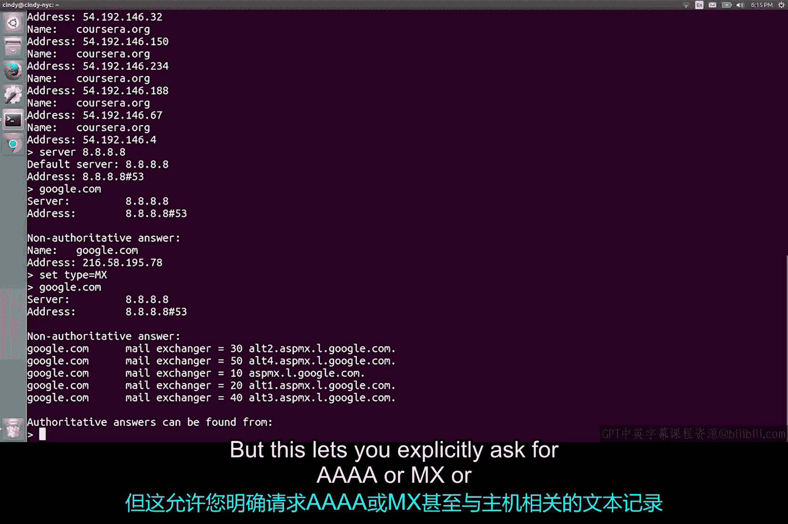

# 080：域名解析工具 🔍


在本节课中，我们将学习域名解析的基本概念，并重点介绍一个名为 `nslookup` 的命令行工具。域名解析是互联网工作的核心环节之一，理解其原理和掌握相关工具对于IT支持专家至关重要。

## 域名解析概述

域名解析是互联网运行的重要组成部分。大多数时候，您的操作系统会为您处理所有查询。但作为一名IT支持专家，有时亲自运行这些查询会很有用，这样您就能确切地看到幕后发生的情况。

幸运的是，有许多不同的命令行工具可以帮助您完成这项任务。

## 常用工具：nslookup

最常见的工具是 `nslookup`，它在我们讨论过的三种操作系统（Linux、Mac 和 Windows）上均可使用。

`nslookup` 的基本用法非常简单：执行 `nslookup` 命令，后跟主机名。输出将显示用于执行请求的服务器以及解析结果。

例如，如果您需要知道 `twitter.com` 的 IP 地址，只需输入：
```bash
nslookup twitter.com
```
系统将返回对应的 **A 记录**。

## 交互模式

`nslookup` 的功能远不止于此。它包含一个交互模式，允许您设置额外选项并连续运行多个查询。

要启动交互式 `nslookup` 会话，只需输入 `nslookup` 命令，后面不跟任何主机名。您应该会看到一个尖括号 `>` 作为提示符。

在交互模式下，您可以连续发出多个请求，还可以进行一些额外配置，以帮助进行更深入的故障排除。

以下是交互模式下的一些关键操作：

*   **指定查询服务器**：在交互模式下，如果您输入 `server` 后跟一个地址，那么所有后续的域名解析查询都将尝试使用该服务器，而不是默认的域名服务器。
*   **设置查询记录类型**：您也可以输入 `set type=`，后跟一个资源记录类型。默认情况下，`nslookup` 会返回 **A 记录**，但此命令允许您明确请求与主机关联的 **AAAA**、**MX** 甚至 **TXT** 记录。

## 调试模式



如果您真想确切地了解发生了什么，可以输入 `set debug`。这将允许工具显示完整的响应数据包，包括任何中间请求及其全部内容。

**警告**：这会输出大量数据，可能包含诸如缓存响应的剩余 **TTL（生存时间）**，乃至请求所针对的区域文件的序列号等详细信息。

## 总结

本节课中，我们一起学习了域名解析的重要性，并深入探讨了 `nslookup` 这一强大工具。我们了解了其基本用法、如何进入交互模式以进行连续查询和配置，以及如何使用调试模式来获取最详细的解析过程信息。掌握这些技能将帮助您更好地诊断和解决网络连接问题。