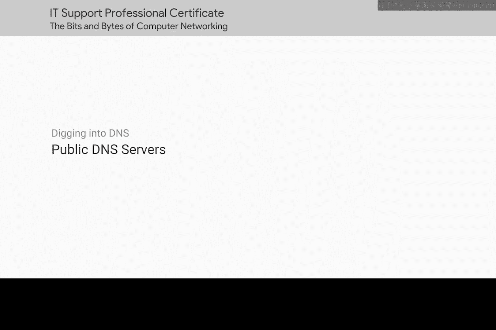
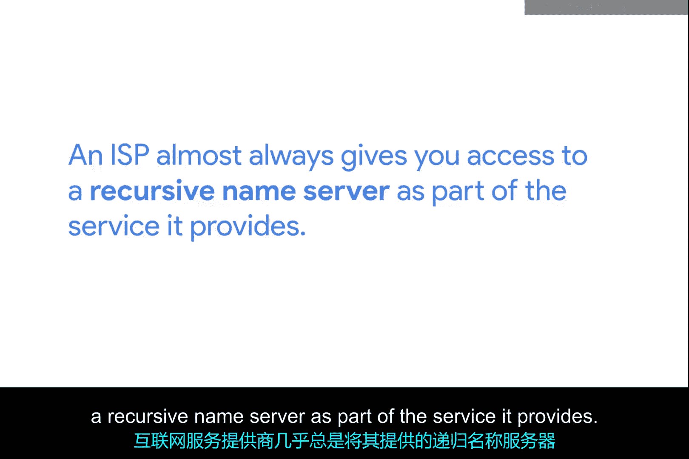
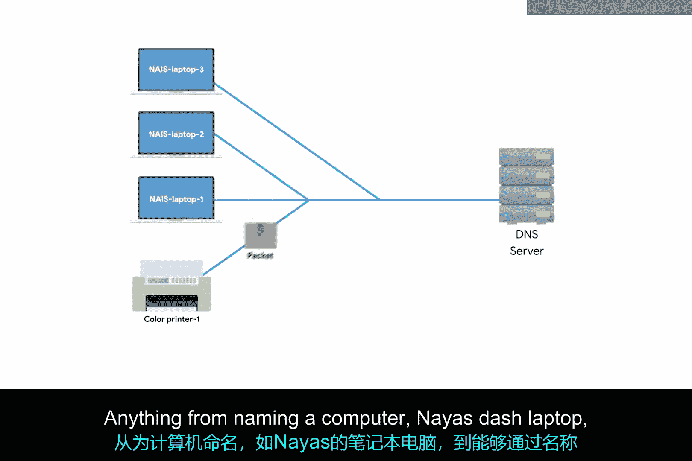
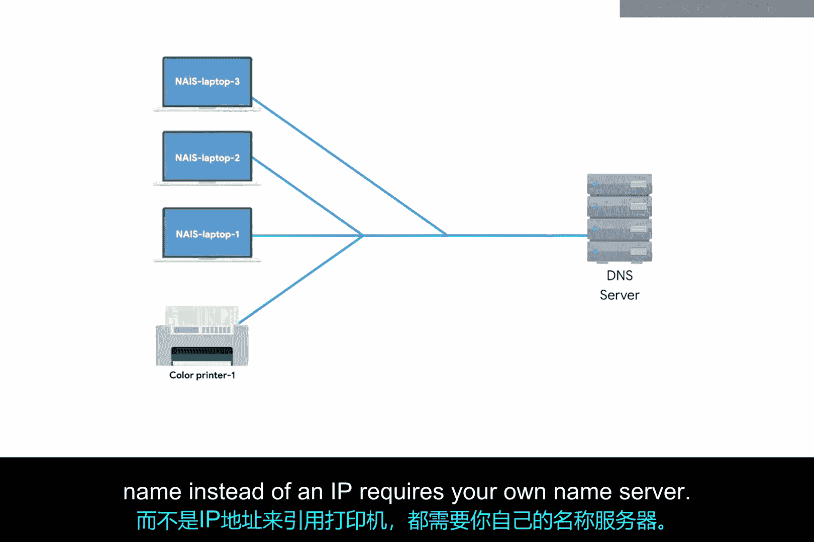
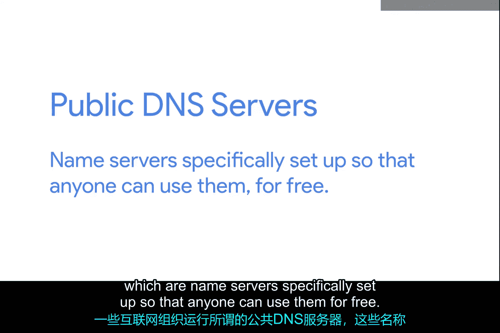
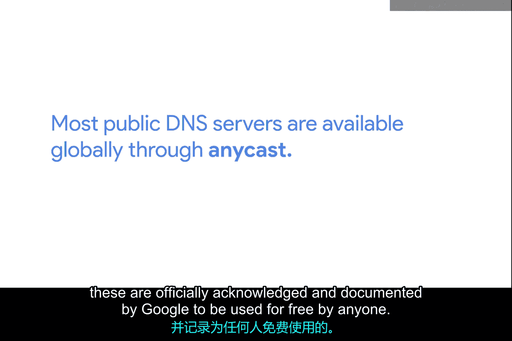
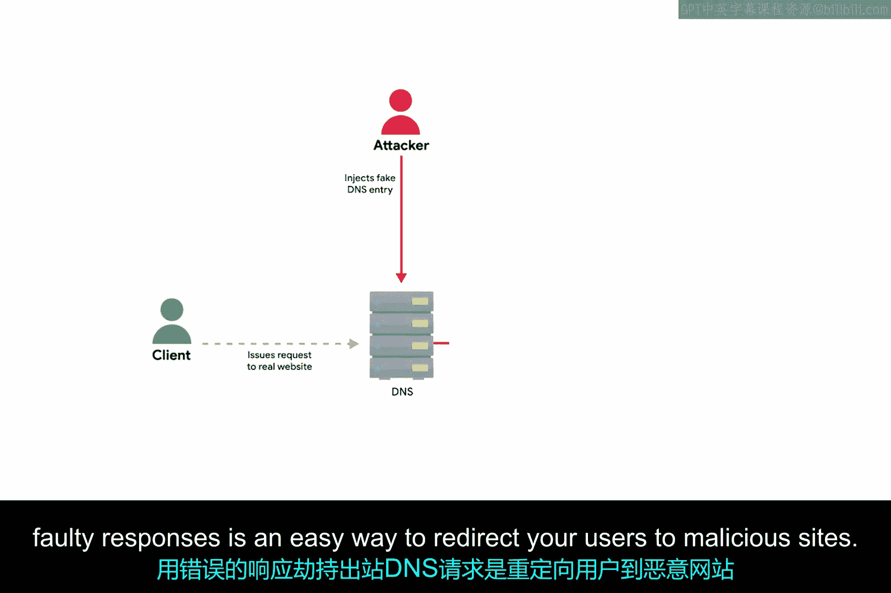
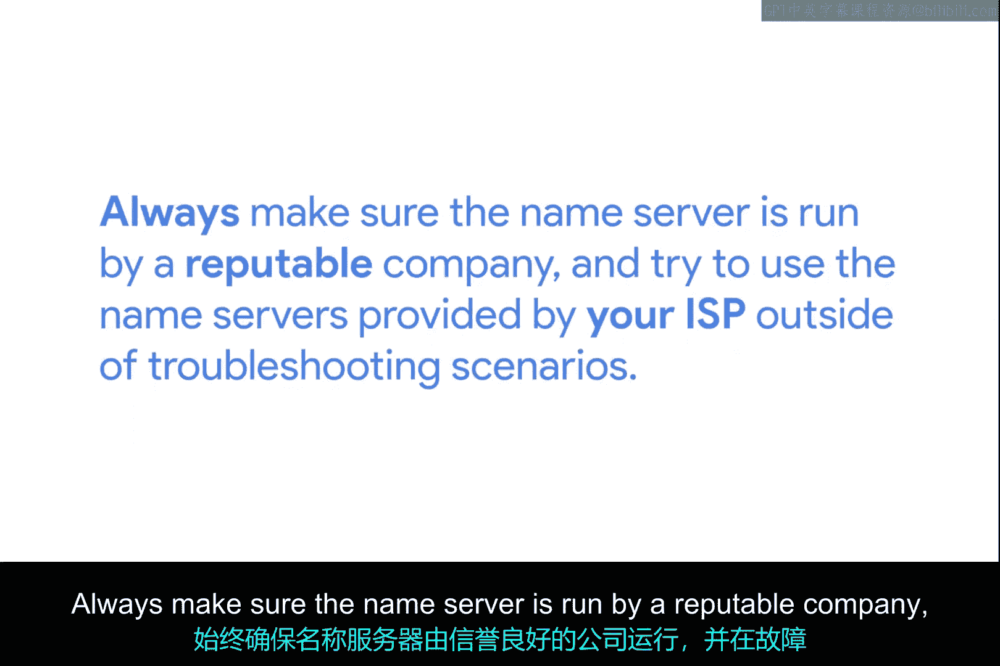
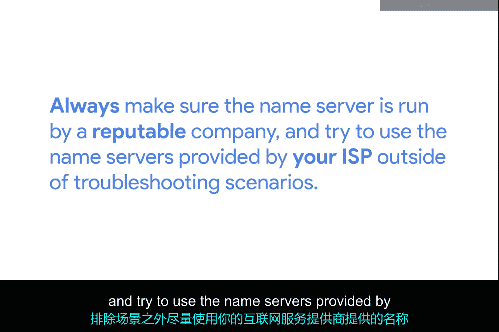

# 081：公共DNS服务器 🖧

在本节课中，我们将要学习公共DNS服务器的概念、用途以及如何安全地使用它们。DNS是网络功能正常的重要组成部分，了解其替代方案对于故障排除和网络建设至关重要。

## 功能正常的DNS的重要性

拥有功能正常的DNS是网络正常运行的重要部分。互联网服务提供商（ISP）几乎总是会为您提供递归域名服务器作为其服务的一部分。在大多数情况下，这些域名服务器是您的计算机与互联网上其他设备通信所需的全部。

## 企业内部的DNS需求

上一节我们介绍了ISP提供的DNS，本节中我们来看看企业内部的DNS需求。大多数企业也会运行自己的DNS服务器。至少，这需要用于解析内部主机的名称。从为笔记本电脑命名到能够通过名称而非IP地址来引用打印机，任何操作都需要您自己的域名服务器。

## 第三方DNS服务提供商

除了ISP和企业自建，第三种选择是使用DNS服务提供商，这种方式正变得越来越流行。别担心，我们将在后续课程中更详细地介绍这个概念。

## 测试DNS功能与备用方案

无论您的网络上使用哪种DNS服务模式，在怀疑DNS工作不正常时，有一种测试DNS功能的方法都是非常有用的。在您自己的DNS出现问题时，拥有一个备用DNS选项也极其有用。您甚至可能处于构建新网络的早期阶段，即使您计划最终拥有自己的域名服务器，它也可能尚未准备就绪。

以下是使用备用DNS的几种情况：
*   测试DNS功能是否正常。
*   作为主DNS故障时的备用方案。
*   在新网络建设初期，自建DNS服务器尚未就绪时。

## 公共DNS服务器简介

一些互联网组织运行所谓的公共DNS服务器，这些是专门设置的域名服务器，任何人都可以免费使用。

## 公共DNS服务器的用途与历史

使用这些公共DNS服务器是排除您可能遇到的任何名称解析问题的便捷技术。有些人甚至将所有解析需求都依赖于这些域名服务器。长期以来，公共DNS服务器是一种在系统管理员之间口口相传的“部落知识”。

在系统管理员传说中，多年来最常用的公共DNS服务器是由Level 3 Communications运行的，它是世界上最大的ISP之一。事实上，Level 3规模如此之大，其主要业务是向其他直接面向消费者的ISP销售其网络连接，而不是自己处理最终用户。

Level 3公共DNS服务器的IP地址是 `4.2.2.1` 到 `4.2.2.6`。这些IP地址很容易记住，但它们一直笼罩在神秘之中。虽然它们已向公众开放使用了近20年，但这并不是Level 3官方承认或宣传的服务。原因我们可能永远无法知晓，这是我们古老系统管理员传说中的一个巨大谜团。

## 其他知名的公共DNS选项

另一个容易记住的选择是谷歌公共DNS的IP地址。谷歌在IP地址 `8.8.8.8` 和 `8.8.4.4` 上运营公共域名服务器。与Level 3的IP地址不同，这些是谷歌官方承认并记录在案的，可供任何人免费使用。大多数公共DNS服务器都通过任播在全球范围内可用。许多其他组织也提供公共DNS服务器，但很少有像这两个选项那样容易记住的。😊

## 使用公共DNS的安全注意事项

在将您的任何设备配置为使用此类域名服务器之前，请务必做好研究。通过错误的响应劫持出站DNS请求，是重定向您的用户到恶意网站的简单方法。

## 选择与使用建议

务必确保域名服务器由信誉良好的公司运营，并且在非故障排除场景下，尽量使用您的ISP提供的域名服务器。大多数公共DNS服务器也会响应ICMP Echo请求，因此它们是使用 `ping` 命令测试一般互联网连接的绝佳选择。😊

## 总结

本节课中我们一起学习了公共DNS服务器。我们了解了它们作为ISP和企业自建DNS的补充或替代方案的角色，探讨了它们在故障排除、备用方案和网络建设初期的用途。我们介绍了历史上著名的Level 3 DNS和目前广泛使用的Google Public DNS，并重点强调了在选择和使用公共DNS时，必须注意安全风险，优先选择信誉良好的服务商。记住，在常规情况下，使用ISP提供的DNS通常是更安全、更可靠的选择。