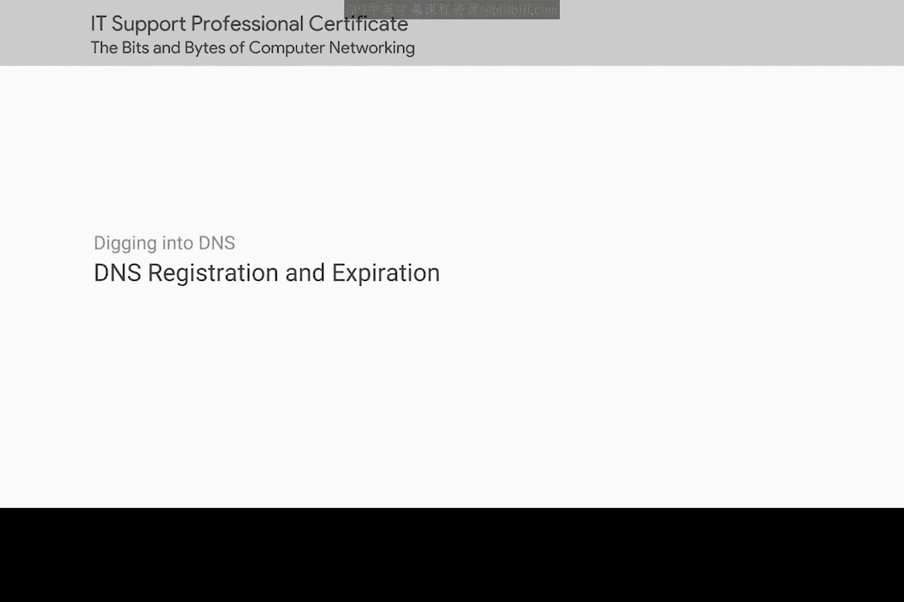
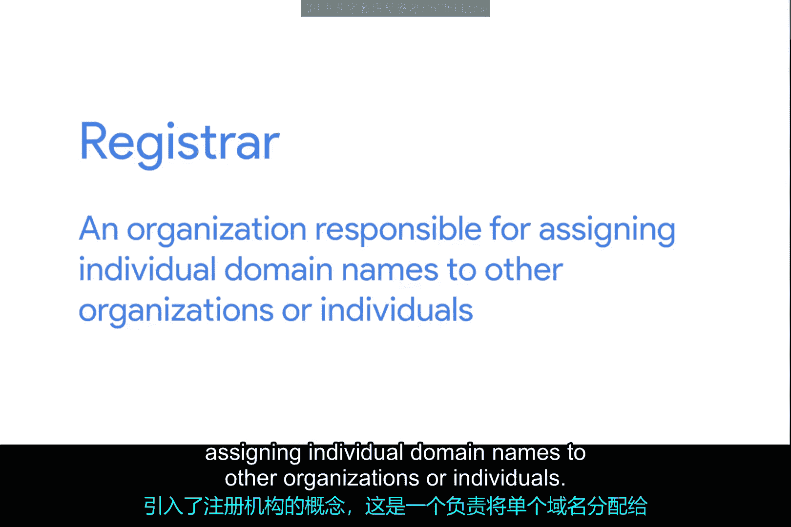
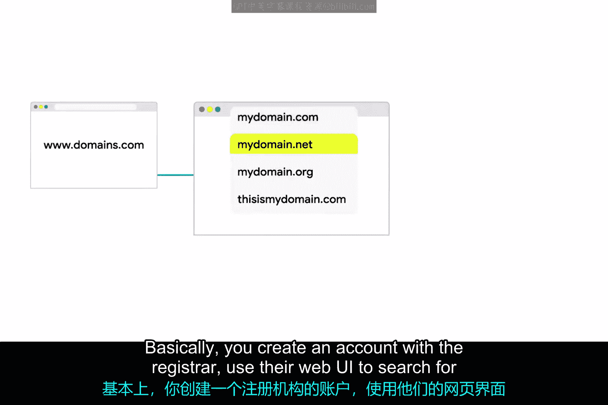
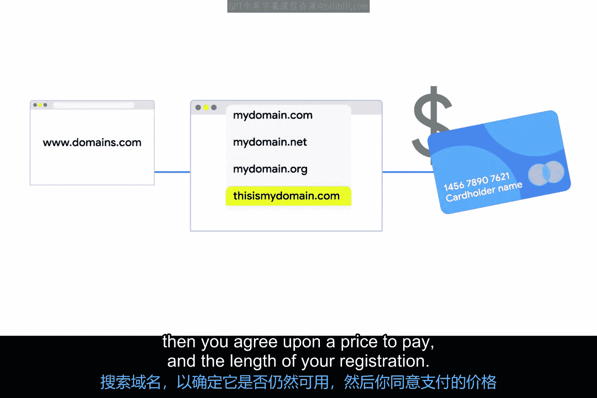
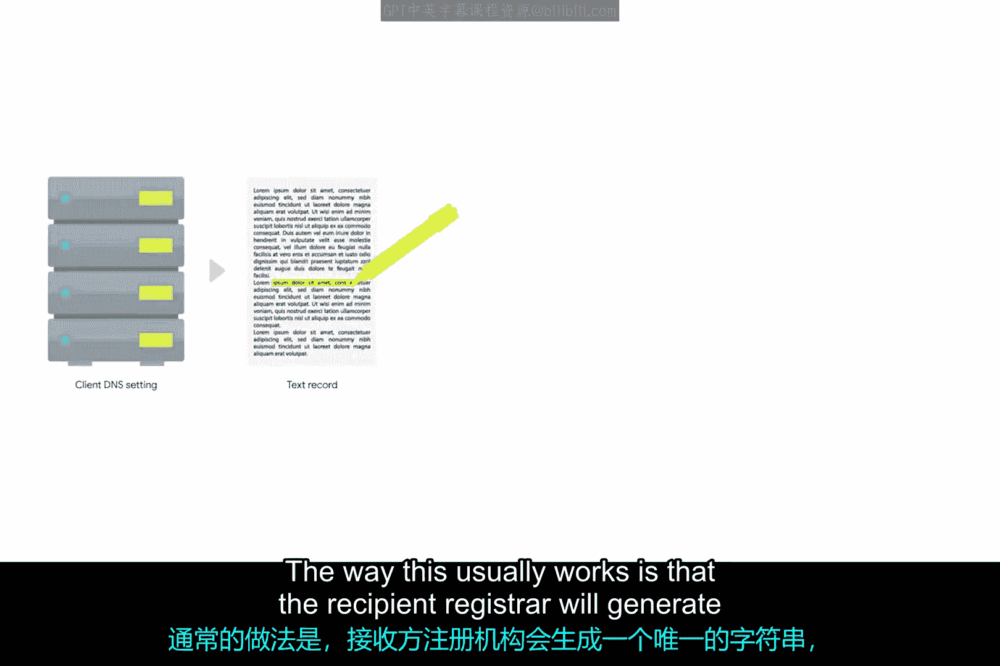
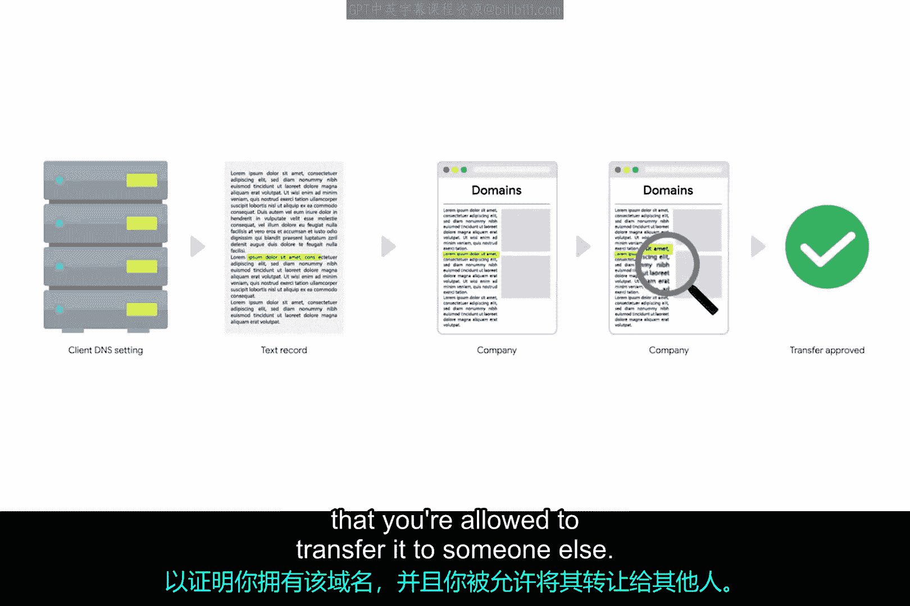

# 082：DNS注册与过期 🏷️

在本节课中，我们将要学习域名系统（DNS）中关于域名注册与过期的核心知识。我们将了解域名如何在全球范围内被唯一分配、注册商的作用、域名转移的流程，以及域名所有权的时间限制。

---

## 域名系统的全球性与唯一性 🌐

上一节我们介绍了DNS的分层管理结构。本节中我们来看看域名如何在全球系统中保持唯一性。

DNS是一个全球性的系统，由ICANN在顶层进行分级管理。域名必须具有全球唯一性，这样的全球系统才能正常工作。不能让任何人随意决定使用任何域名，否则会导致混乱。

---

## 注册商的概念与演变 🏢

为了解决域名分配问题，引入了注册商的概念。

注册商是一个负责向其他组织或个人分配单个域名的机构。最初，只有少数几家注册商，其中最著名的是Network Solutions Inc.公司。它负责注册几乎所有非国家特定的域名。

随着互联网的普及，该领域最终产生了足够的市场需求以引入竞争。最终，美国政府与Network Solutions Inc.达成协议，允许其他公司也销售域名。如今，全球有数百家这样的公司。

---

## 如何注册域名 📝

以下是注册一个域名的基本步骤，这个过程相当简单。

1.  在注册商处创建一个账户。
2.  使用其网页界面搜索一个域名，以确定它是否仍可用。
3.  商定支付价格和注册时长。

一旦你拥有了域名，你可以选择让注册商的名称服务器充当该域的权威名称服务器，也可以配置你自己的服务器作为权威服务器。

---

## 域名的转移流程 🔄

域名也可以由一方转移给另一方，或从一个注册商转移到另一个注册商。

以下是域名转移的典型工作流程。

1.  接收方注册商会生成一个唯一的字符串，以证明你拥有该域名并且有权将其转移给他人。
2.  你配置你的DNS设置，在一个特定的记录（通常是一个TXT记录）中包含这个字符串。
3.  一旦此信息完成传播，就可以确认你既拥有该域名，也批准了其转移。
4.  之后，所有权将转移到新的所有者或注册商。

---

## 域名注册的有效期与过期 ⏳

域名注册的一个重要部分是，这些注册只在一段固定的时间内有效。

你通常需要支付费用来注册域名一定的年限。密切关注你的域名可能何时过期非常重要，因为一旦过期，它们就会被释放，任何人都可以注册它们。

---

本节课中我们一起学习了域名注册与过期的全过程。我们了解了域名必须保持全球唯一性，注册商在其中扮演着分配和管理者的角色。我们掌握了注册、转移域名的具体步骤，并认识到域名所有权具有时效性，必须及时续费以维持所有权。理解这些概念对于管理和维护网络资产至关重要。