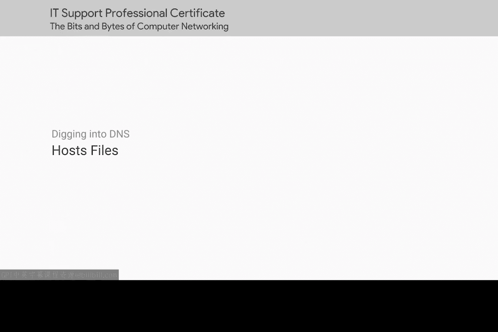
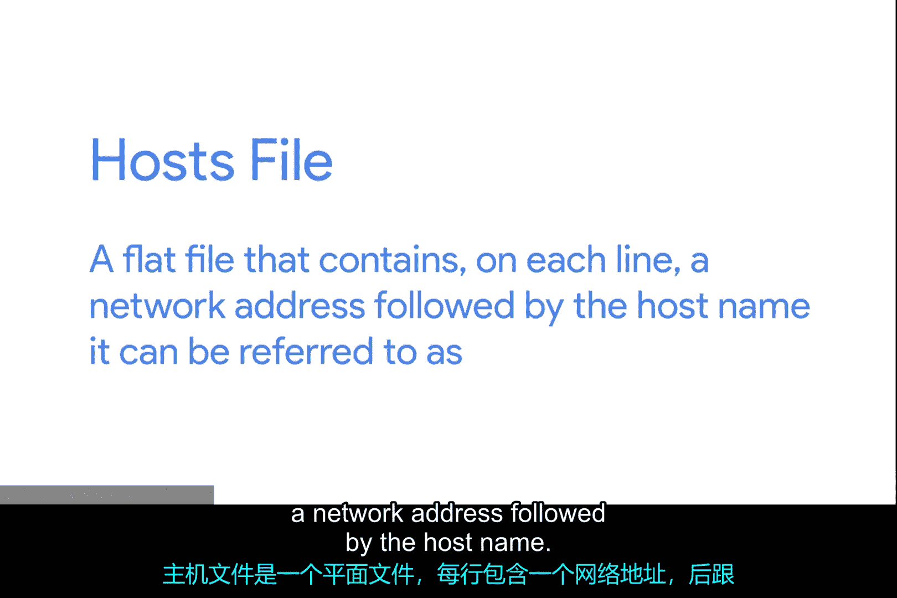
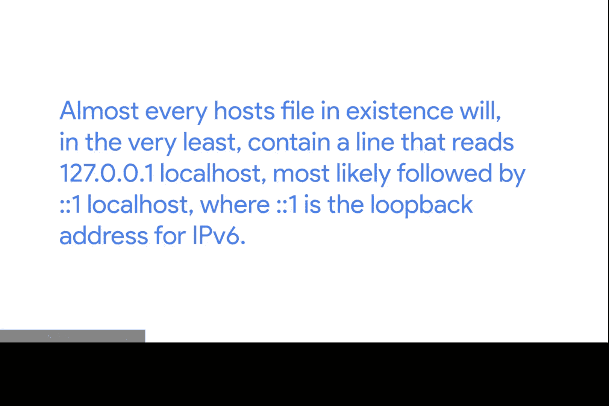

# 083：主机文件 📁



在本节课中，我们将要学习一个在DNS技术普及之前，用于将网络地址与易记名称关联起来的基础技术——主机文件。我们将了解它的工作原理、历史作用以及在现代计算环境中的遗留用途。

## 主机文件的起源


上一节我们介绍了计算机通信需要IP地址，但人类更擅长记忆单词。在DNS技术确立并全球可用之前很久，计算机操作员就清楚地认识到，他们需要一个基于语言的系统来指代网络设备。

人类更擅长记忆描述性词语，而数字则代表了计算机思考和通信的自然方式。将数字化的网络地址与词语关联起来的原始方法就是通过主机文件。



## 什么是主机文件？

主机文件是一个纯文本文件，其中每一行都包含一个网络地址，后跟可以指代该地址的主机名。

以下是一个主机文件条目的示例：
```
1.2.3.4 web_server
```
这意味着，在存放此主机文件的计算机上，用户可以使用 `web_server` 来指代IP地址 `1.2.3.4`。

主机文件由操作系统本身的网络协议栈进行评估。这意味着，只要在此处添加一个条目，就会在你可能引用网络地址的任何地方生效。沿用我们之前的例子，用户可以在网页浏览器的地址栏中输入 `web_server`，或者发出 `ping web_server` 命令，这两种情况它都会被解析为 `1.2.3.4`。

## 主机文件的现代存在与回环地址

主机文件可能是古老的技术，但它们一直沿用至今。所有现代操作系统，包括驱动我们手机和平板电脑的系统，仍然拥有主机文件。


其中一个原因涉及到一个我们尚未介绍的特殊IP地址：**回环地址**。

*   回环地址总是指向自身。因此，回环地址是一种将网络流量发送给自己的方式。
*   发送到回环地址的流量会绕过所有网络基础设施本身，此类流量永远不会离开本节点。

IPv4的回环IP是 `127.0.0.1`。时至今日，它仍然通过主机文件中的一个条目在每个现代操作系统中进行配置。几乎所有现存的主机文件至少都会包含这样一行：
```
127.0.0.1 localhost
```
其后很可能还跟着 `::1 localhost`，其中 `::1` 是IPv6的回环地址。



## 主机文件的当前用途与风险

既然DNS无处不在，主机文件已经不太常用了。但它们仍然存在，并且了解它们仍然很重要。有些软件甚至需要主机文件中有特定的条目才能正常运行，尽管这种做法可能看起来有些过时。

最后，主机文件是计算机病毒干扰和重定向用户流量的常用手段。如今使用主机文件并不是一个好主意，但它们在IT支持中确实有一些有用的故障排除用途。


在几乎所有主流操作系统上，都会在尝试DNS解析之前先检查主机文件。这允许你强制让单台计算机认为某个域名始终指向一个特定的IP。

## 课程总结

本节课中我们一起学习了主机文件。我们了解到，在DNS出现之前，主机文件是映射主机名和IP地址的关键工具。它通过纯文本文件实现映射，由操作系统直接读取。虽然现在主要被DNS取代，但主机文件仍然存在，主要用于定义本地回环地址（`127.0.0.1` 指向 `localhost`），进行本地测试、软件配置或临时的网络故障排除。同时，我们也认识到它可能被恶意软件利用，因此需要谨慎对待。

我们已经涵盖了很多内容，如果需要，请花时间回顾，确保理解我们所讨论的概念。接下来是一个小测验。