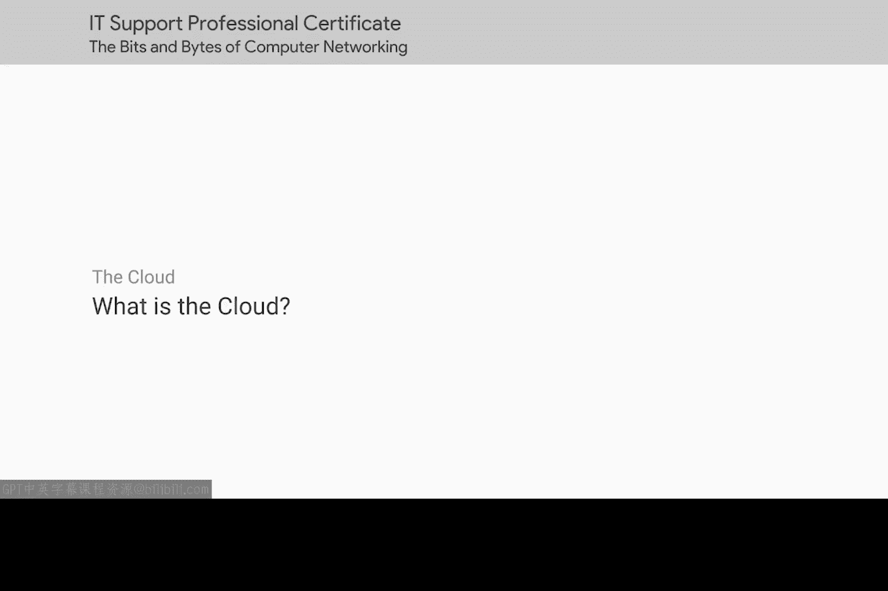
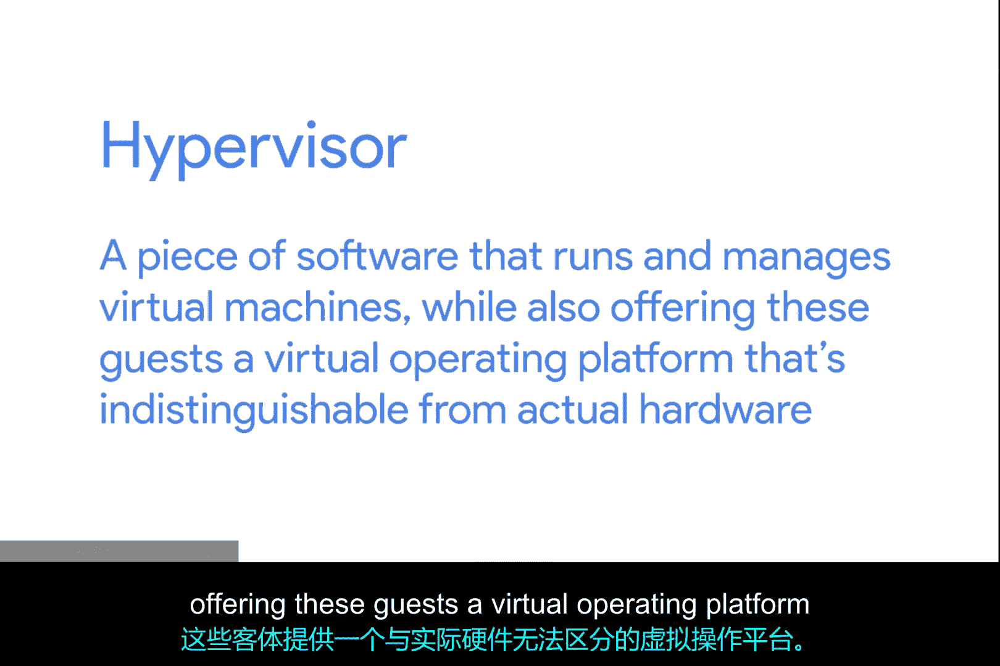
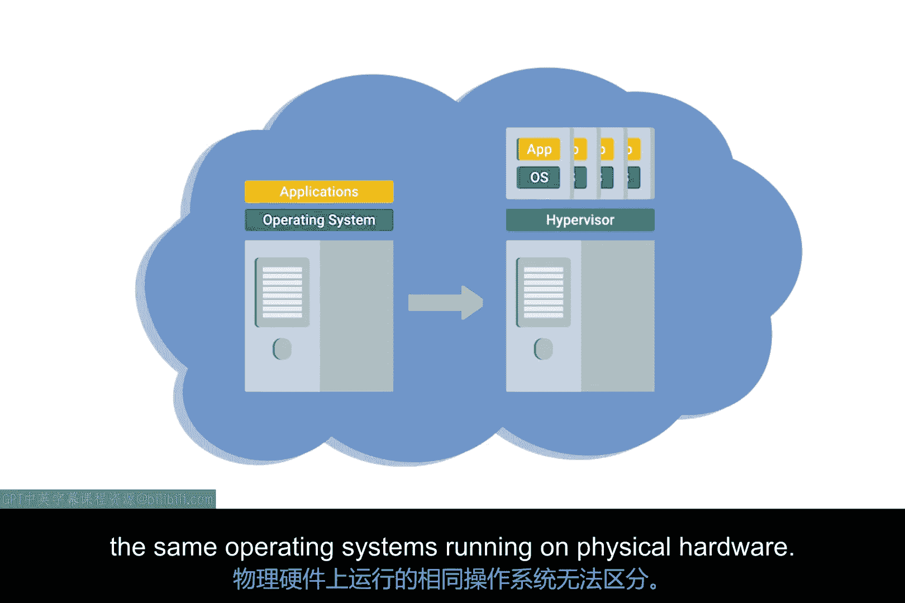
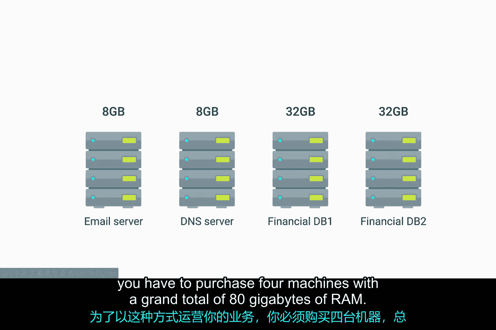
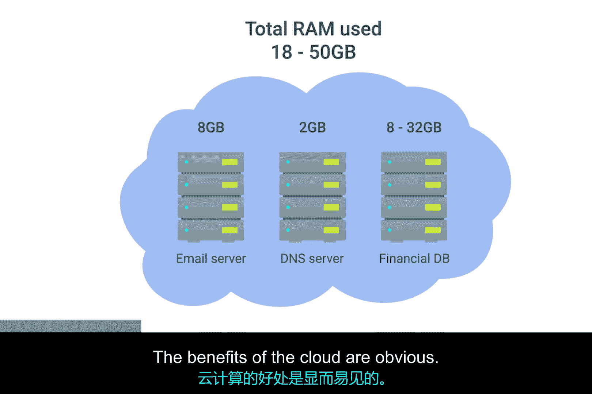
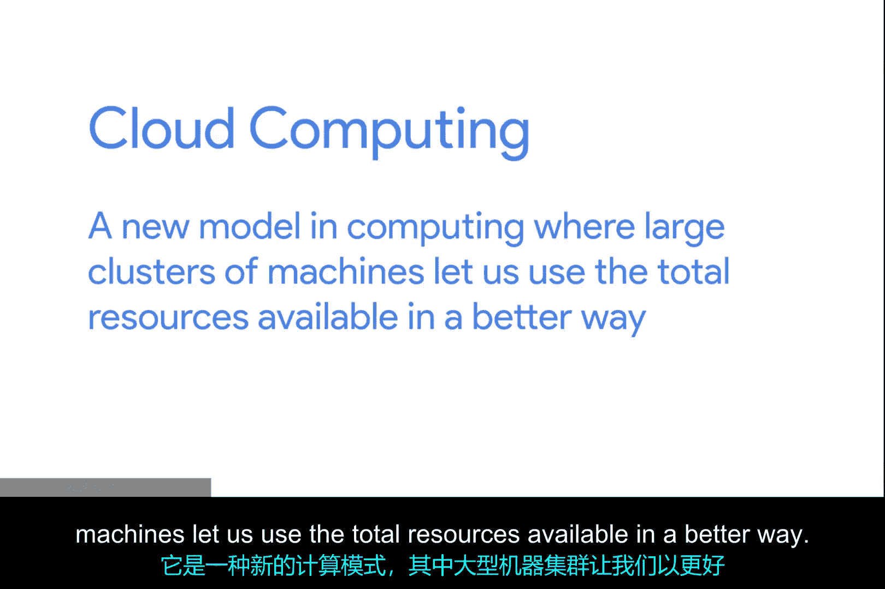

# 084：什么是云 ☁️



在本节课中，我们将要学习“云”这一核心概念。云是当今IT领域的热门话题，理解它的本质对于IT支持专家至关重要。我们将从基本定义出发，逐步探讨其背后的技术原理、不同类型以及实际应用场景。

## 什么是云？

你可能越来越多地听到人们谈论“云”。有公有云、私有云、混合云，甚至还有雨云（不过后者与此无关）。你还会听到云客户端、云存储和云服务器等术语。报纸头条和电视广告中也常提及云。人们说云是未来，IT支持专家确实需要跟上最新的技术创新以提供支持。

但云究竟是什么？事实上，云并非单一的技术、发明或任何有形之物。它只是一个概念，套用另一个关于云的玩笑话来说，这个概念本身也相当模糊。“云”这个术语被用来指代如此难以定义的事物，这本身就很贴切。

## 云计算的核心概念

基本上，**云计算**是一种技术方法，它以便于共享的方式提供计算资源，让众多用户能在需要时获取所需资源。这种方法在很大程度上依赖于公司之间利用这些共享资源相互提供服务。

云计算的核心是一种被称为**硬件虚拟化**的技术。硬件虚拟化是理解云计算技术如何工作的核心概念。它允许物理机器和逻辑机器的概念彼此分离。通过虚拟化，一台被称为**主机**的物理机器可以运行多个独立的**客户机**虚拟实例。



操作系统期望能够以特定方式与底层硬件通信。硬件虚拟化平台使用一种名为**管理程序**的软件。**管理程序**是一种运行和管理虚拟机的软件，同时为这些客户机提供一个与真实硬件无异的虚拟操作平台。



**公式/代码示例：**
```
物理主机 (Host) -> 管理程序 (Hypervisor) -> 多个虚拟客户机 (Guest VMs)
```

## 虚拟化如何工作

通过虚拟化，一台物理计算机可以作为许多独立虚拟实例的主机。每个虚拟实例运行自己独立的操作系统，并且在许多方面与运行在物理硬件上的相同操作系统没有区别。

上一节我们介绍了虚拟化的基本概念，本节中我们来看看云如何在此基础上更进一步。

## 从虚拟化到云

云将这一概念又推进了一步。如果你构建一个由大量互连机器组成的庞大集群，这些机器都能作为许多虚拟客户机的主机，那么你就得到了一个可以在所有实例之间共享资源的系统。

让我们用一个更实际的方式来解释。假设你需要四台服务器。
*   首先，你需要一台电子邮件服务器。经过仔细分析，你预计这台机器需要8GB内存才能正常运行。
*   接下来，你需要一台域名服务器。这台域名服务器几乎不需要任何资源，因为它不需要执行任何真正的计算任务。但它不能和你的电子邮件服务器运行在同一台物理机器上，因为你的邮件服务器需要运行Windows，而域名服务器需要运行Linux。你的硬件供应商销售的最小服务器配置是8GB内存的机器，因此你不得不购买另一台相同规格的机器。
*   最后，你有一个财务数据库。这个数据库在平时相当安静，正常操作时不需要太多资源，但为了让你的月末结算流程能及时完成，你确定这台机器需要32GB内存。它必须运行在一个专为该数据库设计的特殊Linux版本上，因此域名服务器也不能运行在这台机器上。所以你订购了一台具有那么大内存的服务器，以及另一台相同规格的服务器作为备份。



为了以这种方式运营业务，你必须购买四台机器，内存总量高达80GB。这看起来相当不合理，因为很可能在同一时间只会用到其中总共40GB的内存。在大部分月份里，你使用的资源要少得多。这是将大量资金花在了你永远不会或很少会使用的资源上。

## 云解决方案的优势

所以，让我们忘掉那个模型。相反，想象一个由互连服务器组成的庞大集合，可以托管虚拟化服务器。运行在这个服务器集合上的虚拟实例可以根据需要获得底层内存的访问权限。



在这种模式下，运营这个服务器集合的公司可以向你收费，以托管你的服务器虚拟实例，而不是由你购买四台物理机器。而且其成本可能远低于你购买四台物理服务器的花费。云的好处显而易见。

但让我们更进一步。能够托管你虚拟化实例的云计算公司还提供数十种其他服务。因此，你无需担心建立自己的备份解决方案，只需使用他们的服务即可。这很简单。如果你需要负载均衡器，你也可以直接使用他们的解决方案。此外，如果任何底层硬件出现故障，他们会在你毫无察觉的情况下将你的虚拟实例迁移到另一台机器上。

最重要的是，由于这些都是虚拟服务器和服务，你无需等待订购的物理硬件送达。你只需要在网页浏览器中点击几下按钮。这是一笔相当不错的交易。

## 云的类型

在我们的类比中，我们使用了**公有云**的例子，即由另一家公司运营的大型机器集群。**私有云**采用相同的概念，但它完全由一家大型公司使用，并且通常物理托管在其自己的场所内。

你可能遇到的另一个术语是**混合云**，它并非一个独立的概念。这个术语只是用来描述一些情况，例如公司可能在私有云上运行其最敏感的专有技术，同时将不太敏感的服务器委托给公有云。



## 总结

本节课中我们一起学习了云的基础知识。它是一种新的计算模式，其中大型机器集群让我们能够以更好的方式利用可用资源总量。云让你能够在瞬间配置一台新服务器，并利用许多现有服务，而无需自己构建。总而言之，对于任何使用云的人来说，前景一片光明。