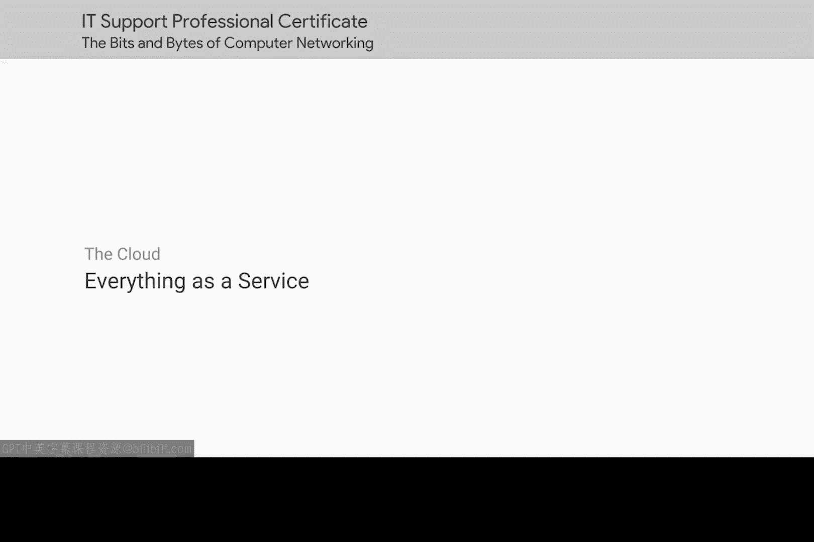
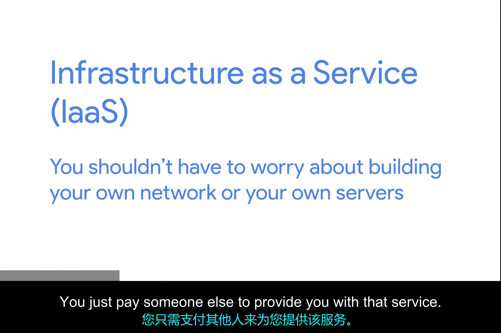
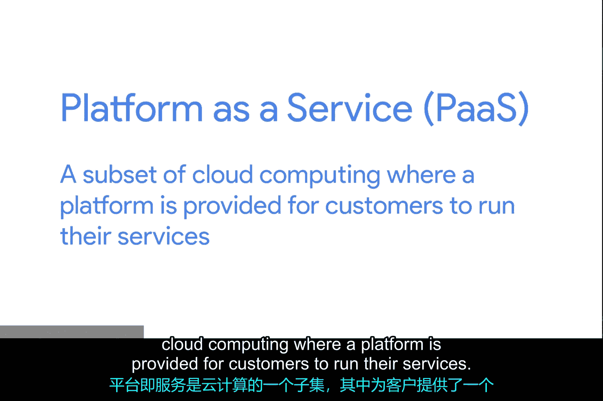
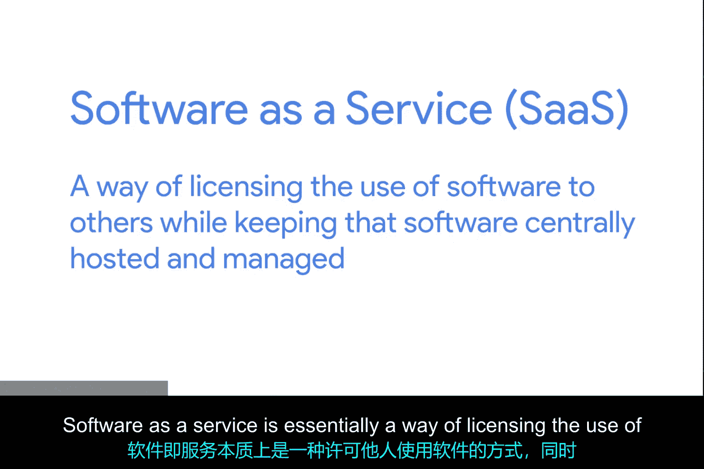
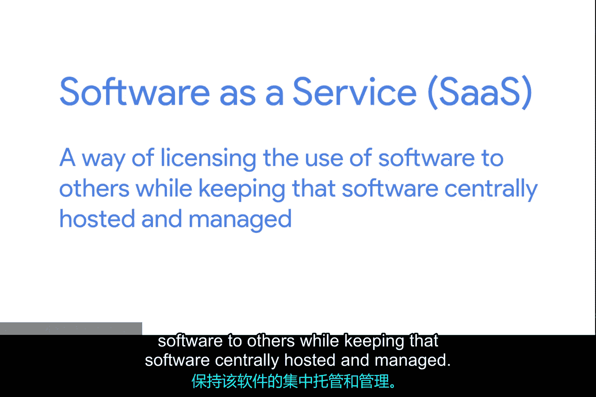

**云计算基础：第2课：一切即服务**

在本节课中，我们将深入探讨云计算的扩展概念，特别是“一切即服务”模型。我们将了解基础设施即服务、平台即服务和软件即服务之间的区别，以及它们如何共同构成了现代云计算的核心。

在上一个视频中，我们给出了云计算的基本定义。但如今，这个术语的含义已远不止托管虚拟机。

随着云计算的兴起，“X即服务”这个术语的使用越来越频繁。这里的“X”可以代表许多不同的事物。我们目前描述的云，最贴切的定义可能是**基础设施即服务**。

**基础设施即服务**背后的理念是，您无需操心构建自己的网络或服务器，只需付费让他人提供这些服务。

---

最近，云的定义已远远超出了基础设施即服务的范畴。其中最常见的是**平台即服务**和**软件即服务**。

**平台即服务**是云计算的一个子集，它为客户提供了一个运行其服务的平台。

这基本上意味着，平台为任何想要运行的软件提供了一个执行引擎。例如，编写新应用程序的Web开发人员并不真的需要一个配备复杂文件系统、专用资源等完整功能的服务器。无论这个服务器是虚拟的还是物理的，都不重要。他们真正需要的只是一个能让其Web应用程序运行的环境。这正是平台即服务所提供的。

---

**软件即服务**在此基础上更进一步。如果说基础设施即服务抽象了您所需的物理基础设施，平台即服务抽象了您所需的服务器实例，那么软件即服务本质上是一种向他人授权使用软件的方式，同时该软件仍由提供方集中托管和管理。

软件即服务在某些领域变得非常流行。一个很好的例子是电子邮件服务。例如，谷歌的Gmail for Business或微软的Office 365 Outlook，都是软件即服务的绝佳示例。使用这些服务意味着您信任谷歌或微软来处理您电子邮件服务的几乎所有方面。

软件即服务是一种获得巨大发展势头的模式。现代网页浏览器功能强大，许多过去需要独立软件才能完成的任务，现在都能在浏览器中良好运行。而如果某件事物能在浏览器中运行，它就成为了软件即服务的绝佳候选者。

如今，您可以在基于订阅的软件即服务模型下找到各种产品，从文字处理器到图形设计程序，再到人力资源管理解决方案。越来越多地，企业网络的核心目的仅仅是提供互联网连接，以访问云端不同的软件或数据。

---

**总结**

本节课我们一起学习了“一切即服务”模型。我们明确了**基础设施即服务**让您无需管理硬件，**平台即服务**进一步为您提供了应用程序运行环境，而**软件即服务**则让您通过订阅直接使用云端托管的完整软件。这些服务模型共同构成了现代云计算灵活、可扩展的基础。