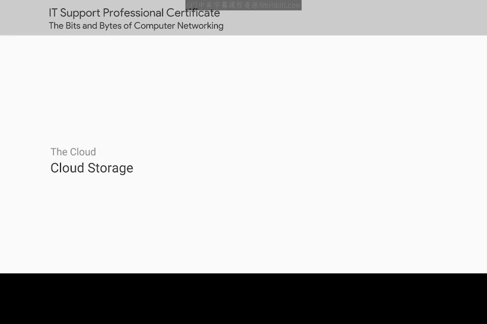

# 086：云存储 📁

在本节课中，我们将要学习云存储技术。云存储是云计算的一种流行应用方式，它允许用户将数据存储在远程服务器上，并通过网络进行访问和管理。我们将探讨其工作原理、优势以及典型应用场景。

## 什么是云存储？ ☁️

上一节我们介绍了云计算的基本概念，本节中我们来看看一种具体的云服务——云存储。

另一种使用云技术的流行方式是云存储系统。在云存储系统中，客户与云存储提供商签订合约，由提供商负责确保其数据的安全、可访问和可用性。这些数据可以是任何内容，从个人文档到大型数据库备份。

## 云存储的优势 🚀

了解了云存储的基本定义后，接下来我们分析它相较于传统存储机制的主要优势。

云存储相比传统存储机制有许多好处。

以下是云存储的几个关键优势：

*   **无需硬件管理**：没有云存储时，管理存储阵列通常很麻烦。硬盘是计算机系统中最常出现故障的组件之一。这意味着你必须仔细监控用于存储的设备，并在需要时更换部件。而使用云存储解决方案，维持底层物理硬件运行的责任在于提供商。
*   **地理冗余与高可用性**：云存储提供商通常在多个不同的地理区域运营。这让你可以轻松地在多个站点复制数据。许多提供商甚至是全球规模的，这使你的数据对世界各地的用户来说都更易于访问。这也提供了防止数据丢失的保护，因为如果一个存储区域出现问题，你仍然可能从另一个区域访问数据。
*   **弹性扩展与成本管理**：云存储解决方案能随你的需求增长。通常，你只需为你实际使用的存储量付费，而不是像本地存储那样拥有固定容量。虽然这并不总是意味着云存储必然更便宜，但它确实意味着你可以更好地管理实际的存储支出。

## 云存储的应用场景 📱

云存储不仅适用于替代大规模本地存储阵列，也是备份较小数据块的优秀解决方案。

以下是云存储的一个常见应用实例：

*   你的智能手机可能会自动将拍摄的每张照片上传到云存储解决方案。如果你的手机损坏、丢失或不小心删除了照片，它们仍然安全地保存在云端。这样，你就永远不会丢失你爱犬Taco的那些珍贵照片了。别担心，Taco，你那2000张照片都得到了充分保护。

## 总结 📝

本节课中我们一起学习了云存储。我们了解到，云存储是一种由服务商维护硬件、提供地理冗余备份、并按需弹性扩展的远程数据存储服务。它既能服务于企业级的大型数据存储与备份，也能方便地保护个人设备上的珍贵数据，例如手机照片的自动备份。