# 087：IPv6地址与子网划分 🧠

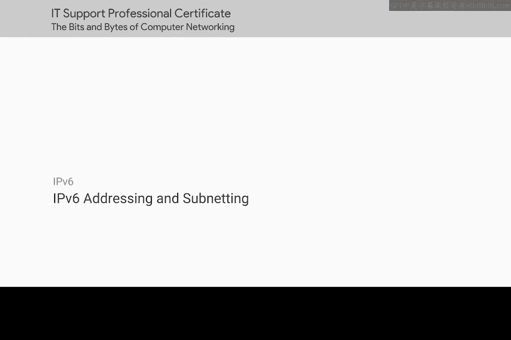

在本节课中，我们将要学习IPv6地址。我们将了解为何需要从IPv4过渡到IPv6，探索IPv6地址的庞大空间和独特格式，并学习如何简化表示它们。最后，我们还会了解IPv6中子网划分的基本概念。

## IPv4的局限性与IPv6的诞生

上一节我们介绍了IPv4地址，本节中我们来看看它的局限性。IANA（互联网数字分配机构）已经耗尽了IPv4地址。

当IPv4最初被开发时，选择了一个32位的数字来代表网络上一个节点的地址。当时互联网尚处于起步阶段，没有人预料到它会像今天这样爆炸式地普及。虽然选择了32位，但对于世界上联网设备的数量来说，这个地址空间已经不够用了。

IPv6正是为了解决这个问题而开发的。到20世纪90年代中期，我们将在某个时间点耗尽IPv4地址空间这一点变得越来越明显。因此，一个新的互联网协议被开发出来，即互联网协议第6版，或称IPv6。

你可能会好奇版本5或IPv5发生了什么。这其实是一个有趣的冷知识。IPv5是一个引入了连接概念的实验性协议，它从未被广泛采用，并且连接状态后来由传输层和TCP更好地处理了。尽管IPv5基本上已成为历史遗迹，但在开始开发IPv6时，共识是不再重用IPv5这个名称。

## IPv6地址的巨大规模

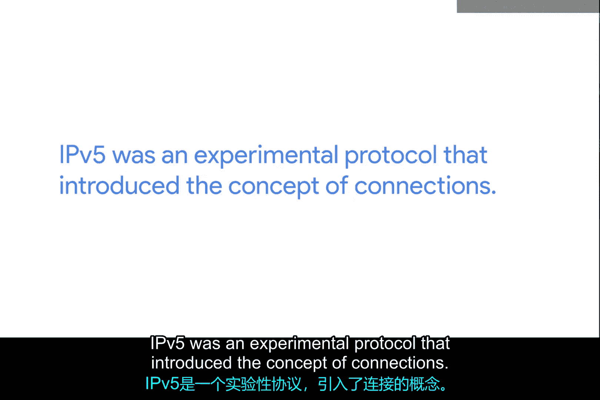

IPv4和IPv6之间最大的区别在于为地址保留的位数。IPv4地址是32位的，这意味着大约有42亿个独立地址。而IPv6地址的大小是128位。一旦你进行计算，这个尺寸差异是惊人的。

不用担心，我们不会让你算。2的128次方会产生一个39位长的数字。这个数字范围有一个你可能从未听说过的名字：**undecillion**（10的36次方）。undecillion不是一个你常听到的数字，因为它极其巨大。现实中几乎没有事物能达到这个规模。一些关于构成整个地球及其上一切事物的原子总数的猜测才进入这个数字范围。这应该能告诉你，我们谈论的是一个非常、非常大的数字。

如果我们能给地球上的每个原子分配一个自己的IP地址，那么在网络设备方面，我们很可能在很长一段时间内都不会有问题。只是为了好玩，我们来看看这个数字实际看起来是什么样子。它看起来像这样：

```
340,282,366,920,938,463,463,374,607,431,768,211,456
```

这很令人震惊，对吧？就像IPv4地址实际上只是一个32位二进制数一样，IPv6地址实际上也只是128位的二进制数。

## IPv6地址的表示方法

IPv4地址被写成四个十进制数的八位组，只是为了让人更容易阅读。但对IPv6地址尝试做同样的事情就行不通了。相反，IPv6地址通常被写成**八个由16位组成的组**。这些组中的每一个又由四个十六进制数字组成。

一个完整的IPv6地址可能看起来像这样：

```
2001:0db8:0000:0000:0000:ff00:0042:8329
```

这仍然太长了，所以IPv6有一种表示法可以让我们进一步简化它。

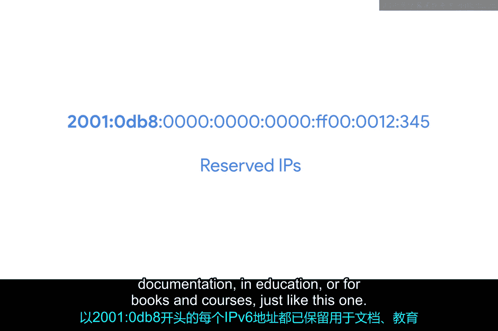

说明IPv6地址数量之多的一个方法是看我们的示例IP。每一个以 `2001:0db8` 开头的IPv6地址都被保留用于文档和教育目的，就像本课程这样。这超过了**18 quintillion（百亿亿）** 个地址，比整个IPv4地址空间还要大得多，仅为此目的而保留。

## 简化IPv6地址的规则

以下是简化IPv6地址的两条规则：

1.  **移除前导零**：你可以从任何一个组中移除任何前导零。
2.  **压缩连续的零组**：任何由零组成的连续组可以用两个冒号 `::` 替换。需要注意的是，对于任何特定地址，这只能进行一次。否则，你将无法确切知道双冒号替换了多少个零。

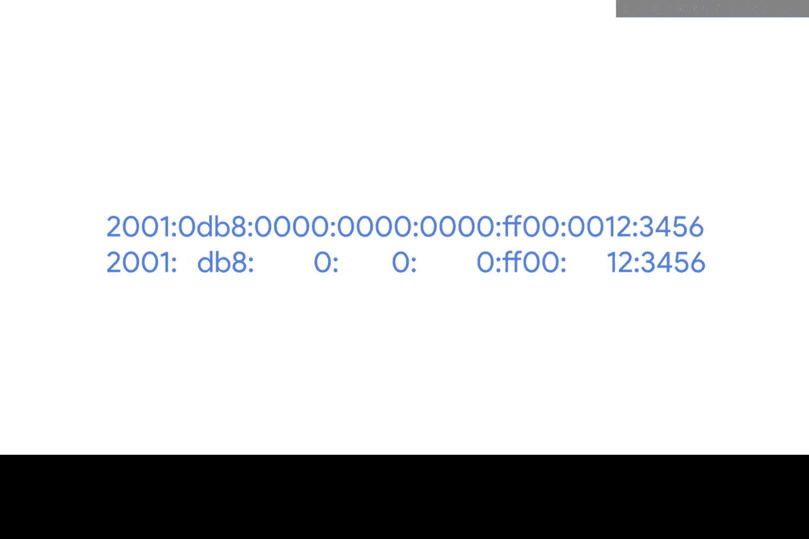

对于这个IP地址 `2001:0db8:0000:0000:0000:ff00:0042:8329`，我们可以应用第一条规则，移除每个组中的所有前导零。这将给我们留下：

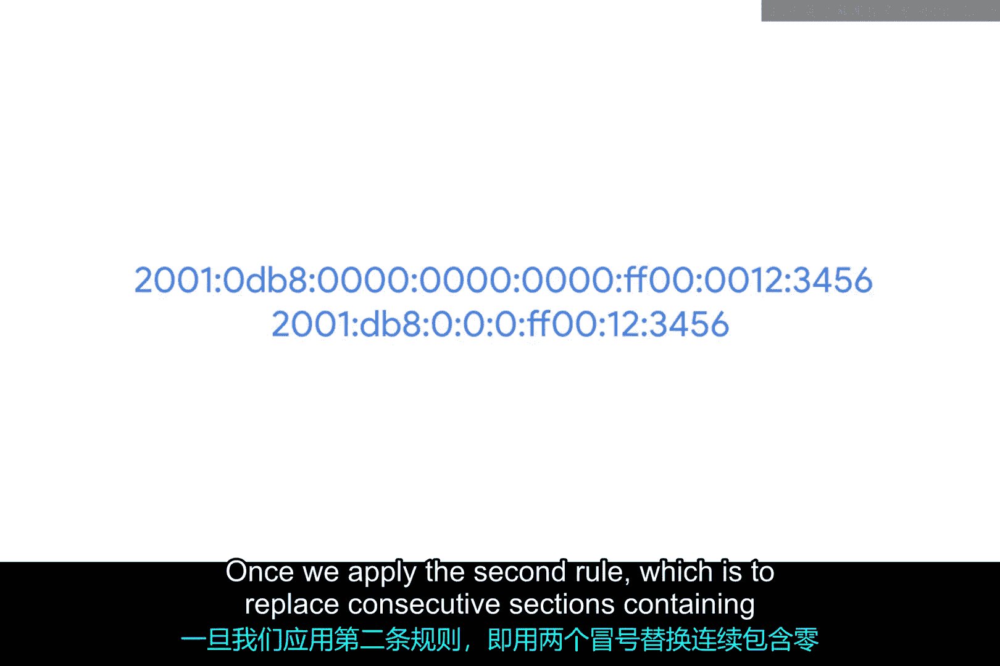

```
2001:db8:0:0:0:ff00:42:8329
```

一旦我们应用第二条规则，即用双冒号替换仅包含零的连续部分，我们最终会得到：

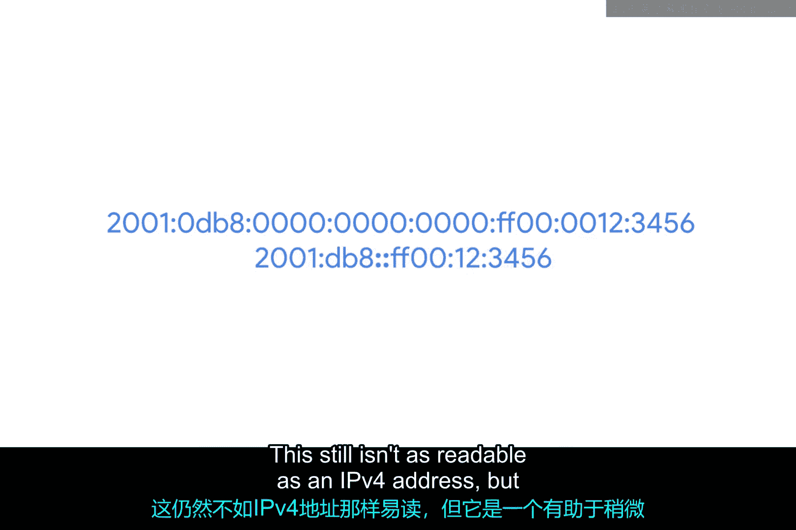

```
2001:db8::ff00:42:8329
```

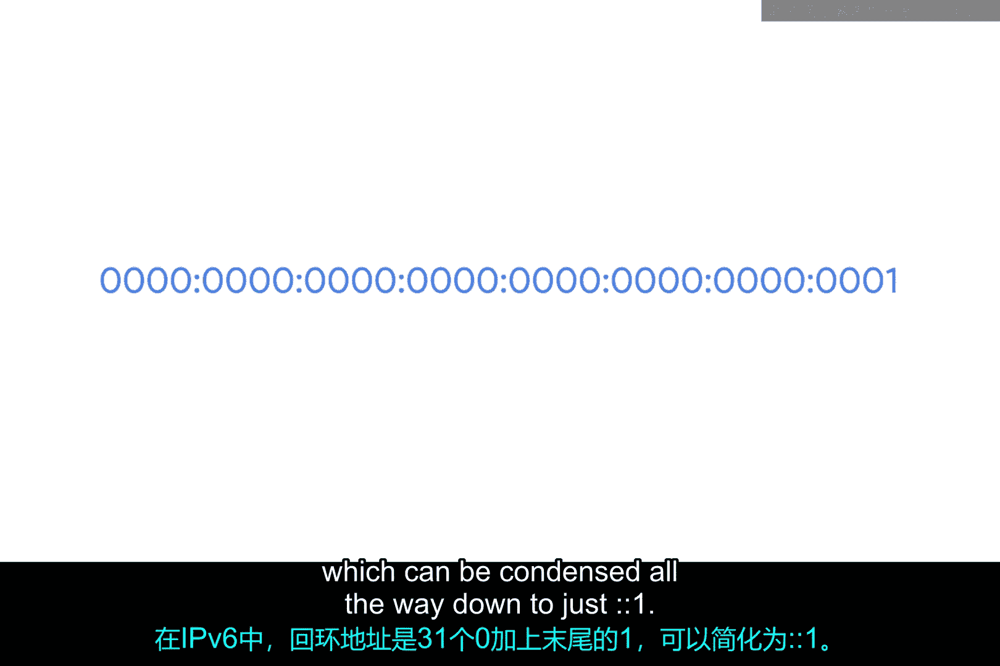

这仍然不如IPv4地址易读，但它是一个很好的系统，有助于稍微减少长度。

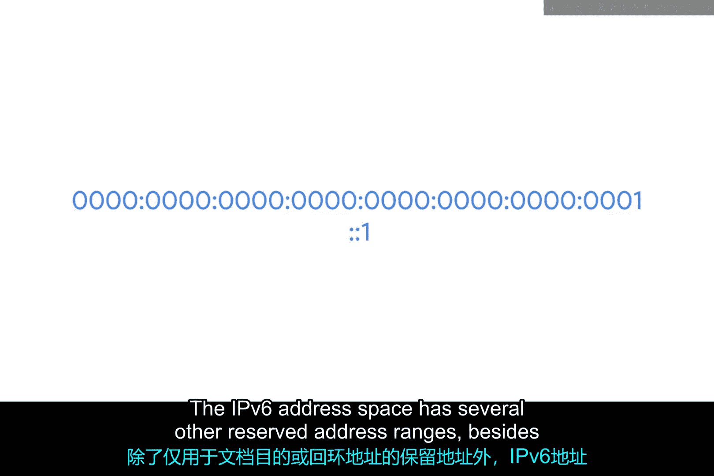

## 特殊IPv6地址

我们可以看到这种方法在IPv6环回地址上被用到了极致。你可能记得，对于IPv4，这个地址是 `127.0.0.1`。对于IPv6，环回地址是31个零后面跟着一个1，可以一直压缩到只剩 `::1`。

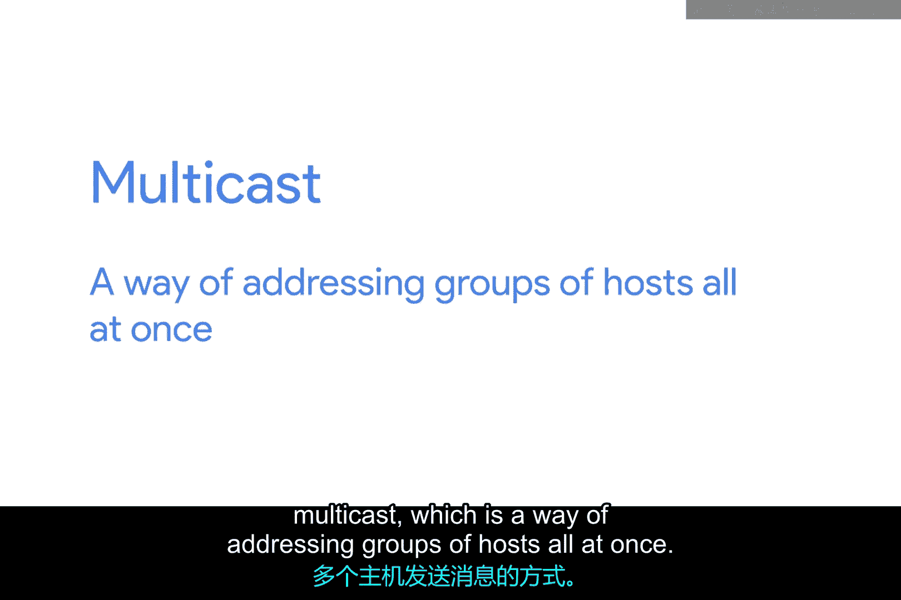

IPv6地址空间还有其他几个保留的地址范围，不仅仅是用于文档目的或环回地址的范围。

例如，任何以 `ff00::` 开头的地址都用于**组播**，这是一种同时向一组主机发送数据的方式。

同样需要知道的是，以 `fe80::` 开头的地址用于**链路本地单播地址**。链路本地单播地址允许本地网段通信，并且是基于主机的MAC地址配置的。IPv6主机使用链路本地地址来接收其网络配置，这很像DHCP的工作方式。主机的MAC地址通过一个算法运行，将其从48位数转换为唯一的64位数，然后被插入到地址的主机ID部分。

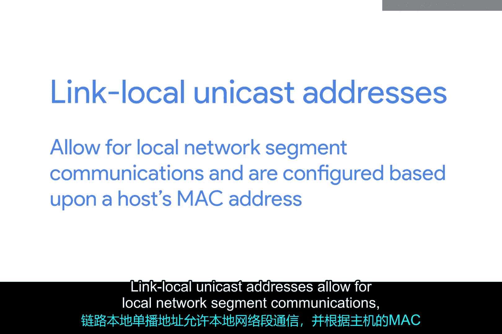

## IPv6子网划分

IPv6地址空间如此巨大，从一开始就没有必要像我们过去对IPv4那样考虑将其分割成地址类别。在IPv6中，网络ID和主机ID之间有一条非常简单的分界线：**任何IPv6地址的前64位是网络ID，后64位是主机ID**。这意味着任何一个给定的IPv6网络都有超过9 quintillion（九百亿亿）个主机的空间。

尽管如此，有时网络工程师可能出于管理目的想要分割他们的网络。IPv6子网划分使用你已经熟悉的**CIDR（无类别域间路由）表示法**。这用于针对IPv6地址的网络ID部分定义一个子网掩码。

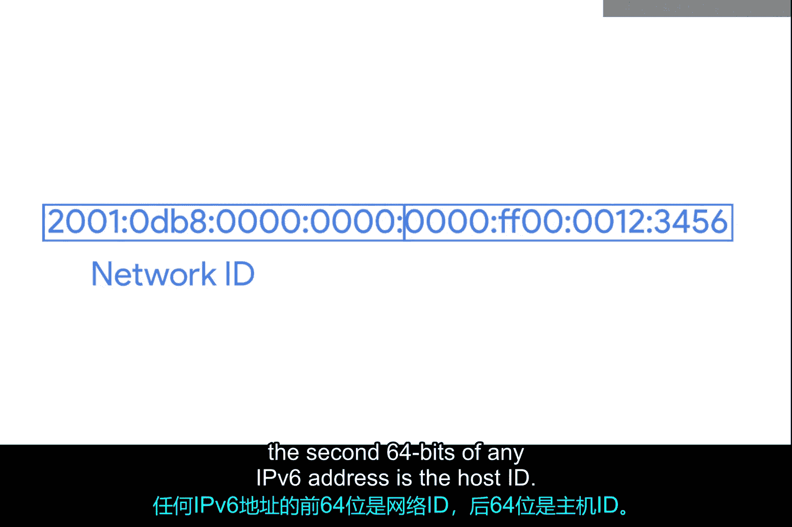

---

本节课中我们一起学习了IPv6。我们了解了IPv6因IPv4地址耗尽而诞生，其128位的地址空间提供了近乎无限的地址。我们学习了IPv6地址的十六进制表示法以及简化它的两条重要规则。我们还认识了一些特殊的IPv6地址，如环回地址 `::1`、组播地址和链路本地地址。最后，我们了解到IPv6采用固定的前64位作为网络ID，后64位作为主机ID，并使用CIDR表示法进行子网划分，使得地址管理在庞大空间下依然清晰简单。