# 088：IPv6头部详解 🧩

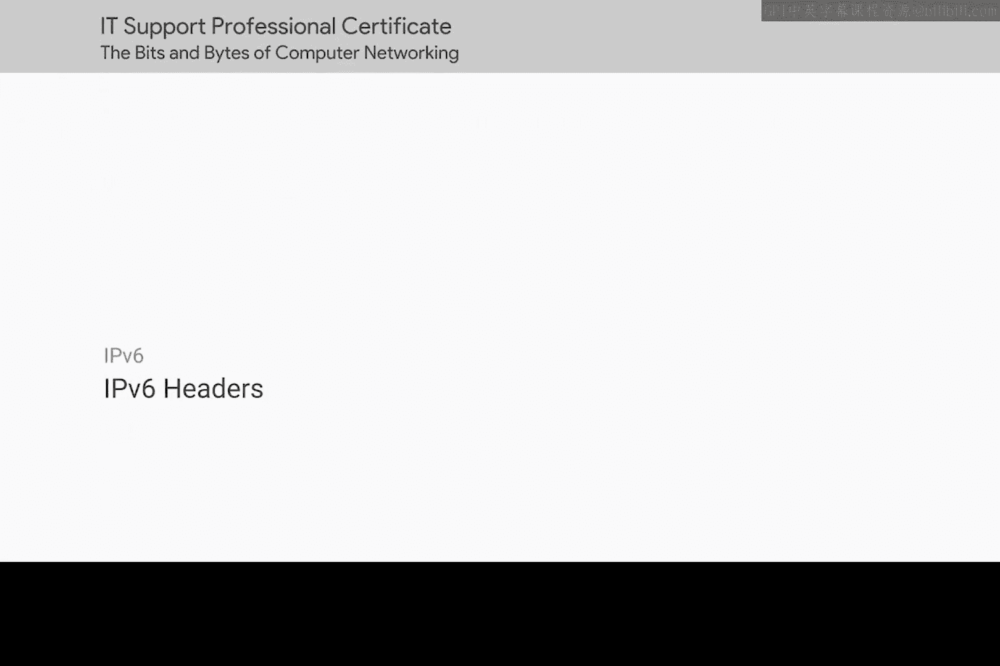

在本节课中，我们将要学习IPv6协议头部结构。与IPv4相比，IPv6不仅地址空间更大，其头部设计也进行了显著简化与优化，旨在提升网络性能。这对于追求高效网络的IT支持专家而言，是一个好消息。

上一节我们介绍了IPv6的开发背景，本节中我们来看看其头部的具体构成。

## 头部字段解析

IPv6头部比IPv4头部更为简洁。以下是其核心字段的详细说明：

以下是IPv6头部的主要字段及其功能：

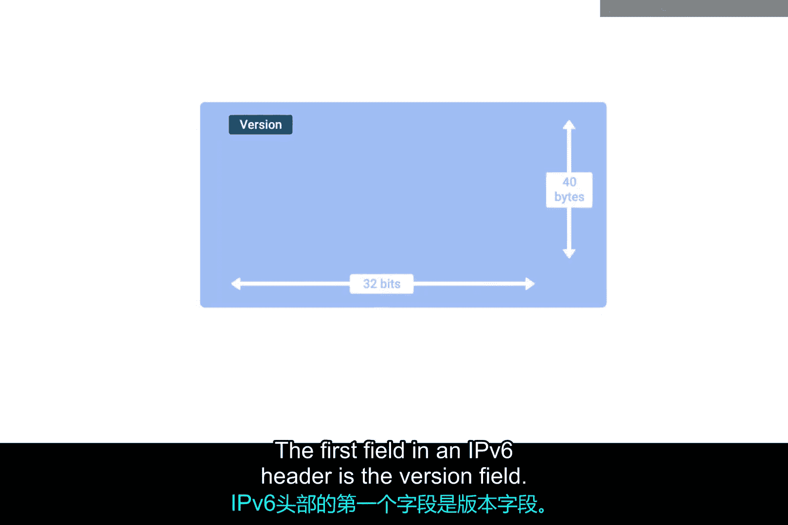

1.  **版本字段**
    *   这是一个 **4位** 的字段，用于定义所使用的IP协议版本。IPv4头部也以相同的字段开始。

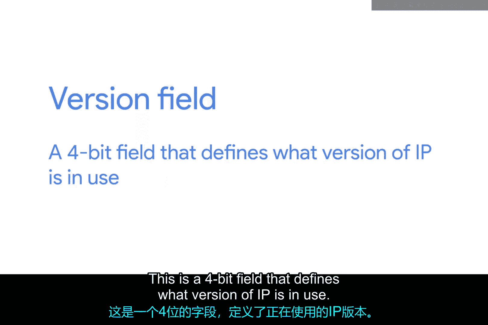

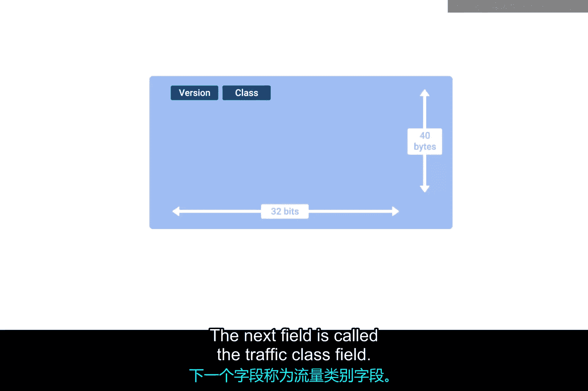

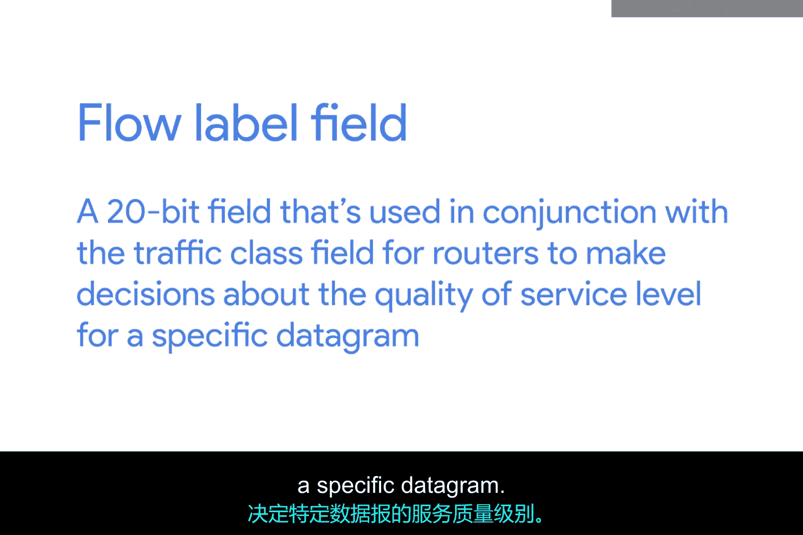

2.  **流量类别字段**
    *   这是一个 **8位** 的字段，用于定义IP数据报内所包含流量的类型。它允许不同类别的流量获得不同的优先级。

3.  **流标签字段**
    *   这是一个 **20位** 的字段，与流量类别字段结合使用，帮助路由器为特定数据报做出服务质量级别的决策。

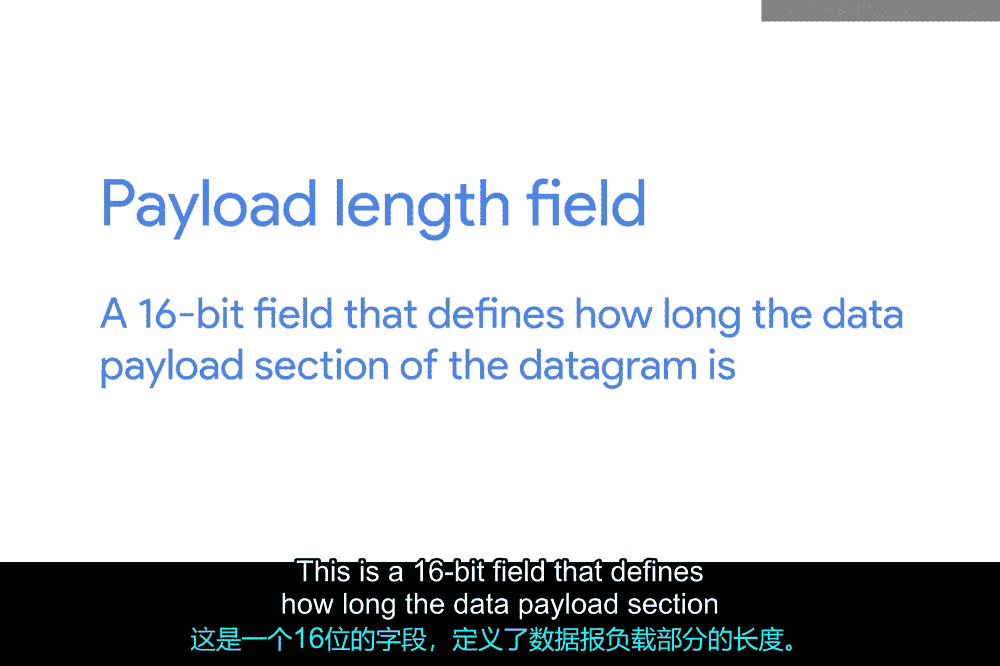

4.  **有效载荷长度字段**
    *   这是一个 **16位** 的字段，用于定义数据报中数据载荷部分的长度。

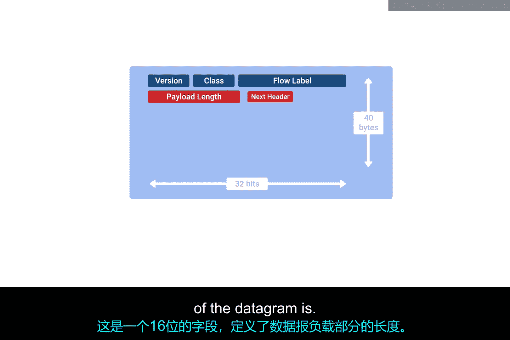

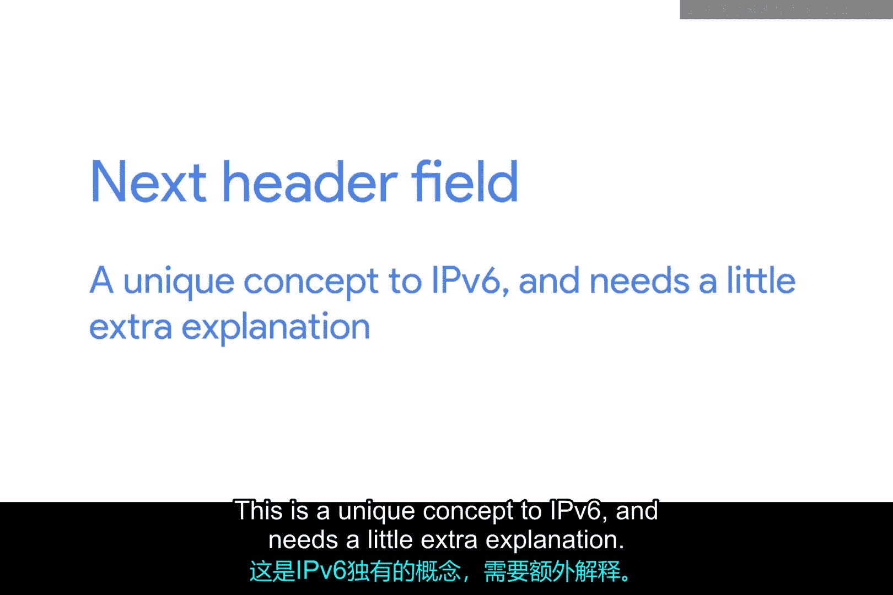

5.  **下一个头部字段**
    *   这是IPv6独有的概念，需要额外解释。IPv6地址长度是IPv4地址的**四倍**，这意味着传输更多比特需要更长时间。为了减少IPv6地址给网络带来的额外数据负担，IPv6头部被设计得尽可能短。实现方法之一是将所有可选字段从IPv6头部本身抽象出去。
    *   **下一个头部字段**定义了紧接在当前头部之后的是哪种类型的头部。这些附加头部是可选的，并非完整IPv6数据报的必需部分。每个附加的可选头部都包含自己的“下一个头部”字段，如果存在大量可选配置，可以形成一条头部链。

6.  **跳数限制字段**
    *   这是一个 **8位** 的字段，其作用和目的与IPv4头部中的TTL字段完全相同。

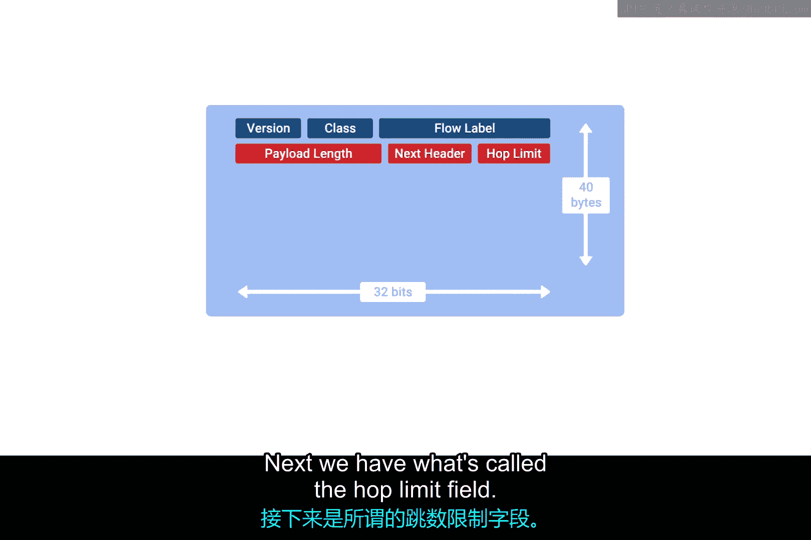
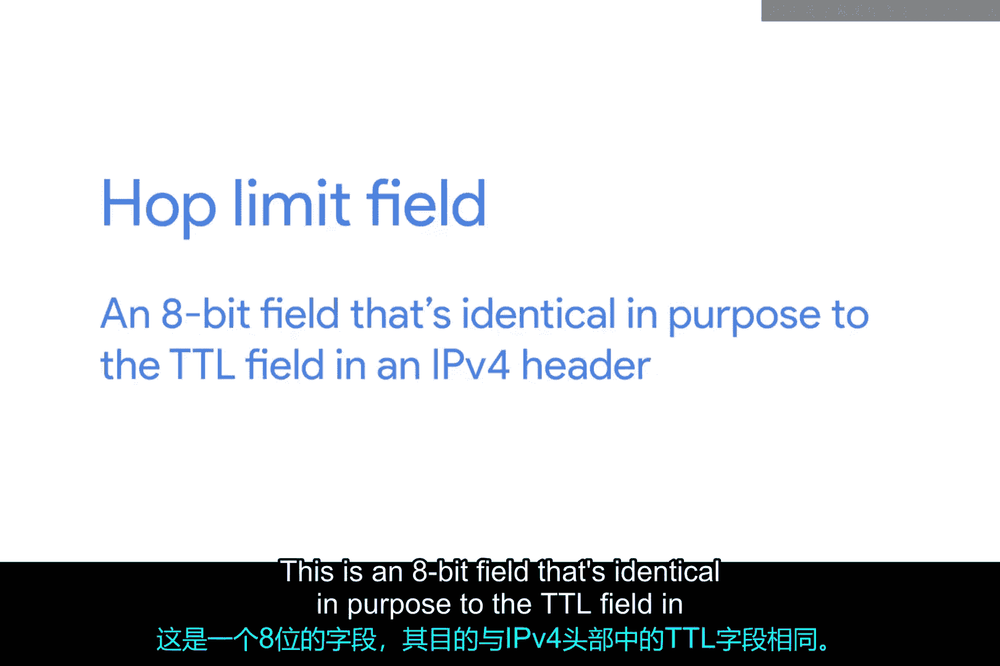

7.  **源地址与目标地址字段**
    *   这两个字段各占 **128位**，用于存储IPv6地址。

## 数据报组装

最后，如果“下一个头部”字段指定了另一个头部，那么该头部将在此处接续。如果没有指定，则接下来是数据载荷，其长度由“有效载荷长度”字段指定。

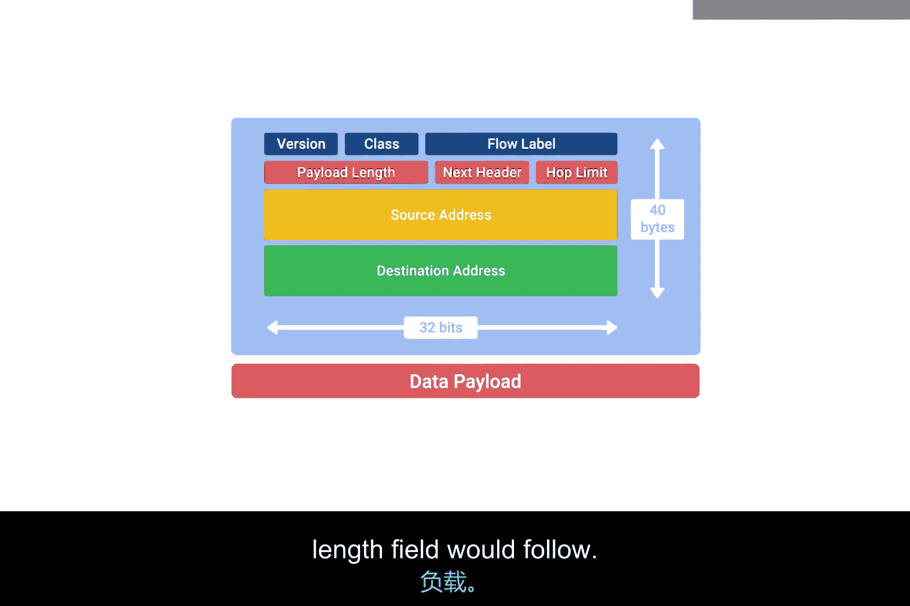

本节课中我们一起学习了IPv6头部的结构。关键点在于，IPv6头部通过固定长度和将可选功能移至扩展头部的方式，变得比IPv4头部更简单、更高效。理解这些字段，特别是“下一个头部”字段的链式设计，是掌握IPv6数据包如何封装和传输的基础。