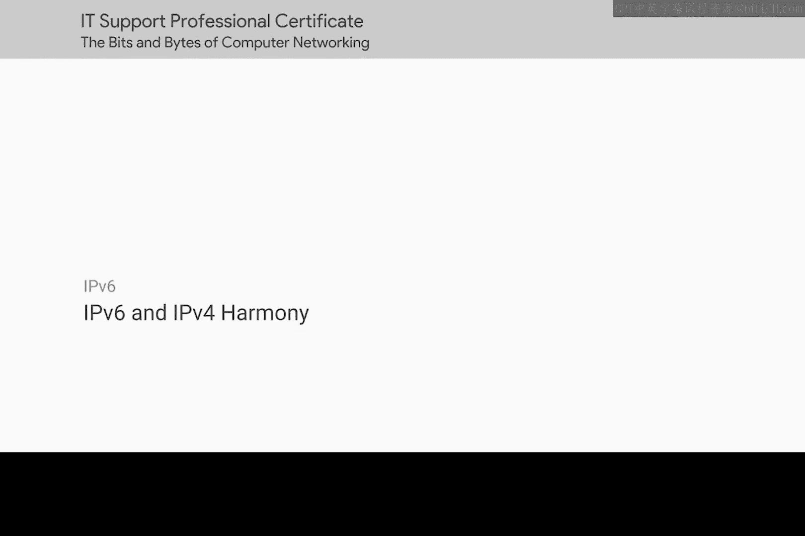
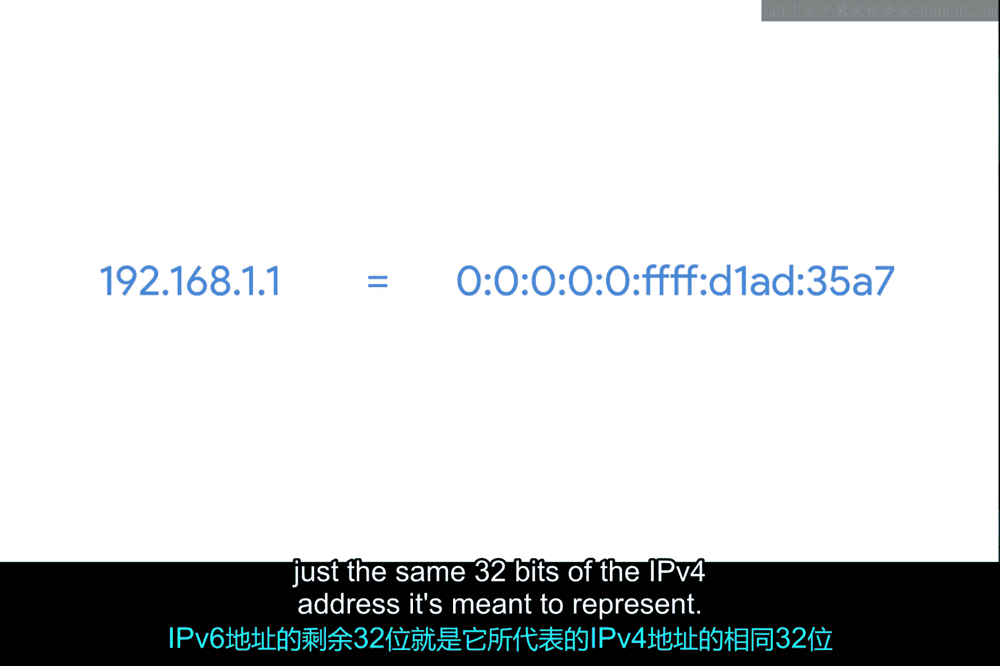
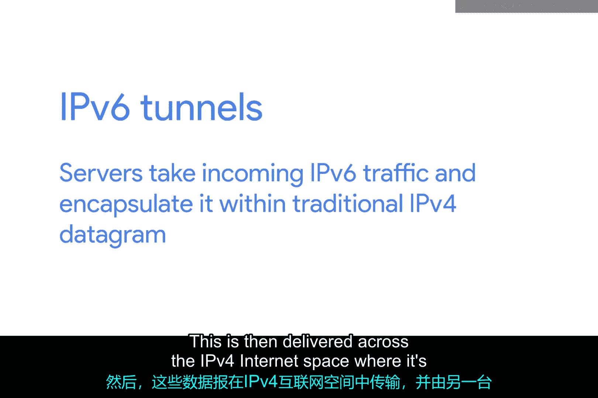
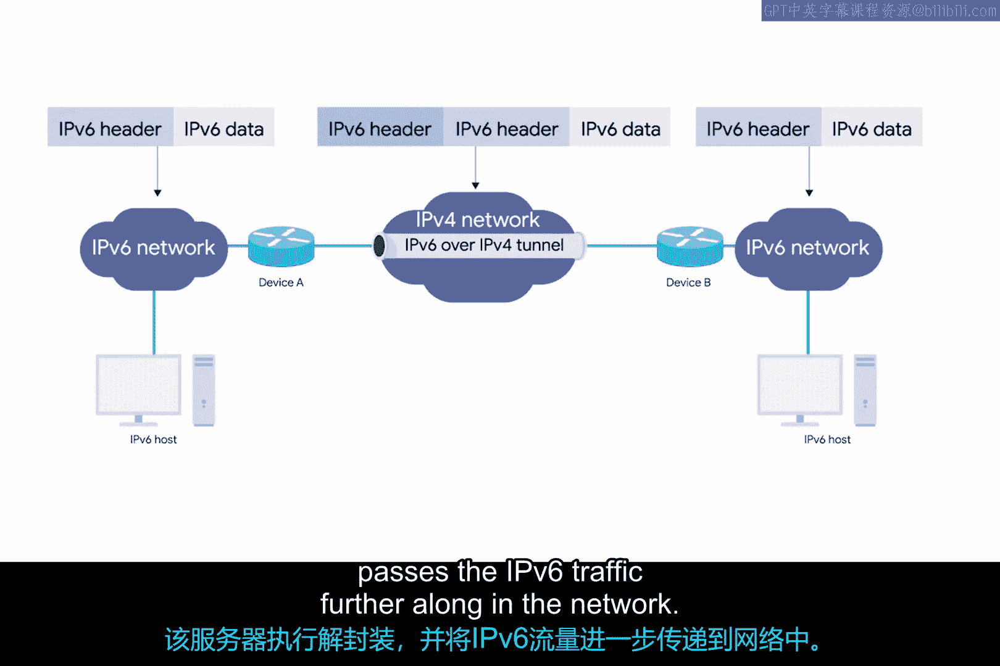
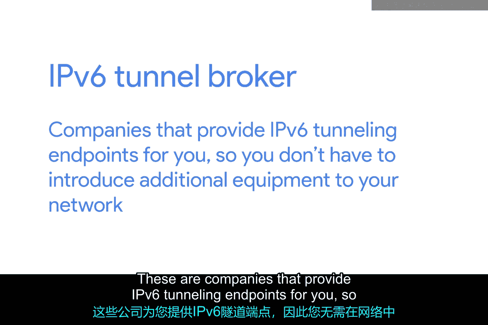

# 089：IPv6与IPv4的和谐共存 🌉

在本节课中，我们将学习IPv6如何与当前广泛使用的IPv4协议共存。由于整个互联网无法一次性切换到IPv6，因此需要过渡技术来确保两种协议能够同时运行。我们将重点介绍两种关键机制：IPv4映射地址空间和IPv6隧道技术。

## 概述

整个互联网和所有连接的网络不可能一次性全部切换到IPv6。这需要大量的协调工作，并且存在许多可能完全无法识别IPv6但仍需连接的旧设备。因此，IPv6要普及的唯一途径，是开发一种让IPv6和IPv4流量能够同时共存的方法。这将允许各个组织在条件成熟时逐步完成过渡。

## IPv4映射地址空间

上一节我们提到了IPv6普及的挑战，本节中我们来看看一种让IPv4流量在IPv6网络中传输的解决方案。

IPv6规范预留了一部分可以直接与IPv4地址关联的地址，这被称为IPv4映射地址空间。

以下是其工作原理：
*   任何以80个零开头，后跟16个1的IPv6地址，都被视为IPv4映射地址空间的一部分。
*   该IPv6地址中剩余的32位，就是它所代表的IPv4地址的32位。

这为IPv4流量在IPv6网络上传输提供了一种途径。其地址格式可以表示为：
`::FFFF:<IPv4地址>`
例如，IPv4地址 `192.0.2.1` 对应的IPv4映射IPv6地址是 `::FFFF:192.0.2.1`。

## IPv6隧道技术

虽然IPv4映射地址解决了部分问题，但更重要的是让IPv6流量能够在IPv4网络上传输。对于单个组织而言，迁移到IPv6比互联网核心网络迁移要容易。因此，在IPv6普及的过程中，它需要一种方法穿越互联网骨干网中遗留的IPv4网络。

当前实现这一目标的主要方式是通过IPv6隧道。

IPv6隧道在概念上相当简单。它由连接两端的IPv6隧道服务器组成。

以下是隧道的工作流程：
1.  这些IPv6隧道服务器接收传入的IPv6流量。
2.  将其封装在传统的IPv4数据报内。
3.  封装后的数据通过IPv4互联网空间传输。
4.  数据被另一端的IPv6隧道服务器接收。
5.  该服务器执行解封装操作，并将IPv6流量继续传递到网络中。

## 隧道代理与协议

随着IPv6隧道技术的发展，IPv6隧道代理的概念也应运而生。

这些是为你提供IPv6隧道端点的公司。这样一来，你无需在自己的网络中引入额外的设备。

用于这类IPv6隧道的协议有很多，它们相互竞争。由于这仍是一个新兴且不断发展的领域，最终哪种协议会胜出尚不明确。在本视频之后，我为你留下了一些链接，你可以阅读关于主要竞争协议的信息。

不过，最终哪种隧道技术成为最普遍的解决方案并不重要。随着IPv6的全面普及，隧道技术本身可能也会逐渐消失。网络层的未来是采用IPv6作为主要协议，终有一天我们将不再需要任何隧道。未来是无限的，也是“无隧道”的，或者类似这样的愿景。

## 总结

本节课中我们一起学习了IPv6与IPv4共存的两种关键技术。我们了解了**IPv4映射地址空间**如何让IPv4地址在IPv6网络中表示和路由。接着，我们探讨了更重要的**IPv6隧道技术**，它通过封装和解封装的方式，让IPv6数据包能够穿越现有的IPv4骨干网进行传输。最后，我们提到了隧道代理服务和多样的隧道协议，并展望了未来全面转向IPv6后，这些过渡技术将完成其历史使命。

你已经出色地完成了所有这些内容的学习，花点时间为自己鼓鼓掌吧。你还需完成最后一次测验和一个最终项目，然后就可以将这门课程从你的待办清单中划掉了。你是否已经看到隧道尽头的曙光？😊