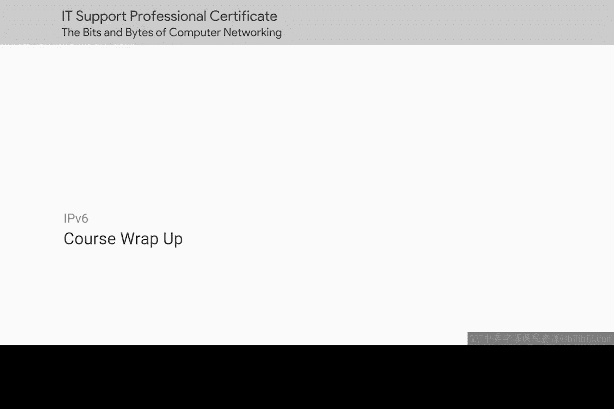

# 091：课程总结 🎉

在本节课中，我们将对已学习的计算机网络核心知识进行总结，回顾关键概念，并展望后续课程内容。

## 课程回顾与成就

你已成功完成本阶段学习。掌握全部内容是一项重大成就。

我们已涵盖相当技术性且复杂的知识，完成全部学习是真正的壮举。请花点时间思考你已掌握的知识量。

## 已掌握的核心知识

你现在已深入了解计算机之间如何通信，这是人与人之间通信方式的重要组成部分。计算机网络每天被数十亿人使用，构成了全球经济的支柱。

以下是本阶段学习的关键内容总结：

*   **信号传输**：你已学习信号如何通过电缆传输。
*   **协议协同**：你已学习多种不同协议如何协同工作，确保数据正确传输。
*   **网络服务**：你已学习各种网络服务，例如帮助人类使用计算机的 **DNS（域名系统）**。

## 知识的应用价值

这些知识非常重要。你将能把所有这些知识应用到你的IT支持职业生涯中。

你也可以用它来帮助你自己的家庭网络运行得更好。无论如何，恭喜你，你已为自己赢得了优势。

## 实践与思考

下次你访问社交媒体网站、流式传输视频，或仅仅是与朋友家人在线聊天时，请花点时间思考一下：互联网上传输的每一点数据都涉及如此多不同的网络设备、层和协议，这是多么神奇。

你也应该花点时间惊叹于你现在已理解所有这些是如何运作的。

## 下阶段课程预告

恭喜！在下一门课程 **《操作系统》** 中，你将学习如何成为一名高级用户。

我的朋友兼同事 Cindy Quach 将作为你的向导，带你探索 Windows 和 Linux 操作系统。

准备好享受乐趣并动手实践吧，Cindy 将教你如何成为一名命令行高手。

---

本节课中，我们一起回顾了计算机网络的核心原理，包括信号传输、协议协同及关键网络服务。你已为理解现代通信的基石奠定了坚实基础。接下来，我们将进入操作系统的世界，继续提升你的技术能力。