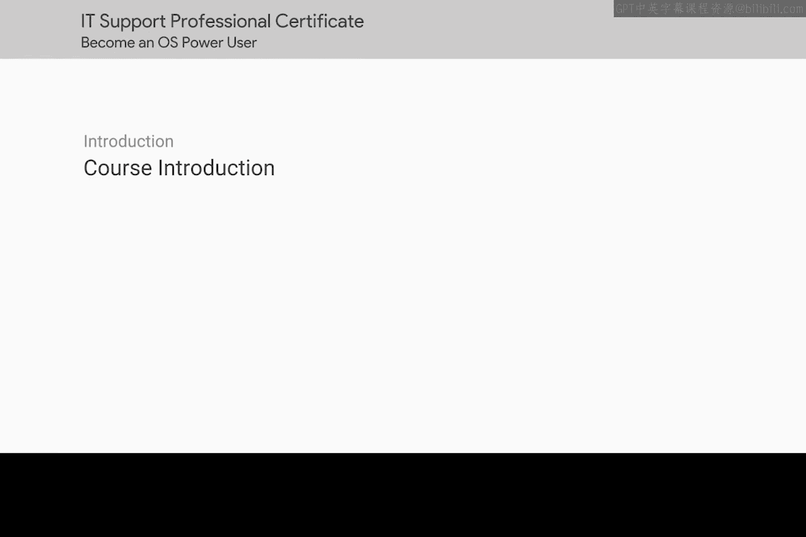
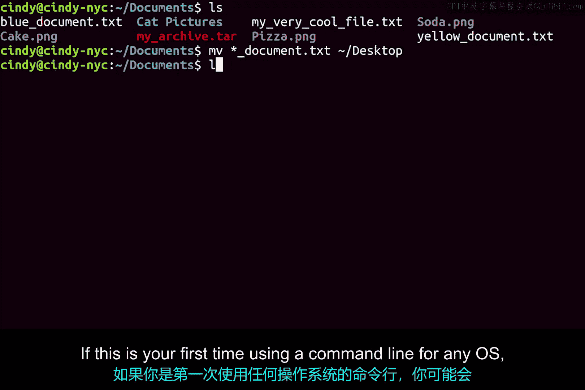
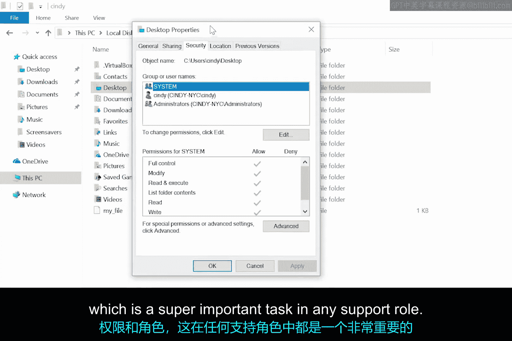
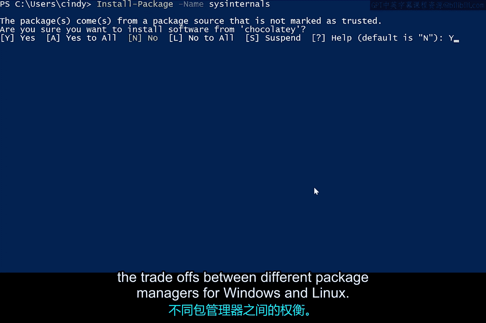
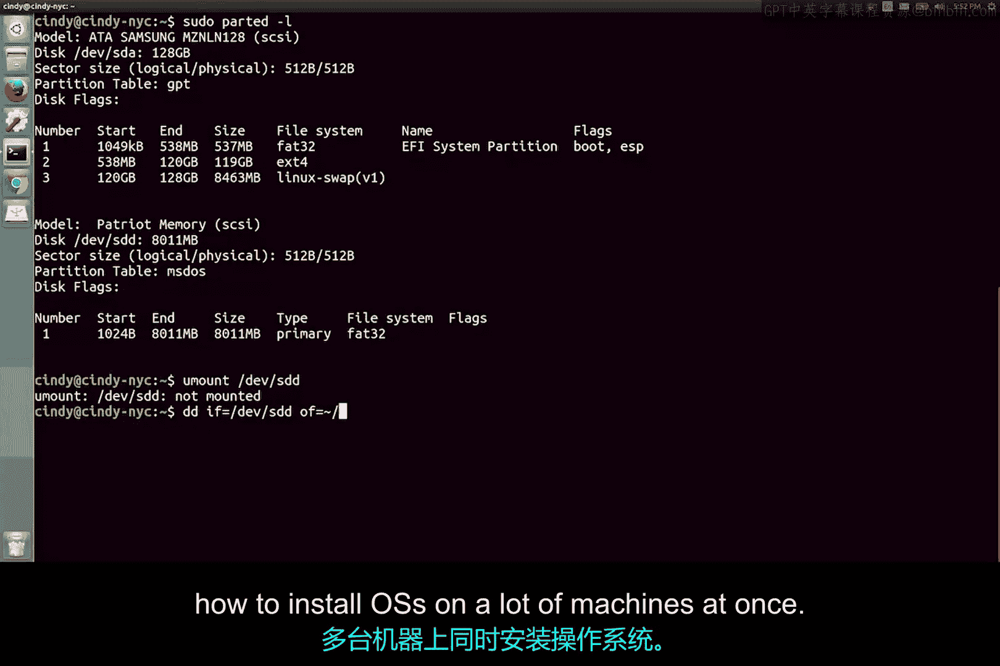

# 094：课程介绍 🖥️

在本节课中，我们将开始学习 Windows 和 Linux 操作系统的核心知识与实践技能。你已经掌握了计算基础，并完成了计算机网络中比特与字节的学习。现在，是时候深入探索 Windows 和 Linux 操作系统了。

## 讲师介绍 👩‍💻

在深入学习之前，请允许我介绍一下自己。我们在第一门课程中已经见过面，但如果你忘记了或跳过了那些课程，我叫 Cindy Quach，是谷歌的一名站点可靠性工程师。我所在的团队负责管理和支持谷歌整个内部的移动设备，包括 Android、I/O 和 Chrome 操作系统。

在专注于移动领域之前，我曾是 Linux 团队的系统管理员，更早之前，我是一名运维工程师。和许多你见过或将见到的谷歌员工一样，我的职业生涯始于 IT 支持专家。我从事 IT 工作已有七年。

我第一次接触计算机是在中学，当时老师将计算机带入课堂，让我们制作有趣的视频和多媒体项目。是我的哥哥将科技带入了我们家。我的父母是越南移民，我们成长过程中并不富裕。因此，如果想在家玩电脑，我们必须发挥创造力。

我记得曾和哥哥花了好几个小时组装一台电脑，而我总是问无数个问题。最终，我也想尝试自己组装一台电脑，于是我收集了一些旧零件，并攒钱购买了新组件。我根据记忆模仿哥哥的做法将所有零件组装起来，但失败了。原来我使用了一些不兼容的部件。但经过大量试错、故障排除以及在互联网上的长时间搜索，我终于让它成功运行了。

当我第一次听到自己组装的电脑启动的声音时，那种感觉非常奇妙。不知不觉中，我也迷上了计算机。我真的很享受 IT 工作所需的高度专注和问题解决过程，但那时我并未想过科技能成为我的职业。

进入大学后，我需要找一份工作来支付学费。那份工作就是校园 IT 支持专家。那时我才意识到，科技确实是我可以追求的职业道路。自我记事起，我就一直在与计算机打交道，我的许多 IT 知识都基于多年来自己解决问题的经验。

我自认为非常擅长操作系统故障排除，直到我成为谷歌 Linux 团队的系统管理员，我才意识到自己对操作系统的了解是多么有限。我身边都是才华横溢的队友，他们维护着大型开源操作系统项目的代码，有些人甚至拥有维基百科页面，因此有时难免会感到能力不足。

随着我更深地投入 Linux 学习，感觉就像重新学走路一样。我只是不习惯在命令行上工作，用它来排查突然出现的复杂问题让人感到不知所措。我必须不断查找命令，并弄清楚在哪里找到某些文件。

但我没有让困难压倒我。我一天天地坚持学习，在团队工作一年后，我意识到自己取得了惊人的进步。一年后，我能够构建和打包自己的工具，然后部署给所有人使用。我甚至开始直接为开源软件贡献代码。使用命令行已经变得像第二天性一样自然。

操作系统有太多东西需要学习，这也是我热衷于教授这门课程的原因之一。

## 课程目标与内容 🎯

学习 Linux 不必感到害怕。使用 Windows 命令并非不可能。入门也绝对不难。所以，让我们直接开始吧。

虽然本课程包含一些概念性学习，但我们将更侧重于操作系统的实践方面。

你不仅将学习如何使用 Windows 和 Linux 操作系统，我们还将教你如何通过命令行与这些操作系统交互。

请记住，命令行输入的是文本命令，而不是依赖图形用户界面。

如果你第一次为任何操作系统使用命令行，起初可能会觉得有点吓人，这完全正常。但到本课程结束时，你将顺利成为一名命令行高手。和往常一样，我们会全程指导你，如果你需要复习，也可以随时重看课程。所以，请慢慢来，你可以做到的。

我们不仅要教你如何在 Windows 和 Linux 中使用命令行。

你还将学习文件系统的工作原理，并能够分配不同的用户权限和角色，这在任何 IT 支持角色中都是一项超级重要的任务。

你将能够理解如何使用软件包管理器，并权衡 Windows 和 Linux 不同软件包管理器之间的利弊。

我们还将教你进程管理，以便你理解运行程序的细微差别。这可以在工作场所进行故障排除时为你节省宝贵时间。

我们还将更深入地探讨你已经使用过的远程连接工具，帮助你在远程工作时访问其他计算机。

最后，我们将教你操作系统部署，即如何一次性在多台机器上安装操作系统。

到本课程结束时，你将成为 Windows 和 Linux 操作系统真正的超级用户。这对于任何追求 IT 支持专家职业的人来说，都是一项非常宝贵的技能。毕竟，我们大部分时间都在操作系统中度过。

但请记住，你需要练习、练习、再练习，才能牢固掌握操作系统。就像任何技能一样，你需要真正投入才能精通。最终，操作操作系统对你来说会变得像第二天性一样自然。

我们强烈建议你在学习本课程时，使用一台安装了这些操作系统（至少一种）的计算机进行同步操作。在学习本课程的同时操作真实的操作系统，是学习这些概念更高效的方式。

如果你无法访问它们，那也完全没关系。你将在名为 Quicklabs 的应用程序中进行主动学习练习，以模拟使用 Windows 和 Linux 操作系统的体验。

我非常兴奋能教你关于 Windows 和 Linux 操作系统的知识，让我们开始吧。

## 总结 📝

本节课中，我们一起了解了本操作系统课程的讲师背景、学习目标以及核心内容框架。我们明确了本课程将重点从实践角度出发，教授 Windows 和 Linux 两大操作系统的使用，特别是命令行的操作、文件系统、用户权限、软件包管理、进程管理和远程连接等关键技能。记住，实践是掌握这些技能的关键，请准备好跟随课程一起动手操作。