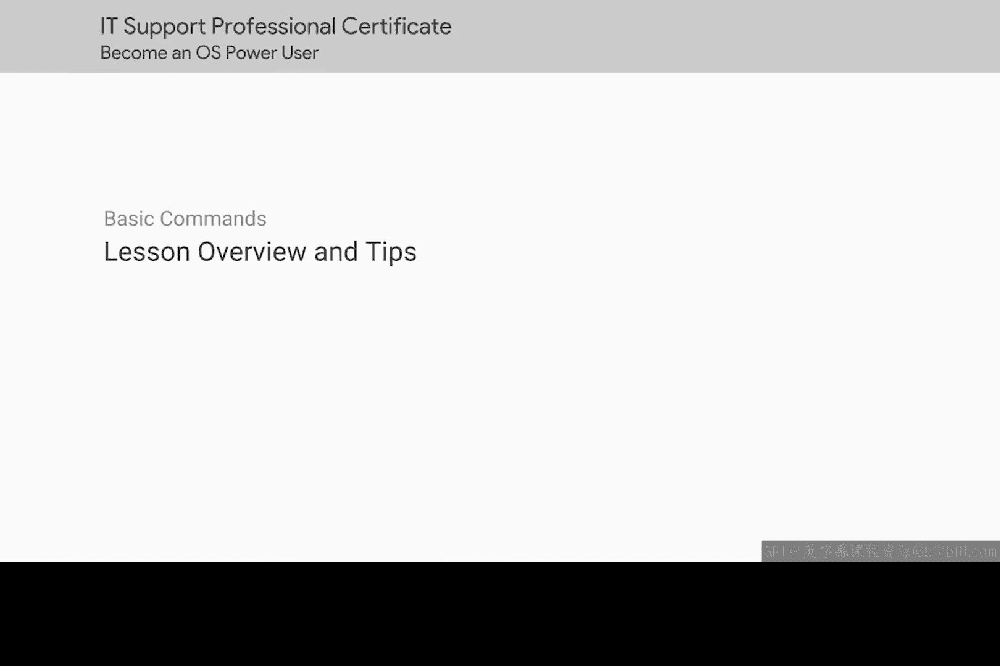
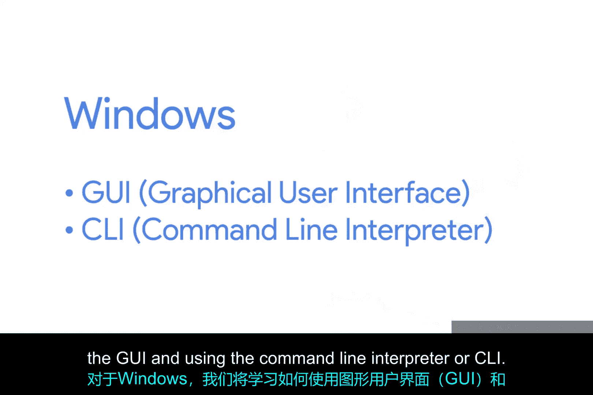
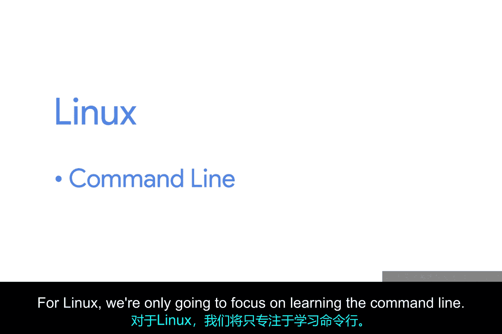
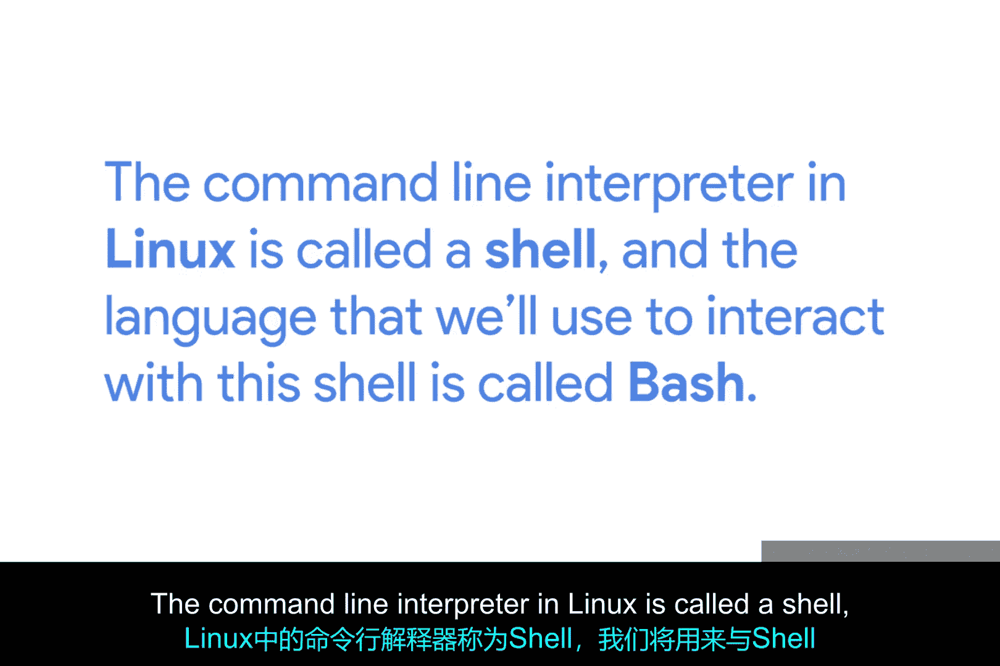
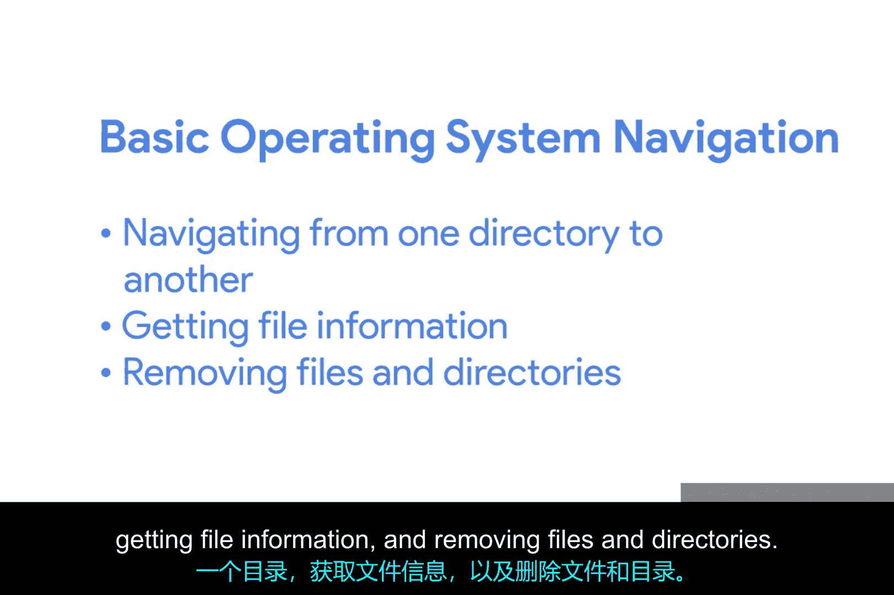
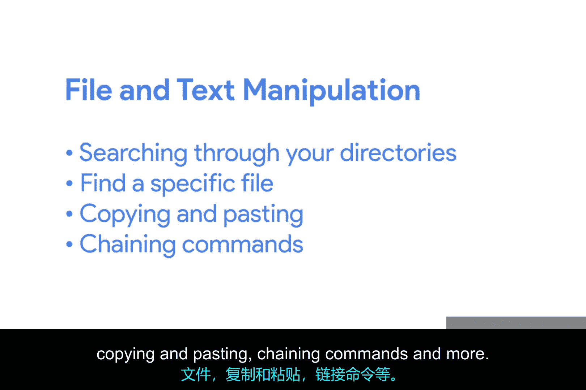

# 095：课程概述与实践技巧 🖥️

在本节课中，我们将学习如何在Windows和Linux操作系统中执行常见的导航任务。我们将重点介绍Windows的图形用户界面和命令行界面，以及Linux的命令行界面。

---

## 课程内容概览

在第一门课程中，我们初步接触了Windows和Linux操作系统。现在，让我们深入学习如何在这两种操作系统中执行所有常见的导航任务。对于Windows，我们将学习如何使用图形用户界面和命令行解释器进行导航。对于Linux，我们将专注于学习命令行。

Linux的命令行解释器称为Shell，我们用来与Shell交互的语言称为Bash。值得注意的是，这两种操作系统非常相似。因此，即使您不知道如何使用Linux的图形用户界面，只要您了解如何导航Windows的图形用户界面，您就能将这些工具应用到Linux的图形用户界面中。

在工作场所，您可能只使用Windows的图形用户界面。即便如此，如果您学会使用Windows命令行，这将使您与其他IT支持专家区分开来。您很快会发现，在任何操作系统中使用命令行实际上可以帮助您更快、更高效地完成工作。

我们强烈建议您跟随课程并亲自执行我们在本课程中进行的任务。如果可能，请暂停视频，进行我们做的练习，或输入我们介绍的任何命令。这样，您将更容易理解它们。

我们还建议您记录我们展示的所有命令。您可以用传统的笔和纸笔记本写下它们，或在文档或文本编辑器中输入它们。如果您必须，甚至可以将它们刻在石头上。我们只是希望您将它们记录在某个地方。当我们第一次向您介绍这些命令时，您可能不会立即记住所有命令，但通过一些练习，输入命令将成为您的第二天性。

您还可以使用我们在本视频后的补充阅读中为您提供的官方Windows命令行和Bash文档作为参考。在本课程中，内容分为两个主题：第一个是基本的操作系统导航，如从一个目录导航到另一个目录、获取文件信息和删除文件及目录；第二个主题是文件和文本操作，如搜索目录以查找特定文件、复制和粘贴、链接命令等。

好了，闲话少说，让我们开始吧。

---

## 实践技巧与建议

为了帮助您更好地掌握本课程内容，以下是一些实用的学习建议：

*   **动手实践**：跟随视频中的示例，亲自在您的计算机上执行命令和操作。
*   **记录命令**：创建一个命令清单，记录下课程中介绍的所有重要命令及其用途。
*   **查阅文档**：充分利用提供的官方文档，当您忘记某个命令的具体用法时，可以快速查找。
*   **循序渐进**：从基本的导航命令开始练习，熟练掌握后再进行更复杂的文件和文本操作。

---

## 总结

本节课中，我们一起学习了本课程的总体目标和结构。我们了解到，课程将涵盖Windows和Linux操作系统的基本导航与文件操作，并强调了动手实践和记录命令的重要性。掌握这些技能，尤其是命令行操作，将显著提升您作为IT支持专业人员的工作效率。