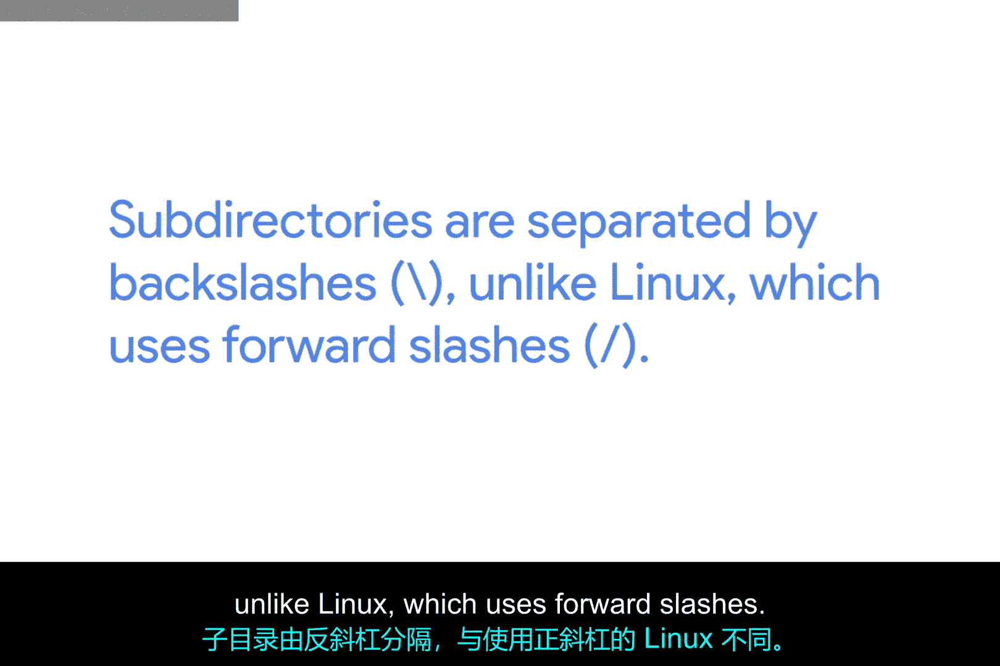
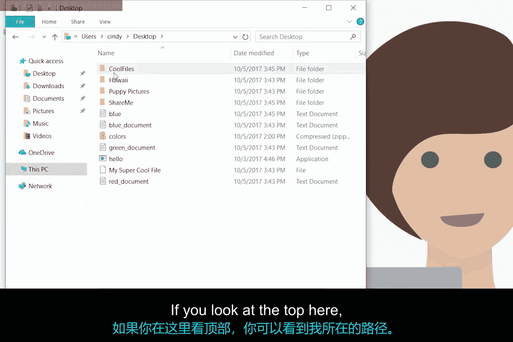
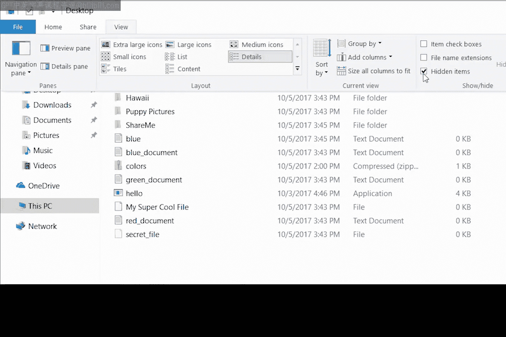
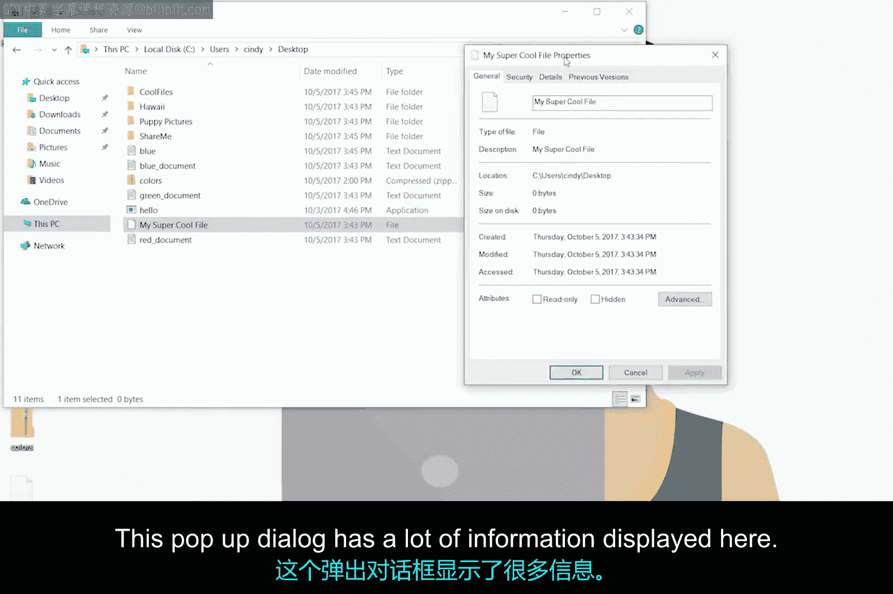
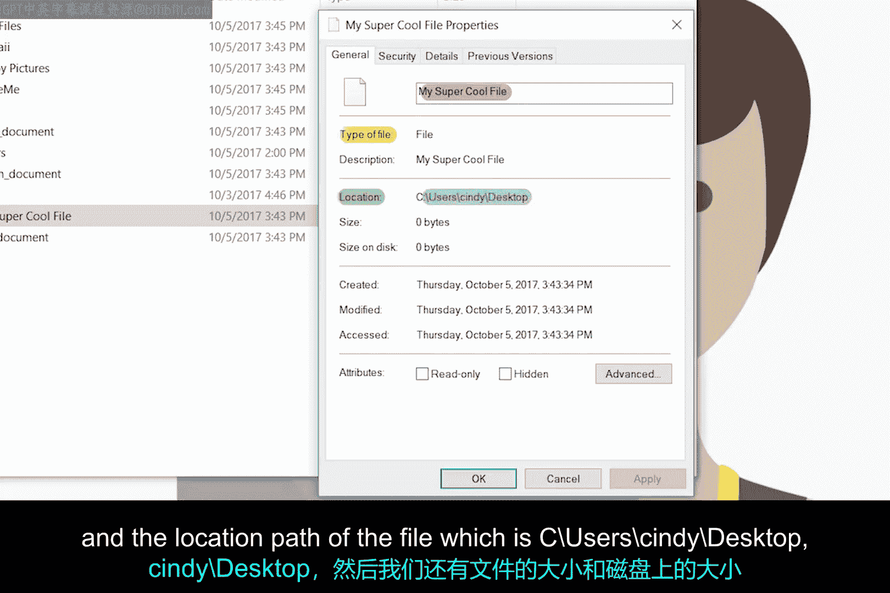
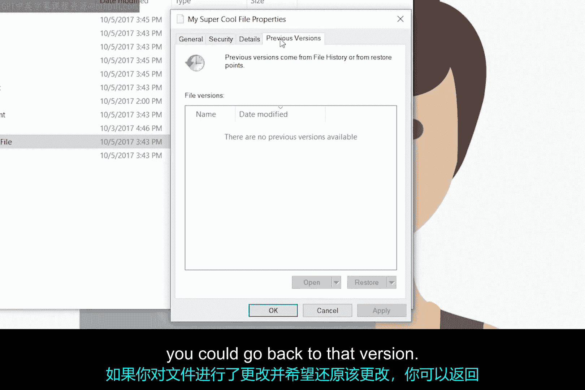
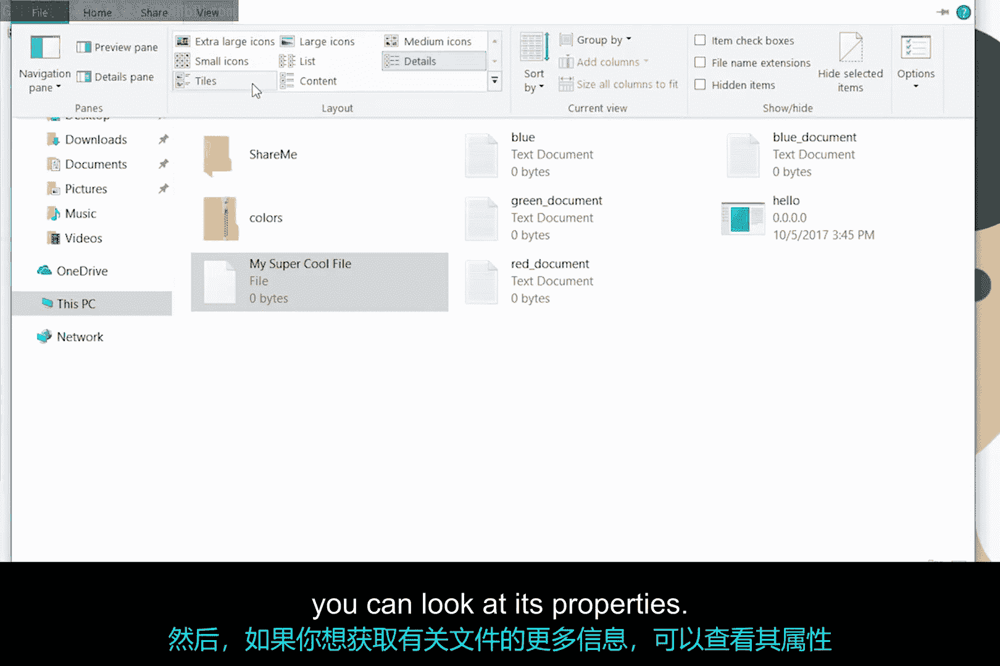

# 096：在GUI中列出目录 📂

在本节课中，我们将学习操作系统如何组织文件和目录，并重点掌握如何在Windows图形用户界面中查看和管理它们。我们将了解路径的概念、如何查看隐藏文件以及如何获取文件的详细信息。

## 目录结构与路径

在操作系统中，文件和文件夹（或称目录）以层次化的目录树结构进行组织。你有一个主目录，它分支出去并包含其他目录和文件。我们称这些文件和目录的位置为**路径**。

大多数Windows路径看起来像这样：`C:\Users\Cindy\Desktop`。

在Windows中，文件系统被分配给驱动器盘符，例如`C:`、`D:`或`X:`。每个驱动器盘符代表一个文件系统。文件系统用于跟踪计算机上的文件。每个文件系统都有一个**根目录**，它是该文件系统中所有其他目录的父目录。

因此，`C:`盘的根目录写作`C:\`，`X:`盘的根目录写作`X:\`。子目录之间用反斜杠`\`分隔，这与使用正斜杠`/`的Linux系统不同。

> **路径公式**：`[驱动器盘符]:\[目录1]\[目录2]\...\[文件名]`

路径从驱动器的根目录开始，一直延伸到路径的末尾。

## 在GUI中导航

现在，让我们打开“此电脑”并导航到主目录。Windows系统中的主目录是存储文件系统的驱动器，在本例中，我们的文件系统存储在“本地磁盘(C:)”上。

以下是导航步骤：
1.  打开“此电脑”。
2.  双击进入“本地磁盘(C:)”。
3.  进入“用户”文件夹。
4.  进入用户文件夹“Cindy”。
5.  最后，进入“桌面”文件夹。

在窗口顶部的地址栏，你可以看到当前所在的路径：`C:\Users\Cindy\Desktop`。

在我们的桌面目录中，可以看到一些文件夹和文件，例如“puppies pictures”文件夹、“Hawaii”文件夹和一个名为“My Super Cool File”的文件。

## 查看隐藏文件

桌面上还有一些你看不到的文件，我们称之为**隐藏文件**。隐藏文件有几个原因：一是我们不想让任何人看到或意外修改这些文件，它们可能是关键的系统文件或配置文件。

为了查看隐藏文件，请按照以下步骤操作：
1.  点击窗口顶部的“查看”菜单。
2.  勾选“隐藏的项目”复选框。

现在，我们可以看到系统上的所有隐藏文件了。例如，这里可能有一个名为“secret.txt”的文件。出于尊重隐私，我们不会查看其内容。查看完毕后，建议取消勾选“隐藏的项目”，以免意外更改其他设置。

## 查看文件属性

如果我们想查看文件的详细信息，可以右键点击文件并选择“属性”。让我们以“My Super Cool File”为例。

弹出的属性对话框显示了许多信息，我们来逐一分解：

*   **常规**选项卡：显示文件名、文件类型、用于打开它的应用程序以及文件的位置路径（例如`C:\Users\Cindy\Desktop`）。
*   **大小**：这里会显示“大小”和“占用空间”。文件大小是它实际包含的数据量，而“占用空间”可能不同，这与文件系统如何分配存储空间有关。初学者暂时只需了解基本概念即可。
*   **时间戳**：显示文件的创建时间、上次修改时间和上次访问时间。
*   **属性**：可以为此文件启用的属性，例如“只读”和“隐藏”。如果勾选“隐藏”，文件将被隐藏，只有启用“显示隐藏项目”时才会可见。还有一些高级选项，我们目前暂不讨论。
*   **其他选项卡**：“安全”选项卡（我们将在后续课程中讨论）、“详细信息”选项卡（提供文件的元数据）和“以前的版本”选项卡（允许我们将文件还原到早期版本）。

## 总结与过渡

总结一下，在Windows GUI中列出目录：
*   我们可以在文件资源管理器中默认看到文件和文件夹的列表。
*   你可以使用图标、列表等不同方式更改查看它们的形式。
*   如果想获取文件的更多信息，可以查看其“属性”。

本节中，我们一起学习了如何在图形界面中浏览目录、理解路径、查看隐藏文件以及获取文件属性。下一节，我们将看看如何通过Windows命令行界面来查看所有这些信息。