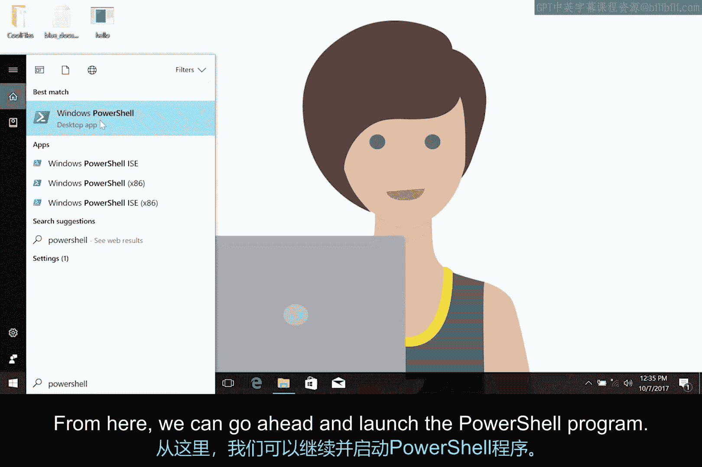
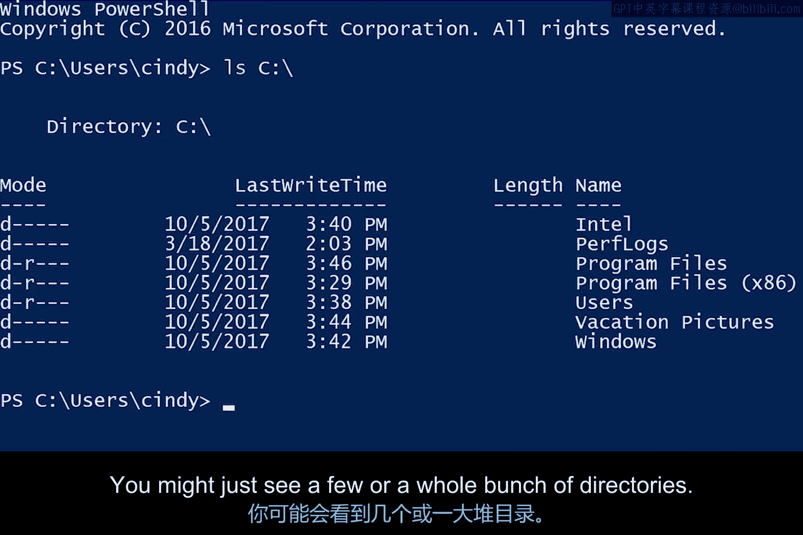
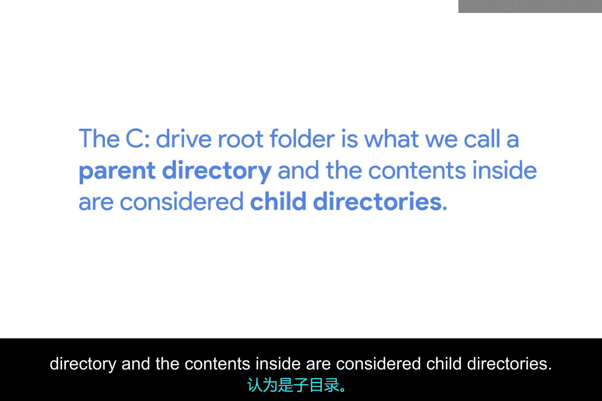
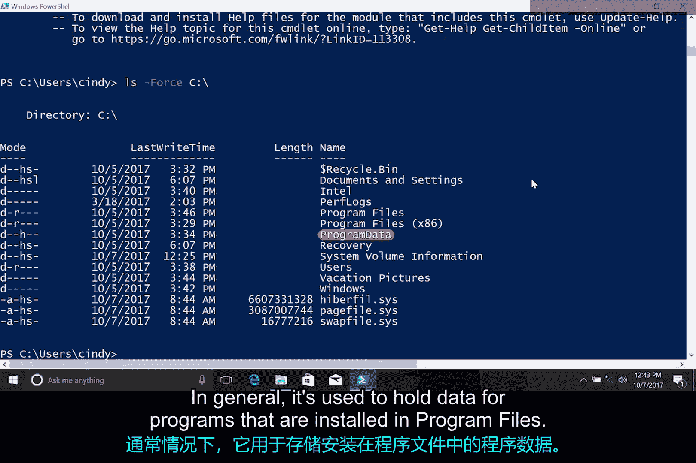

# 097：Windows命令行界面基础 🖥️

在本节课中，我们将要学习如何在Windows操作系统中使用命令行界面来浏览和管理文件系统。我们将重点介绍两种主要的命令行工具，并学习一个用于列出文件和目录的核心命令。

## Windows中的命令行界面

在Windows系统中，有两种主要的命令行界面可供使用。

第一种是**命令提示符**，其可执行文件为 `cmd.exe`。命令提示符已经存在了很长时间，它与早期MS-DOS系统中使用的命令提示符非常相似。

第二种是**PowerShell**，其可执行文件为 `powershell.exe`。由于PowerShell不仅支持命令提示符中的大多数命令，还提供了更多强大的功能，因此在本模块的练习中，我们将使用PowerShell。

需要指出的是，我们将要使用的许多PowerShell命令实际上是其他Shell中常见命令的**别名**。你可以将别名理解为命令的昵称或简称。

## 使用 `ls` 命令列出目录 📂

我们将要学习的第一个命令是用于列出文件和目录的 `ls` 命令。

让我们从列出C盘根目录下的目录开始。C盘是安装Windows操作系统的地方，对于许多用户来说，它可能是计算机中唯一的硬盘驱动器。



要打开PowerShell CLI，只需在应用程序列表中搜索“PowerShell”并启动该程序。

以下是启动PowerShell的界面示例：


我们将使用 `ls`（即“list directory”的缩写）命令，并为其指定我们想要查看的路径。路径本身并不是命令的一部分，而是一个**命令参数**。你可以将参数理解为与命令相关联的一个值。

要列出C盘根目录，我们输入以下命令：
```powershell
ls C:\
```
现在，你可以看到C盘根目录下的所有目录。你可能只看到几个目录，也可能看到一大堆目录，这完全取决于你的计算机用途。



## 理解目录层级关系 👨‍👦



C盘根目录就是我们所说的**父目录**，而其内部的内容则被视为**子目录**。

随着你继续深入学习操作系统，会遇到一些起初可能觉得不太贴切的术语，但它们实际上非常有意义。“父”和“子”是操作系统中表示层级关系的常用术语。

例如，如果我有一个名为“dogs”的文件夹，其中嵌套了另一个名为“Corgi”的文件夹，那么“dogs”就是父目录，“Corgi”就是子目录。

以下是C盘根目录的示例，展示了父目录与子目录的关系：


## 探索常见的子目录

现在，让我们来看看这个文件夹中一些常见的子目录：

以下是C盘根目录下几个关键子目录及其作用的说明：
*   **Program Files (x86)**：这些目录包含了Windows中安装的大多数应用程序和其他程序。
*   **Users**：此目录包含用户配置文件目录或主目录。每个登录此Windows机器的用户都会在这里拥有自己的目录。
*   **Windows**：这是Windows操作系统安装的位置。

## 获取命令帮助

如果我们打开PowerShell并运行 `Get-Help ls`，将会看到描述 `ls` 命令参数的文本。这会给我们一个命令参数的简要摘要。

如果你想查看更详细的帮助信息，可以尝试 `Get-Help ls -Full`。现在，你可以看到每个参数的描述以及一些如何使用该命令的示例。

## 查看隐藏文件

如果我们想查看此目录中的所有隐藏文件该怎么办呢？我们可以使用 `ls` 命令的另一个有用参数：`-Force`。

`-Force` 参数将显示通常仅用 `ls` 命令不会列出的隐藏文件和系统文件。使用以下命令：
```powershell
ls -Force
```
现在，你可以看到一些重要的文件和目录，例如：
*   **`$Recycle.Bin`**：这是回收站所在的位置。当你将文件移动到回收站时，它们会被移动到此目录，而不是立即被删除。
*   **ProgramData**：此目录包含许多不同的内容。通常，它用于存放安装在“Program Files”中的程序的数据。

以下是使用 `-Force` 参数后可能显示的隐藏文件示例：



## 总结


在本节课中，我们一起学习了Windows命令行界面的基础知识。我们认识了命令提示符和PowerShell两种工具，并重点掌握了使用 `ls` 命令及其参数（如 `-Force`）来列出文件和目录的方法。我们还理解了父目录与子目录的层级关系，并探索了C盘根目录下的一些关键文件夹。现在你已经知道如何在Windows文件系统中进行初步的浏览和查看了。