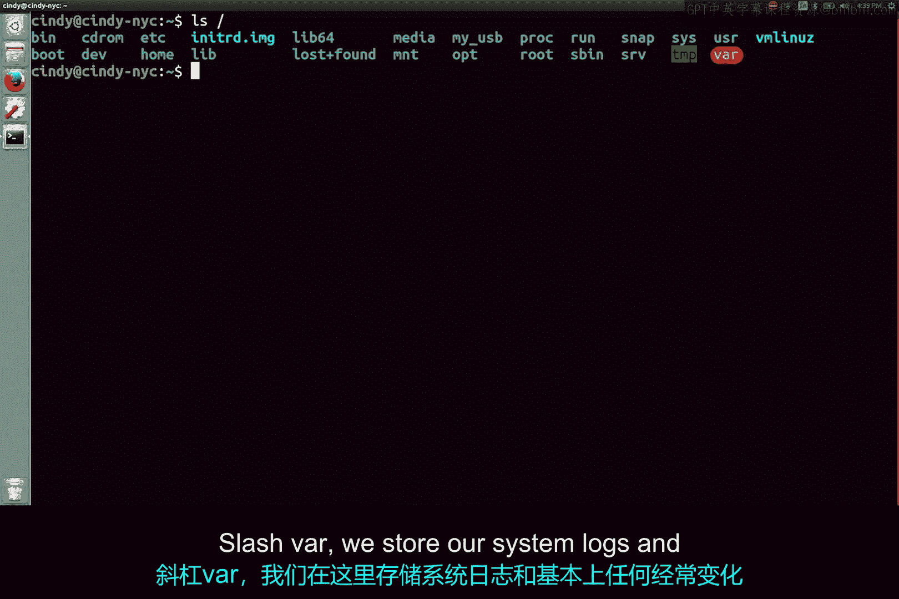
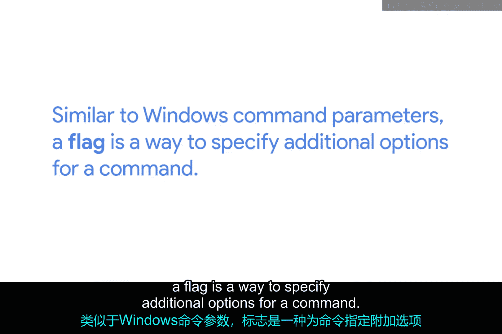
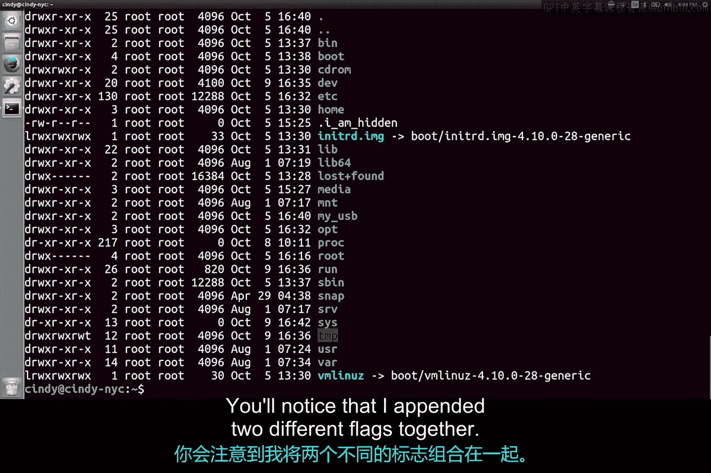
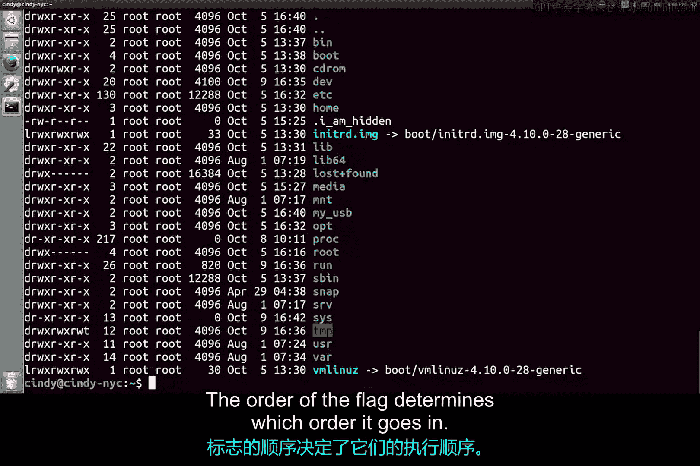

# 098：列出目录内容 📂


在本节课中，我们将要学习Linux系统中如何查看目录内容。我们会介绍`ls`命令的基本用法、如何指定路径、以及如何使用标志（flags）来获取更详细的信息。同时，我们也会初步了解Linux文件系统的几个关键目录。

## 根目录与路径

Linux系统中，所有其他目录都源于一个主目录，称为**根目录**。根目录的路径用一个斜杠 `/` 表示。

一个从根目录开始的Linux路径示例如下：`/home/Cindy/desktop`。

这类似于Windows中的路径：`C:\Users\Cindy\desktop`。

## 使用 `ls` 命令

要查看目录下的内容，我们使用 `ls`（list directory contents）命令。如果不提供路径参数，该命令默认会列出当前所在目录的内容。



例如，要查看根目录下的内容，可以运行：
```bash
ls /
```
运行后，我们可以看到根目录下列出的所有目录。这些目录各有不同的用途。



## 重要的系统目录

以下是几个关键目录的简要说明：
*   **`/bin`**：存储**必需的二进制文件或程序**。我们刚刚使用的 `ls` 命令程序就位于此文件夹中。它类似于Windows的“Program Files”目录。
*   **`/etc`**：存储**重要的系统配置文件**。
*   **`/home`**：用户的**个人目录**，存放用户文档、图片等。类似于Windows的“Users”目录。
*   **`/proc`**：包含**当前运行进程**的信息。我们将在后续课程中详细讨论进程。
*   **`/usr`**：用于存放**用户安装的软件**，而非用户个人文件。
*   **`/var`**：存储**系统日志**以及任何**经常变化的文件**。

## 使用命令标志

`ls` 命令有几个非常有用的**标志**。标志类似于Windows命令的参数，用于为命令指定额外的选项。

通常，我们使用连字符 `-` 后跟标志选项来指定标志。例如：`ls -l`。每个命令可用的标志选项各不相同。

### 获取命令帮助

有两种主要方法可以查看命令的可用选项和帮助信息。

**1. 使用 `--help` 标志**
你可以通过添加 `--help` 标志来查看命令的可用选项。例如：
```bash
ls --help
```
输出的帮助信息顶部会说明命令的使用格式，并给出命令功能的描述。后面的大段文本则列出了所有可用的选项及其作用。`--help` 标志非常有用，即使是经验丰富的操作系统用户也经常查阅它。

**2. 使用 `man` 命令**
另一种方法是使用 `man`（manual）命令来查看Linux中的手册页（man pages）。使用方法如下：
```bash
man ls
```
这会显示比 `--help` 更详细的信息。

## 实用的 `ls` 命令标志

现在，让我们回到 `ls` 命令，看看如何让它输出更友好的信息。

**1. `-l` 标志（长格式）**
默认的 `ls` 输出可读性不强。使用 `-l`（long）标志可以以长列表格式显示文件和文件夹的详细信息，类似于Windows的“显示属性”。
```bash
ls -l /
```
现在我们可以看到关于目录及其内容的额外信息。让我们从左到右分解这个输出：
*   **第一列**：文件权限（我们将在后续课程中详细讲解）。
*   **第二列**：文件的链接数（同样会在后续课程中讨论）。
*   **第三列**：文件所有者。
*   **第四列**：文件所属的用户组（这是指定访问权限的另一种方式，我们将在另一节课中讨论）。
*   **第五列**：文件大小。
*   **第六列**：最后修改的时间戳。
*   **第七列**：文件或目录名。



**2. `-a` 标志（显示所有）**
`-a`（all）标志可以显示目录下的**所有文件，包括隐藏文件**。
```bash
ls -a
```
或者，你可以将多个标志组合使用：
```bash
ls -la
```
这等同于 `ls -l -a`。标志的顺序通常不影响结果。




使用 `-a` 标志后，你会看到一些之前未显示的文件出现了。在Linux中，可以通过在文件或目录名前加一个点 `.` 来将其隐藏。例如，名为 `.iamhidden` 的文件就是一个隐藏文件。


## 总结

本节课中我们一起学习了：
*   如何使用 `ls` 命令查看目录内容。
*   理解了Linux的根目录 `/` 和路径的概念。
*   认识了几个重要的Linux系统目录，如 `/bin`、`/home`、`/etc` 等。
*   学会了使用命令标志，特别是 `-l` 来获取详细列表，以及 `-a` 来显示隐藏文件。
*   掌握了两种获取命令帮助的方法：`--help` 标志和 `man` 命令。

如果你觉得任何部分讲得太快，可以重新观看视频。在下一节课中，我们将开始在命令行界面中学习如何切换目录。