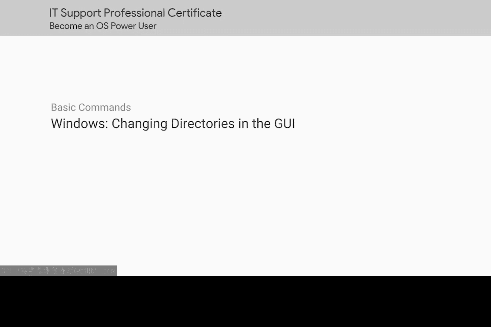
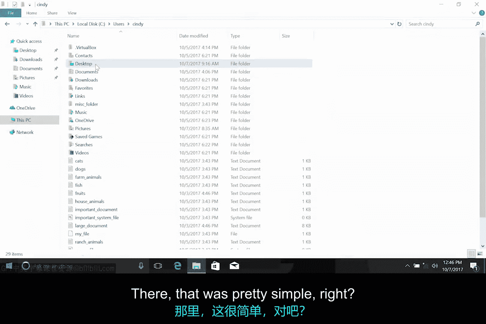
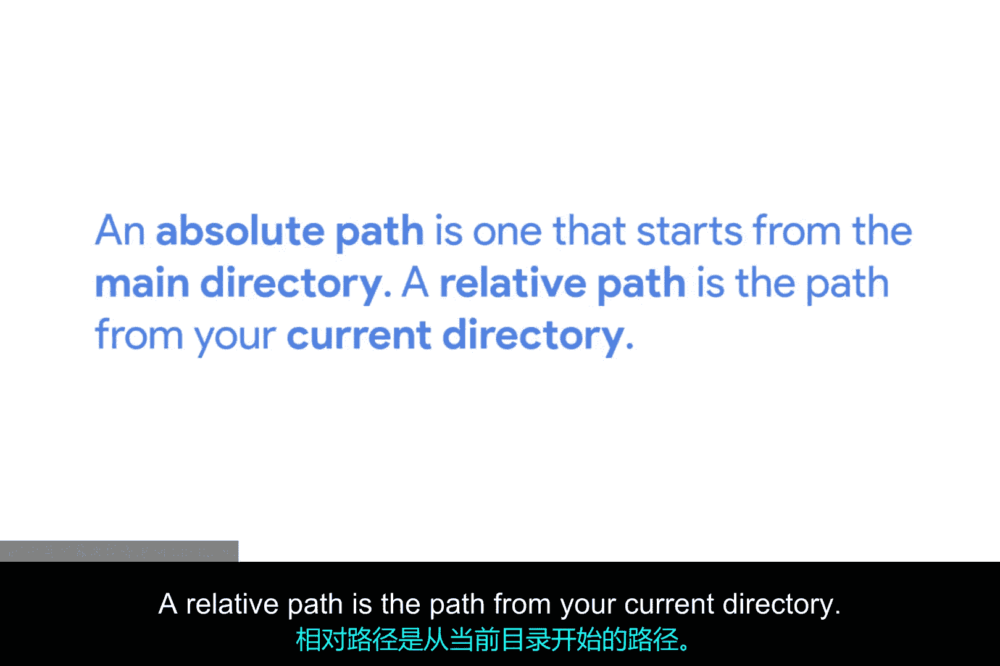

# 099：在GUI中更改目录

在本节课中，我们将学习如何在图形用户界面中浏览和更改目录。了解目录的结构以及如何在它们之间移动，是有效管理计算机文件的基础。

## 目录结构与导航 🗂️

上一节我们介绍了目录的基本布局。本节中我们来看看如何在图形界面中从一个目录移动到另一个目录。

你可能经常在图形界面中更改目录，甚至没有意识到这一点。即便如此，我们仍将展示具体操作方法。知识就是力量。

## 路径的类型：绝对路径与相对路径 🧭

现在我们已经可以自由地在系统中的任何目录和路径之间移动了。需要指出的是，路径有两种不同的类型：**绝对路径**和**相对路径**。

*   **绝对路径**是从根目录（例如 `C:\` 或 `/`）开始的完整路径。
*   **相对路径**是从你当前所在目录开始的路径。

这两种路径的区别在图形界面操作中不那么重要，但在命令行界面中至关重要。接下来，让我们看看这在Windows命令行中是什么样子。

## 总结 📝

本节课中我们一起学习了如何在图形界面中浏览目录，并理解了**绝对路径**和**相对路径**的核心概念。掌握这些基础知识，将为后续学习命令行操作打下坚实的基础。