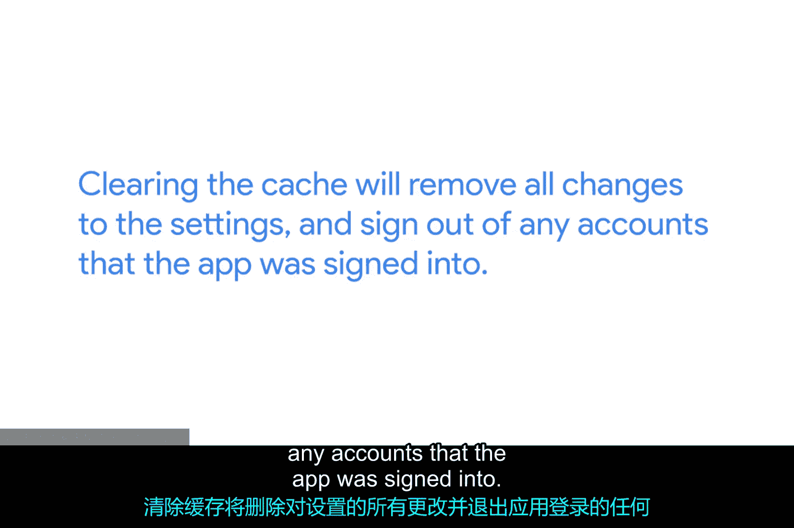

**移动操作系统与软件：第2课：移动应用程序包管理**

在本节课中，我们将学习移动操作系统（如iOS和Android）中软件的发布、安装与管理方式。我们将重点探讨应用程序商店、企业应用分发以及故障排除的基本概念。

---

现在，我们来讨论软件和移动操作系统。我们将主要使用iOS和Android的例子，但其他移动操作系统的工作方式也类似。如果你的移动设备使用专门的系统，你可以在设备文档中找到该软件如何工作的信息。

移动操作系统上的软件以移动应用程序（或称App）的形式分发。应用程序必须来自移动设备已配置为信任的来源。在大多数操作系统上，你不能随意从一个网站下载并安装应用。相反，移动操作系统使用应用商店。

应用商店是一个中心化的、受管理的市场，供应用开发者发布和销售移动应用。应用商店应用本身就像一个**包管理器**，而应用商店服务则像一个**包仓库**。人们通过一个统一的界面，从中心化来源获取免费或付费的应用程序。

通过应用商店发布的应用程序通常已经过安全审查，并获得了商店所有者的批准。这些应用由开发者进行签名。操作系统被配置为只信任由其认可的发布者签名的代码。我们将在未来的模块中更详细地讨论代码签名。现在，你可以把它想象成签署一封信，开发者是在声明“这是我编写的”。不过，代码签名与签署信件有一个不同点：**如果有人修改了代码，签名就会失效**。这让操作系统能够知道代码是否被篡改。

上一节我们介绍了面向公众的应用分发，本节中我们来看看组织内部的应用管理。

中心化的应用商店对于面向公众的应用非常有效。但如果你的组织需要运行某种定制应用呢？这时就需要使用企业应用管理，它允许组织分发定制的移动应用。这些应用由组织开发或为组织开发，并不对公众开放。

企业应用使用企业证书进行签名，安装这些应用的设备必须信任该证书。作为IT支持专家，你可能会通过移动设备管理服务来协助管理企业应用的安装，我们将在未来的视频中学习相关内容。

除了应用商店和企业分发，还有另一种安装应用的方式。

还有一种方式可以将应用安装到移动操作系统上，这被称为侧载。侧载是指你直接安装移动应用，而不使用应用商店。侧载安装包比通过应用商店安装风险更高，通常只有应用开发者才会这样做。

移动应用是独立的软件包，因此它们包含了所有依赖项。当你安装一个应用时，它已经内置了运行所需的一切。移动应用的数据被分配到一个特定的存储位置。当你使用一个移动应用时，任何由该应用更改或创建的内容最终都会存储在该应用分配的存储位置或缓存中。

因此，将移动应用重置到首次安装时的状态非常简单，只需删除或清除其缓存即可。在你的IT支持角色中，你可能会帮助人们排查移动应用问题。清除缓存将移除所有对设置的更改，并注销应用已登录的任何账户。

在处理难以控制的应用时，这可能不是你首先尝试的方法，但当问题确实很严重时，这是一个很好的技巧。请查看补充阅读材料，获取如何执行此操作的指南。

移动设备通常会被配置为定期检查应用更新。在IT支持中，你可能需要确保应用已更新。你可以在补充阅读材料中找到如何检查应用更新的详细信息。

---

本节课中，我们一起学习了移动应用程序的分发渠道（应用商店、企业分发、侧载）、代码签名的基本概念、应用数据的存储方式，以及通过清除缓存来重置应用状态的故障排除技巧。理解这些基础知识对于管理和支持移动设备至关重要。