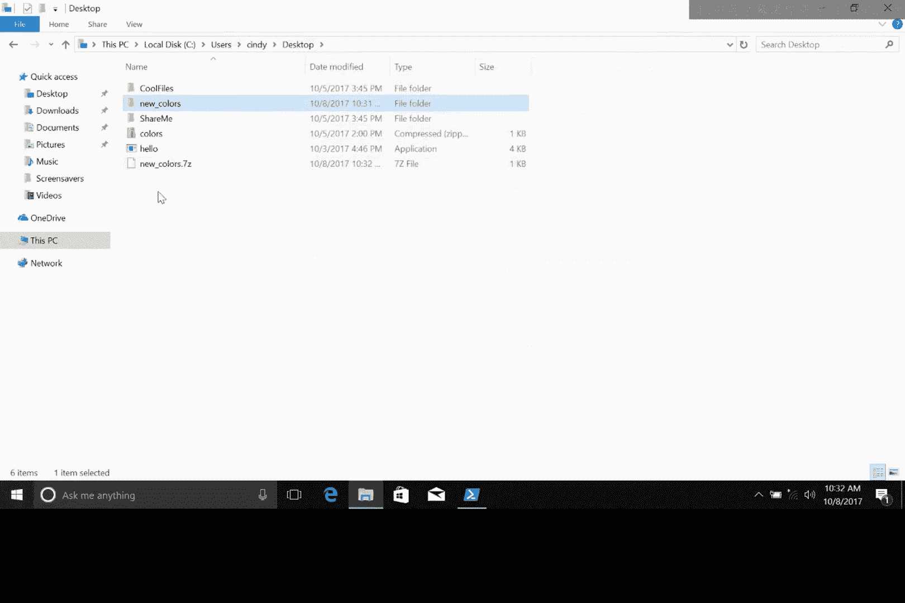
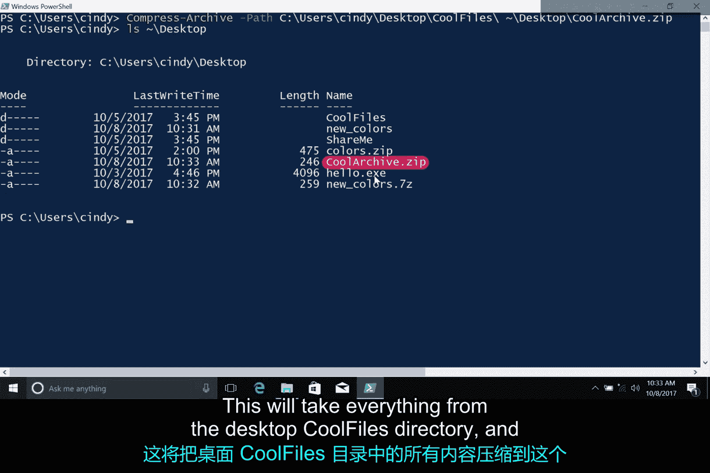

# 146：软件包与归档文件

在本节课中，我们将要学习一种特殊的“软件包”——归档文件。我们将了解什么是归档文件，它与普通软件包的区别，以及如何在Windows系统中创建和解压归档文件。

## 什么是归档文件？📦

上一节我们介绍了软件包，本节中我们来看看一种特殊的“包”——归档文件。

归档文件本身并非真正的软件安装包。它是由一个或多个文件**压缩**而成的单个文件。软件包的归档文件通常包含软件的核心或源代码文件，这些文件被压缩成一个文件。当我们从源代码归档文件安装软件时，这个过程被称为“从源代码安装”。

以下是常见的归档文件类型：
*   **.tar**
*   **.zip**
*   **.rar**

## 如何安装归档文件中的软件？🔧

要安装归档文件中的软件，首先需要**提取**归档文件的内容，以查看其中的文件。然后，根据软件编写所用的编程语言，使用特定的方法进行安装。由于安装方法因编程语言而异，本节课我们不会深入讨论如何从源代码安装，但会重点讲解如何提取归档文件的内容——这是IT支持专家经常需要进行的操作。

## 归档文件的用途与工具 🛠️

不仅仅是软件，任何文件（如图片或音乐文件）都可以被归档，你在IT支持工作中会经常见到它们。复杂之处在于，不同类型的归档文件有多种不同的提取方式。

幸运的是，Windows中有一个非常流行的工具，可以用于归档和解压不同文件类型（如.rar、.zip），这就是开源工具 **7-Zip**。它已经安装在我的电脑上。如果你想自己下载，我已在补充阅读材料中提供了链接。

## 实践：解压与创建归档文件 💻

我的桌面上有一个名为 `colors.zip` 的归档文件。让我们解压它，看看里面有什么文件。我只需右键点击文件，选择 **7-Zip -> 提取到当前文件夹**。看起来这个归档文件里有一堆文件。

除了解压文件，你也可以创建归档文件。我可以新建一个文件夹，命名为 `new_colors`。然后，我将把 `new_blue.txt` 文件和旧的 `colors` 文件夹放入其中。接着，我将使用7-Zip将其归档：右键点击 `new_colors` 文件夹，选择 **7-Zip -> 添加到归档...**，点击确定。



这很实用。如果你想通过电子邮件发送一堆文件，无需逐个发送，可以将它们全部合并到一个归档文件中，只发送这一个文件。


## 使用命令行管理归档文件 ⌨️

如果你使用的是 **PowerShell 5.0 或更高版本**，你甚至可以直接在命令行中提取和压缩归档文件。

假设你的桌面上有一个名为 `cool_files` 的文件夹，里面有一堆文件，你想将它们添加到一个新的zip文件中。打开PowerShell命令行界面后，你可以输入以下命令：

```powershell
Compress-Archive -Path .\Desktop\cool_files\* -DestinationPath .\Desktop\cool_archive.zip
```

现在检查你的桌面，你应该能看到 `cool_archive.zip`。这个命令会将桌面 `cool_files` 目录中的所有内容压缩到这个zip文件中。



## 总结 📝


本节课中我们一起学习了归档文件的概念。我们了解到归档文件是压缩后的文件集合，常用于打包和传输多个文件。我们实践了如何使用图形化工具7-Zip来解压和创建归档文件，并介绍了在PowerShell中使用 `Compress-Archive` 命令进行压缩的基本方法。掌握这些技能对于高效管理文件至关重要。