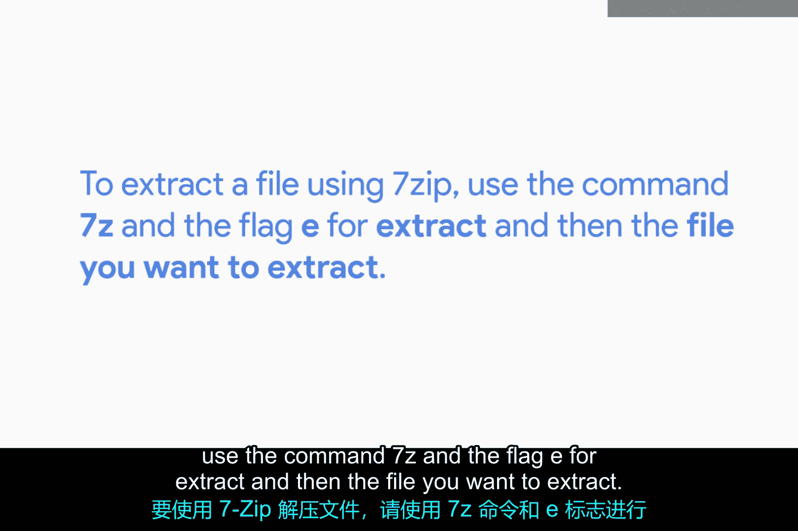
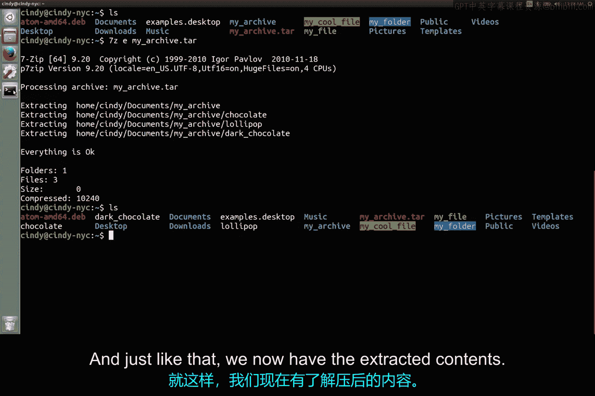

# 147：Linux存档与解压工具 🗜️

在本节课中，我们将学习如何在Linux系统中使用7-Zip工具来解压文件，并简要介绍其他常见的存档工具。

## 概述

我们已经安装了Linux版本的7-Zip软件包，其名称为`p7zip-full`。接下来，我们将学习如何使用这个工具来解压文件。



## 使用7-Zip解压文件

要使用7-Zip解压文件，我们需要在终端中使用`7z`命令，并配合`e`标志（代表解压），然后指定要解压的文件名。



**命令格式如下：**
```bash
7z e 文件名
```

例如，假设我们想要解压家目录中的一个名为`example.tar`的文件。

**操作步骤如下：**
1.  打开终端。
2.  导航到文件所在的目录（例如家目录）。
3.  输入命令：`7z e example.tar`。

执行命令后，文件的内容就会被提取到当前目录中。

## 其他存档工具简介

除了7-Zip，还有许多其他用于存档和解压文件的工具。其中一个非常流行且预装在大多数Linux发行版中的工具是`tar`命令。

虽然本节课不深入讲解`tar`命令的具体用法，但如果您想了解更多信息，可以参考接下来的补充阅读材料。

## 关于不同存档类型的说明

在Windows和Linux系统中工作时，您会遇到许多不同类型的存档文件（如`.zip`、`.tar`、`.gz`、`.rar`等）。请记住，不同类型的存档文件可能需要使用不同的命令或工具来解压。

## 总结

本节课中，我们一起学习了在Linux系统上使用7-Zip解压文件的基本方法，了解了其命令格式为`7z e 文件名`。同时，我们也认识到存在多种存档工具和文件格式，在实际操作中需要根据文件类型选择合适的解压方式。