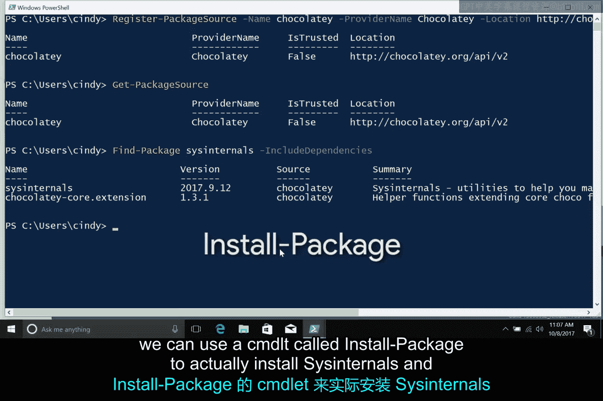

# 148：Windows包依赖管理 🧩

在本节课中，我们将要学习软件包依赖的概念，了解Windows操作系统如何管理这些依赖，并初步探索如何使用PowerShell包管理器来查找和安装软件及其依赖项。

## 概述

软件包通常需要依赖其他代码片段才能正常工作。理解和管理这些依赖关系是IT支持工作中的一项重要技能。本节将解释依赖关系的基本概念，介绍Windows的动态链接库和并排程序集机制，并演示如何使用命令行工具来管理包依赖。

## 什么是软件依赖？🔗

软件包为了运行，通常需要依赖其他代码片段。

例如，假设你正在Windows电脑上安装一款游戏。该程序可能需要执行一些计算来实现游戏中的物理效果，并将结果以图形形式渲染到屏幕上。为了完成这些任务，游戏可能**依赖**一个物理引擎来进行计算，同时**依赖**一个渲染库来在屏幕上显示精美的图形。为了让游戏正常工作，你必须确保所有这些软件都对游戏可用。


这种依赖其他软件片段来使应用程序工作的方式，就称为拥有**依赖关系**。因为一段代码需要依赖另一段代码才能运行。在我们的例子中，游戏**依赖**物理引擎和渲染库才能运行。

## 动态链接库（DLL）📚

那么，当我们提到“库”时，指的是什么呢？你可以将**库**视为一种打包他人编写的、有用代码集合的方式。这些代码被捆绑成一个单一的单元。需要其功能的程序可以在需要时调用它。在Windows中，这些共享库被称为**动态链接库**，简称 **DLL**。

> 你可以在接下来的阅读材料中找到关于动态链接库的更多细节。

DLL的一个非常有用的特性是，同一个DLL可以被许多不同的程序使用。这意味着所有共享代码无需为每个想使用它的应用程序单独加载到内存中，从而总体上减少了内存使用量。

## Windows安装包与依赖管理 📦

Windows应用程序通常有许多依赖项，它们与一个名为**MSI文件**的东西一起，位于同一个安装包中。MSI文件会告诉Windows安装程序如何将所有组件组合在一起。这意味着一个给定的安装包将包含所有资源和依赖项（如DLL）。Windows安装程序还会负责管理这些依赖项，并确保程序能够使用它们。

在过去，情况并不总是这么理想。想象这样一个场景：你一直在电脑上用来播放电影的视频播放器，使用一个图形DLL来在屏幕上显示影片。一款你想玩的新游戏发布了，于是你也安装了它。这个游戏附带了一个新版本的图形库，因此游戏安装程序用新的DLL更新了现有版本。突然间，你的视频播放器停止工作了。原来，视频播放器不知道如何使用新版本的DLL。这在当时是个相当棘手的问题。

然而，在现代Windows操作系统中，DLL地狱已成为过去。为了解决这个问题，大多数共享库和资源都由一种称为**并排程序集**（SxS）的机制来管理。这些共享库大多存储在 `C:\Windows\WinSxS` 文件夹中。

如果一个应用程序需要使用共享库来执行任务，该库会在一个名为**清单**的文件中被指定。这会告诉Windows从SxS文件夹加载相应的库。SxS系统还支持自动访问同一共享库的多个版本。因此，当你安装新软件时，不会破坏已有程序的运行环境。

## 使用包管理器管理依赖 ⚙️

除了清单和SxS系统，以及安装程序将依赖项捆绑在安装包中的方式外，你还可以使用**Windows包管理器**来帮助安装和维护已安装软件需要使用的库及其他依赖项。

我们将在关于Windows包管理器的课程中更详细地讨论这一点。但在这里，我们将给你一个预览，展示如何使用PowerShell的Windows包管理功能。

使用一个名为 `Find-Package` 的Windows包管理命令，你可以直接从命令行定位软件及其依赖项。

> 顺便说一下，**命令**基本上是我们给那些使用“动词-名词”格式的Windows PowerShell命令起的名字。我们已经使用过很多命令，例如 `Get-Help`、`Select-String` 等等。Windows内置了数百个命令，你甚至可以编写自己的命令。

好的，回到手头的任务。假设你想安装 **Sysinternals** 软件包，这是一套由微软发布的工具集，可以帮助你排查Windows电脑上的各种问题。

你可以从微软网站下载Sysinternals软件包，或者也可以使用包管理功能。

## 实践：在PowerShell中查找包 🖥️


首先，我们需要通过从开始菜单键入 `PowerShell` 来打开一个PowerShell终端。

然后，我们可以尝试通过执行以下命令来定位Sysinternals包：
```powershell
Find-Package -Name "sysinternals" -IncludeDependencies
```
然而，出现了一个错误：“未找到匹配项”。这是怎么回事？

这个异常产生的原因是，PowerShell中默认的包源是 **PowerShell Gallery**，而它并不包含Sysinternals包。幸运的是，我们只需要告诉PowerShell一个可以找到这个Sysinternals包的地方。

那是一个名为 **Chocolatey** 的包存储库。我们将在包管理器视频中深入了解更多关于Chocolatey的信息，但现在，你只需要知道它是一个存放各种Windows软件包的地方。

因此，在我们安装任何包之前，我们需要添加一个**包源**，告诉我们的电脑在哪里可以找到我们想要安装的包。既然我们想使用Chocolatey来查找包，我们需要将其添加为一个包源。我们将使用PowerShell命令 `Register-PackageSource` 来完成这个操作。

让我们继续输入：
```powershell
Register-PackageSource -Name "chocolatey" -ProviderName "Chocolatey" -Location "https://chocolatey.org/api/v2/"
```
现在，我们可以使用 `Get-PackageSource` 命令来验证两个软件源都已准备就绪。

然后，再次尝试使用 `Find-Package` 命令查找我们的包及其依赖项：
```powershell
Find-Package -Name "sysinternals" -IncludeDependencies
```
很好！现在我们知道了这就是我们想要的包，我们可以使用一个名为 `Install-Package` 的命令来实际安装Sysinternals及其相应的依赖项。

我们将在后续课程中进行安装操作。

## 总结



本节课中，我们一起学习了软件依赖的核心概念。我们了解到，应用程序（如游戏）需要依赖其他代码库（如物理引擎或渲染库）才能运行。在Windows中，这些共享代码通常以**动态链接库**的形式存在。现代Windows通过**并排程序集**机制管理不同版本的DLL，避免了“DLL地狱”问题。最后，我们初步探索了使用PowerShell包管理器（如通过Chocolatey源）来查找软件包及其依赖项的方法，为后续的软件安装和管理打下了基础。