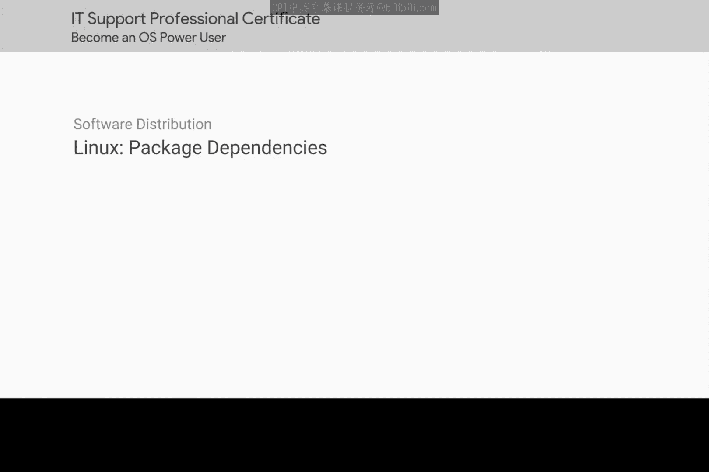
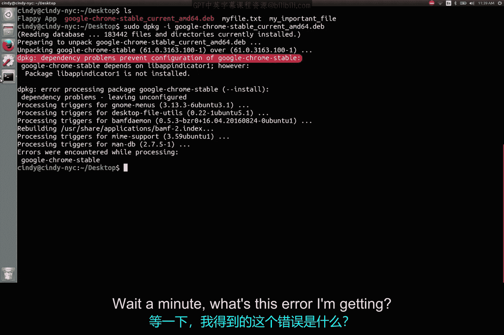
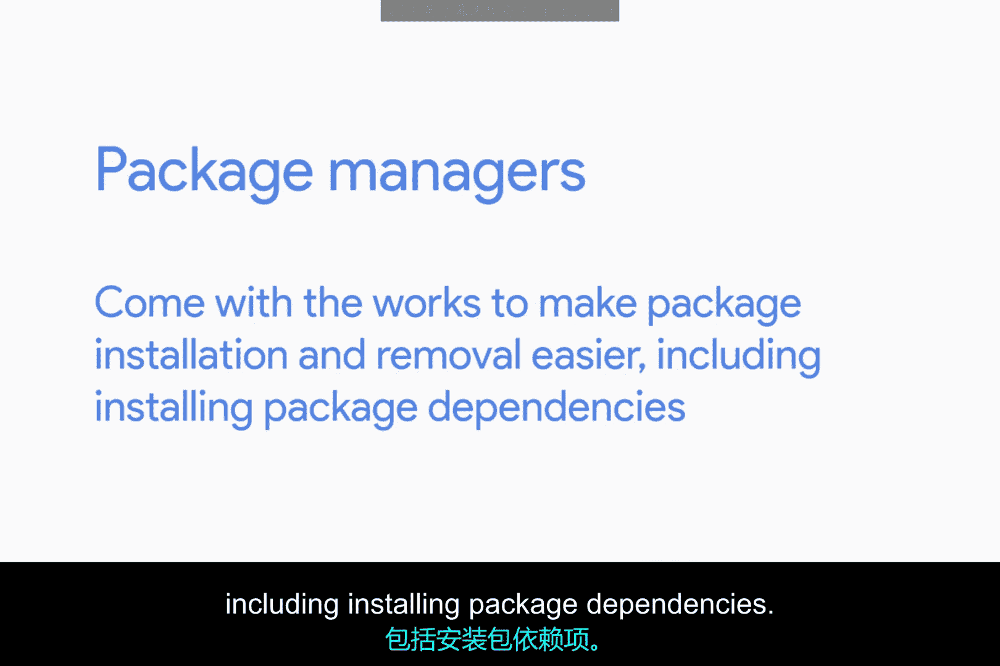

# 149：理解包依赖



在本节课中，我们将要学习 Linux 系统中的包依赖概念。我们将通过一个具体的安装示例，了解什么是依赖关系，以及为什么它会导致安装失败。

## 什么是包依赖？

上一节我们介绍了如何使用 `dpkg` 命令安装独立的软件包。本节中我们来看看在安装过程中可能遇到的一个常见问题：包依赖。

让我们看看在 Linux 中包依赖会是什么样子。我们已经在上一课学习了如何使用 `dpkg` 命令在 Linux 中安装一个独立的软件包。



现在，让我们尝试安装另一个软件包。我已经在桌面上下载了 Google Chrome 浏览器，并想使用 `sudo dpkg -i` 命令来安装它。

```
sudo dpkg -i google-chrome-stable_current_amd64.deb
```

哦，等等，我收到的这个错误是什么？错误提示：“依赖问题阻止了 Google Chrome Stable 的配置”。

## 依赖错误解析

这个错误提示表明，它无法安装 Google Chrome，因为它依赖于另一个当前未在此机器上安装的软件包。因此，在安装 Chrome 之前，我们必须先安装这个名为 `libappindicator1` 的包。

虽然像 `dpkg` 这样的独立包安装器使用起来可能很快，但它不会为我们安装包的依赖项。在 Linux 中，这些依赖项可以是其他软件包，也可以是像共享库这样的东西。

Linux 共享库类似于 Windows 的 DLL（动态链接库），它们是可供其他程序使用的代码库。

## 如何处理依赖错误？

如果你遇到了依赖错误，该怎么办？你可以一个一个地手动安装这些依赖项。当然可以，但在某些情况下，你可能看到的不仅仅是一个依赖项，甚至可能多达十个。这在 Linux 中尤其常见。

为了能让一个程序运行而不断地安装其他程序，这并不有趣。

幸运的是，这就是包管理器发挥作用的地方。包管理器配备了各种功能，使软件包的安装和卸载变得更加容易，其中包括自动安装包依赖项。



我们将在下一课详细讨论包管理器。但现在，只需知道如果你安装一个独立的软件包，其依赖项不会自动安装，这就足够了。

## 总结

本节课中我们一起学习了 Linux 的包依赖概念。我们通过尝试安装 Google Chrome 遇到了依赖错误，了解到一个软件包可能依赖于其他未安装的库或包。我们还认识到，虽然 `dpkg` 工具简单直接，但它不处理依赖关系，这引出了对更高级的包管理器的需求。下一课，我们将深入探讨能够自动解决这些依赖问题的包管理器。