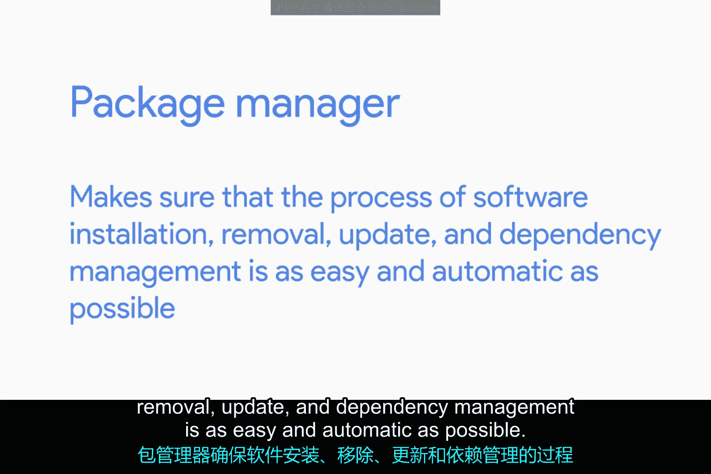
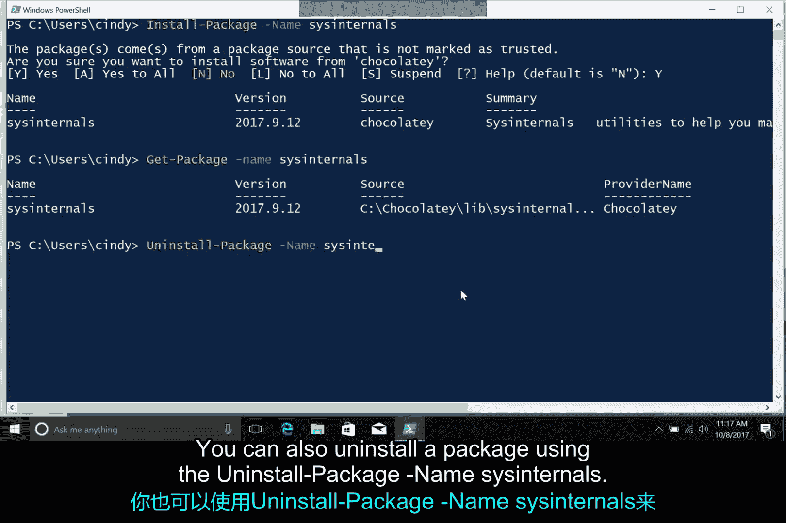

# 150：Windows包管理器 🖥️

在本节课中，我们将学习一种不同的软件管理方式——包管理器。我们将重点了解Windows系统上的包管理器工具，特别是Chocolatey，并学习如何使用它来简化软件的安装、更新和卸载过程。

## 概述

上一节我们介绍了通过独立可执行文件或安装包来安装软件及其依赖项的方法。本节中，我们来看看如何使用名为“包管理器”的工具来管理软件安装。

包管理器旨在使软件的安装、移除、更新和依赖项管理过程尽可能简单和自动化。



## 传统软件安装方式

回想一下在Windows计算机上安装新程序的常规方式。你可能会在搜索引擎中搜索它，访问该程序的网站，下载安装程序，然后运行它。如果你想更新软件，可能需要打开程序并使用它提供的任何机制来安装新版本。许多程序提供自动更新功能，微软也通过Windows Update管理其自身编写的软件。但有时，你可能仍需返回最初下载软件的网站，获取新版本的安装程序。最后，如果你想移除软件，可能会使用Windows的“添加或删除程序”工具，或者运行程序提供的自定义卸载程序。

像Windows Installer这样的安装技术可以处理依赖项管理，但它们并不能很好地帮助你从程序的中央目录安装软件或执行自动更新。

## 引入包管理器：Chocolatey

这时，像Chocolatey这样的包管理器就派上用场了。Chocolatey是一个适用于Windows的第三方包管理器，这意味着它不是由微软编写的。它允许你从命令行安装Windows应用程序。

Chocolatey基于一些现有的Windows技术（如PowerShell）构建，并允许你安装公共Chocolatey存储库中存在的任何软件包或软件。你还可以将缺失的软件添加到公共存储库中，甚至可以根据需要（例如为内部公司应用程序打包）创建自己的私有存储库。

像SCCM和Puppet这样的配置管理工具甚至可以与Chocolatey集成，这有助于使公司内Windows计算机的软件部署管理自动化和简单化。

## Chocolatey的安装与使用方法

我们在之前的视频中讨论了几种安装软件包的方法，现在让我们将Chocolatey加入其中，它本身支持多种软件安装方法。

首先，你可以安装Chocolatey命令行工具，并直接从PowerShell CLI运行它。或者，你可以使用PowerShell最近发布的包管理功能，只需指定软件包的来源应为Chocolatey存储库。

还记得我们讨论安装软件时提到的内容吗？在将Chocolatey添加为软件源后，我们使用以下命令来定位Windows Sysinternals软件包：

```powershell
Find-Package -Name sysinternals -IncludeDependencies
```

这很好，但我们究竟如何安装这个软件包呢？这时就需要用到 `Install-Package` 命令了。我们可以使用这个工具来安装一个软件及其依赖项。

让我们尝试安装之前找到的那个Sysinternals软件包：

```powershell
Install-Package -Name sysinternals
```

确认后，软件包就安装好了。我们可以使用 `Get-Package` 命令来验证它是否已安装：

```powershell
Get-Package -Name sysinternals
```

你也可以使用以下命令卸载软件包：

```powershell
Uninstall-Package -Name sysinternals
```

## 总结



本节课中，我们一起学习了Windows包管理器Chocolatey的基本概念和使用方法。我们了解了它如何通过命令行简化软件的安装、更新和卸载流程，并实践了使用PowerShell命令来查找、安装和验证软件包。掌握包管理器工具，可以极大地提升软件管理的效率和自动化水平。