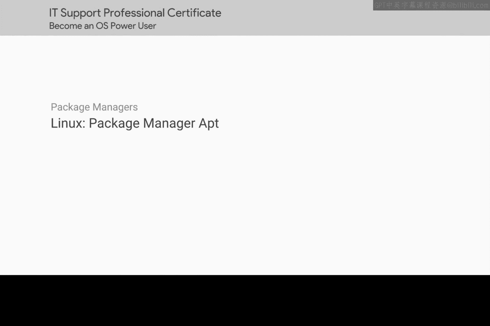
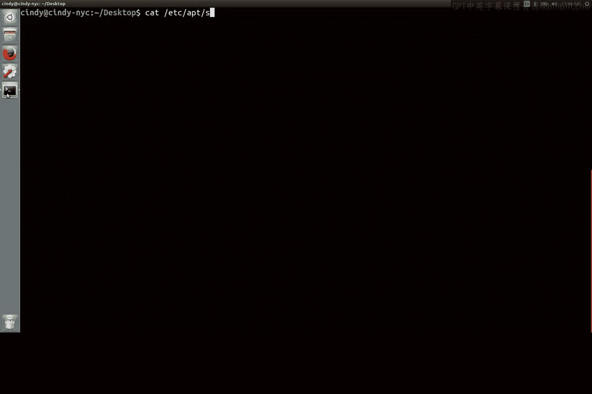
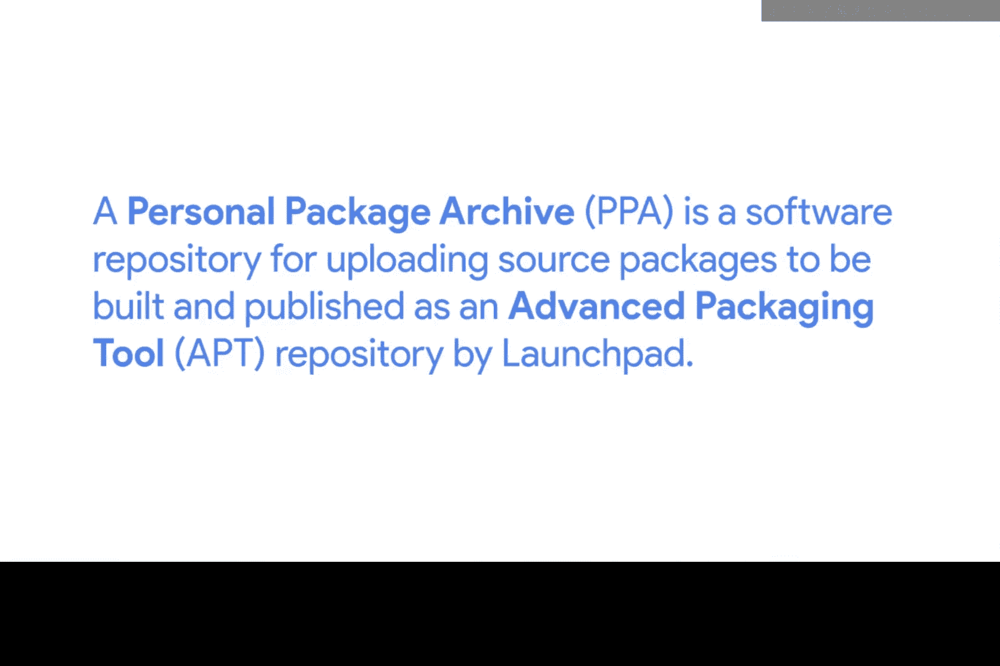
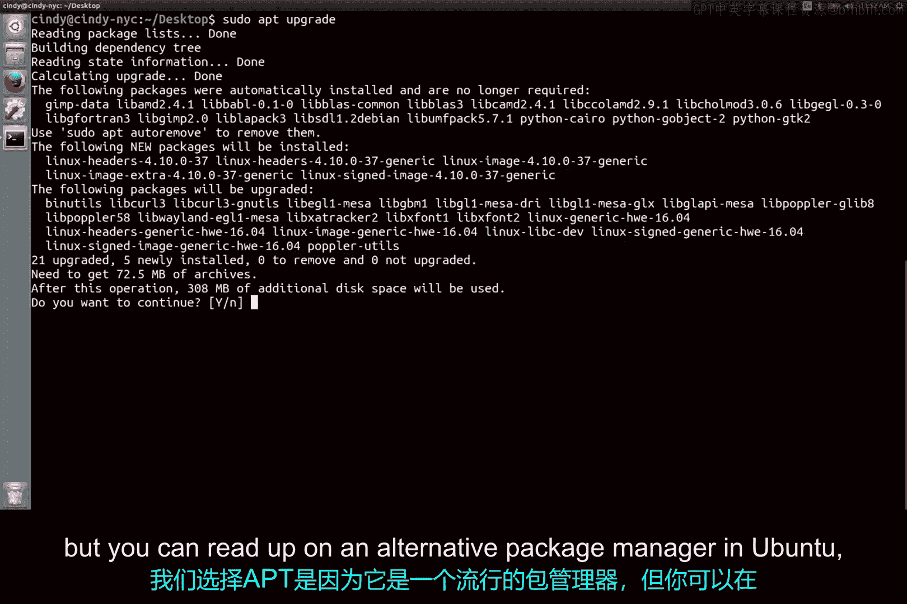

# 151：apt包管理器详解 🐧



在本节课中，我们将学习Ubuntu Linux系统中一个至关重要的工具——**apt包管理器**。我们将了解它的作用、如何使用它来安装和卸载软件、以及它背后的核心概念“软件仓库”。掌握apt是高效管理Linux系统软件的基础。

## 概述：什么是apt？

apt，全称Advanced Package Tool，是Ubuntu及其衍生发行版中使用的包管理器。它的主要作用是简化软件包的安装、升级和移除过程。apt能自动处理软件包之间的依赖关系，让你无需手动寻找和安装每个依赖项。

## 安装与卸载软件包

上一节我们介绍了apt的基本概念，本节中我们来看看如何使用它进行最基本的操作：安装和卸载软件。

**安装软件包**的命令格式如下：
```bash
sudo apt install <package_name>
```
例如，要安装开源图像编辑器GIMP，你可以运行：
```bash
sudo apt install gimp
```
执行此命令后，apt会自动从配置的软件仓库中查找`gimp`包及其所有依赖项，并询问你是否确认安装。输出信息会清晰地告诉你将新增、升级或移除哪些包。

**卸载软件包**的命令是：
```bash
sudo apt remove <package_name>
```
例如，要移除GIMP：
```bash
sudo apt remove gimp
```
apt在移除软件时，通常会询问你是否要同时移除那些不再被其他软件需要的依赖包，这有助于保持系统的整洁。

## 核心概念：软件仓库

你可能会好奇，apt是如何知道从哪里下载GIMP的？这要归功于**软件仓库**。

软件仓库是存储软件包及其元数据的服务器。开发者将软件发布到这些仓库中，用户只需将仓库地址添加到自己的系统，就可以方便地搜索和安装海量软件，而无需手动在互联网上逐个寻找。

在Ubuntu中，系统的主要软件仓库列表存储在以下文件中：
```
/etc/apt/sources.list
```
你的系统正是通过读取这个文件中的地址，才知道该去哪些服务器上查找软件。如果未在此文件中添加仓库链接，你的计算机将不知道去哪里检查软件。



除了官方仓库，还有一种常见的仓库类型叫**PPA**。

## 关于PPA的注意事项

PPA，全称Personal Package Archive，是托管在Launchpad.net（由Canonical公司运营）上的个人软件包存档。它允许开发者和团队更快速地发布和更新他们的软件。



你可以像添加普通仓库一样添加PPA。但使用时需要谨慎：
*   PPA中的软件可能不像Ubuntu官方仓库中的软件那样经过严格的审查和测试。
*   某些PPA可能包含有缺陷甚至恶意的软件。
因此，建议只添加来自可信来源的PPA。

## 更新系统与软件包

软件仓库中的软件会不断更新。为了确保你能获取到最新的软件和安全补丁，需要定期更新本地的软件包列表和升级已安装的软件。

以下是两个关键命令：
1.  **更新软件包列表**：`sudo apt update`
    此命令会同步远程仓库的软件包索引列表到本地，让你知道有哪些可用的新版本，但**不会**实际安装或升级任何软件。
2.  **升级已安装的软件包**：`sudo apt upgrade`
    在执行完`apt update`后，运行此命令会根据更新后的列表，自动下载并安装所有可用的更新。

在安装新软件前，先运行`sudo apt update`是一个好习惯，这能确保你获取的是仓库中最新的软件信息。

## 探索更多apt命令

apt的功能远不止于此。你可以使用`apt --help`命令查看所有可用选项。

以下是其他一些有用的命令示例：
*   `apt list`：列出所有可用或已安装的软件包。
*   `apt search <keyword>`：在仓库中搜索包含关键字的软件包。
*   `apt show <package_name>`：显示某个软件包的详细信息。

虽然Ubuntu上还有其他包管理器（如`dpkg`、`snap`），但apt因其易用性和强大的依赖处理能力而成为最受欢迎的选择之一。



## 总结

本节课中我们一起学习了Ubuntu Linux的核心包管理工具——apt。我们掌握了如何使用`apt install`和`apt remove`来管理软件，理解了**软件仓库**和**PPA**的概念及其重要性，并学会了通过`apt update`和`apt upgrade`来保持系统更新。熟练使用apt是IT支持领域和日常Linux系统维护中一项高频且关键的技能。在接下来的课程中，我们将继续深入探索Linux系统的其他管理工具。