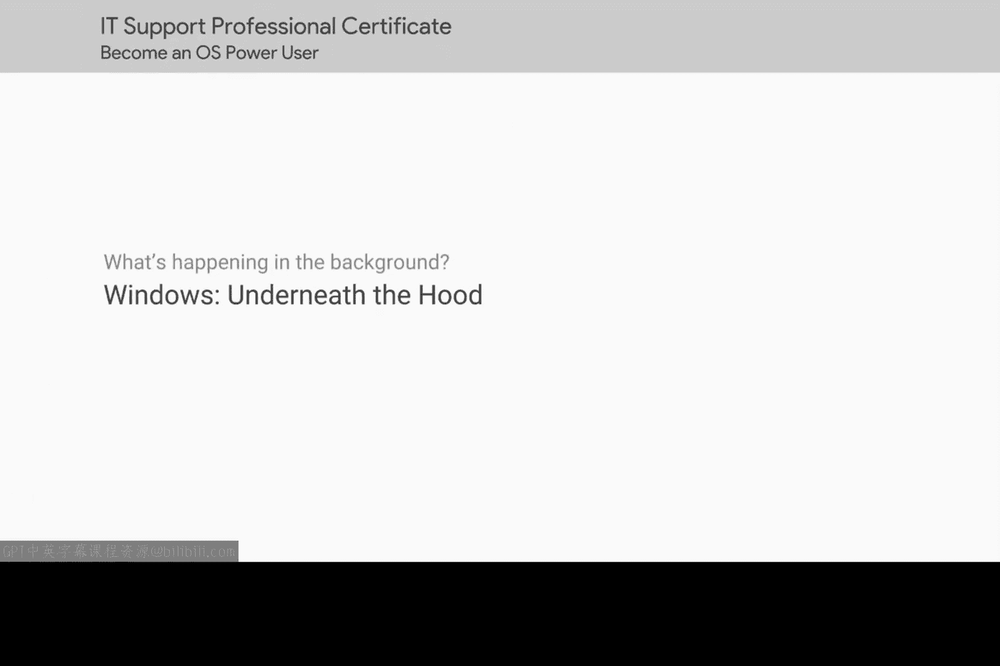

# 152：Windows软件安装底层原理

在本节课中，我们将学习Windows操作系统下软件安装的底层原理。我们将探讨当您点击安装程序时，系统内部实际发生了什么，这对于IT支持人员理解和排查安装问题至关重要。

## 软件安装的抽象与底层

上一节我们介绍了使用包管理器安装软件的实践层面，这是一种抽象化的安装方式。本节中我们来看看软件安装的底层机制。

作为IT支持人员，理解安装或卸载软件时底层技术实际发生的变化非常重要。您可能会遇到这样的情况：安装的软件包修改了不该修改的配置文件，从而引发问题。因此，了解软件安装的底层工作原理是必要的。

## Windows中EXE文件的安装过程

当您点击一个安装可执行文件（EXE）时，接下来发生的情况取决于程序开发者如何设置其应用程序的安装方式。

如果该EXE文件包含的代码用于不使用Windows安装器系统的自定义安装，那么其底层发生的细节大多是不明确的。这是因为大多数Windows软件是以闭源软件包的形式分发的，意味着您无法查看源代码来了解程序在做什么。

在这种情况下，虽然您无法阅读开发者编写的指令，但可以使用特定工具来检查安装程序正在执行的操作。一种方法是使用**Microsoft Sysinternals Toolkit**提供的进程监控程序。该工具将显示安装可执行文件正在进行的任何活动，例如它写入的文件以及它执行的任何进程活动。

您可以在接下来的补充阅读中了解更多关于Microsoft Sysinternals Toolkit的信息。

## MSI文件的安装机制

那么，MSI文件或封装了MSI的可执行文件又如何呢？同样，应用程序本身是闭源的，因此您无法窥视其源代码以了解其功能。但是，使用MSI格式的安装包需要遵守一套规则和标准，以便Windows安装器系统能够理解其指令并执行安装。

MSI文件的内容比初看起来要复杂。事实上，它们根本不是简单的文件。它们实际上是数据库的组合，这些数据库在不同的表中包含安装指令，同时包含了程序所需的所有文件、对象、快捷方式、资源和库，全部组合在一起。

Windows安装器使用存储在MSI数据库表中的信息来指导应如何执行安装。它会知道文件和应用程序数据应放置在何处，以及成功安装程序需要进行的任何其他操作。

Windows安装器会跟踪其执行的所有操作，并创建一组单独的指令来撤销这些操作。这就是它允许用户卸载程序的方式。

如果您对MSI文件的详细内容感到好奇，或者想自己创建一个Windows安装器包，可以查看Microsoft提供的**Orca.exe**工具。这是满足您好奇心的好方法。

ORCA是Windows SDK（软件开发工具包）的一部分，但您不需要是程序员才能使用它。ORCA可以帮助您编辑或创建Windows安装器包，因此请随意探索其功能。我们在此视频后的补充阅读中提供了该工具的链接。

## 总结与过渡

Windows安装过程在底层涉及大量操作，而这一切仅由几次点击触发。那么，Linux系统的情况又如何呢？我们将在下一节中探讨。