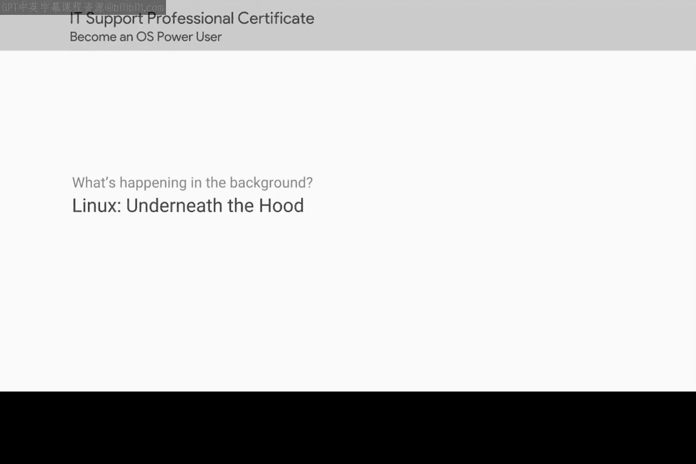
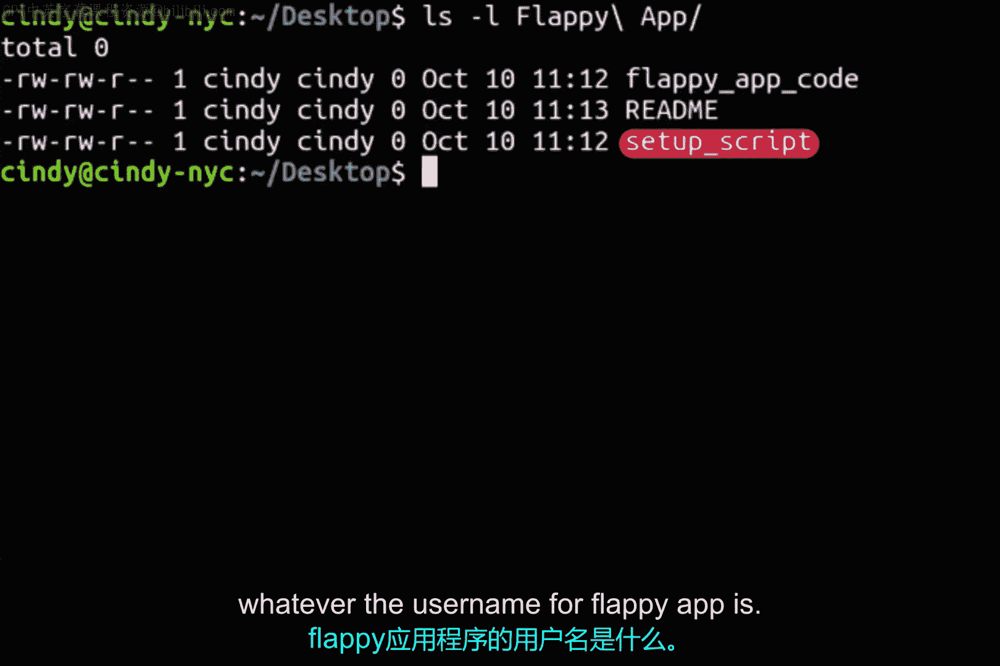

# 153：Linux软件安装详解 🐧



在本节课中，我们将学习Linux操作系统中的软件安装机制。我们将了解如何从源代码直接安装软件，并解析安装过程中的关键步骤。

## 从源代码安装软件

上一节我们介绍了Linux系统的基本概念，本节中我们来看看如何从源代码安装软件。在Linux中，直接从源代码安装软件是一种更透明的方式。这种方法会因软件而异，因为不同的编程语言编译方式不同。

我们不会深入探讨软件开发细节，但假设我们有一个包含简单软件包的归档文件需要安装。

## 安装包结构解析

以下是一个典型源代码安装包包含的文件：

*   **`setup`脚本**：这是一个脚本文件，它将在计算机上运行一系列任务以完成软件包的安装配置。
*   **`Flappy app code`**：这是软件的实际源代码。
*   **`Readme`文件**：这是源代码归档文件中一个相当标准的文件，包含了关于该归档文件的信息。它明确要求你在进行任何操作前先阅读此文件。

在这些文件中，我们最关心的是`setup`脚本，因为它告诉我们如何安装软件包。

## 安装脚本示例

一个示例安装脚本可能包含以下程序指令：

1.  **编译指令**：将`flappy app`代码编译成机器指令。
    ```bash
    gcc -o flappy_app flappy_app.c
    ```
2.  **复制二进制文件**：将编译好的`flappy app`二进制文件复制到`/bin`目录。
    ```bash
    cp flappy_app /usr/local/bin/
    ```
3.  **创建目录**：在`/home/用户名/`路径下为`flappy app`创建一个文件夹。
    ```bash
    mkdir /home/$USER/.flappy_app
    ```

## 安装过程总结

以上是对安装一个简单软件包时所发生过程的非常简化的概述。最终，软件开发者决定他们的软件需要哪些条件才能工作，并运行相应的任务使其正常运行。



这些任务是创建文件还是更新目录，完全由开发者决定。如果你了解所使用的编程语言，你可以自己阅读这些指令，但这超出了本课程的范围。

总而言之，这就是Linux中软件安装的基本工作原理。

---

本节课中我们一起学习了Linux下从源代码安装软件的基本流程，包括安装包的结构、核心的`setup`脚本的作用以及一个简化的安装步骤示例。理解这个过程有助于我们更深入地认识软件在系统中的部署方式。