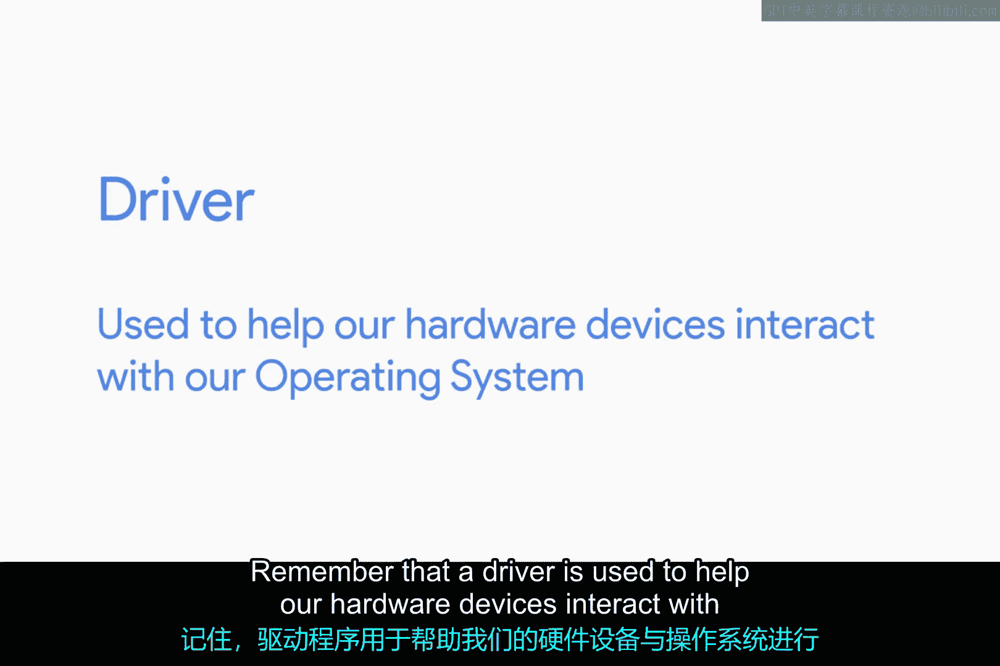
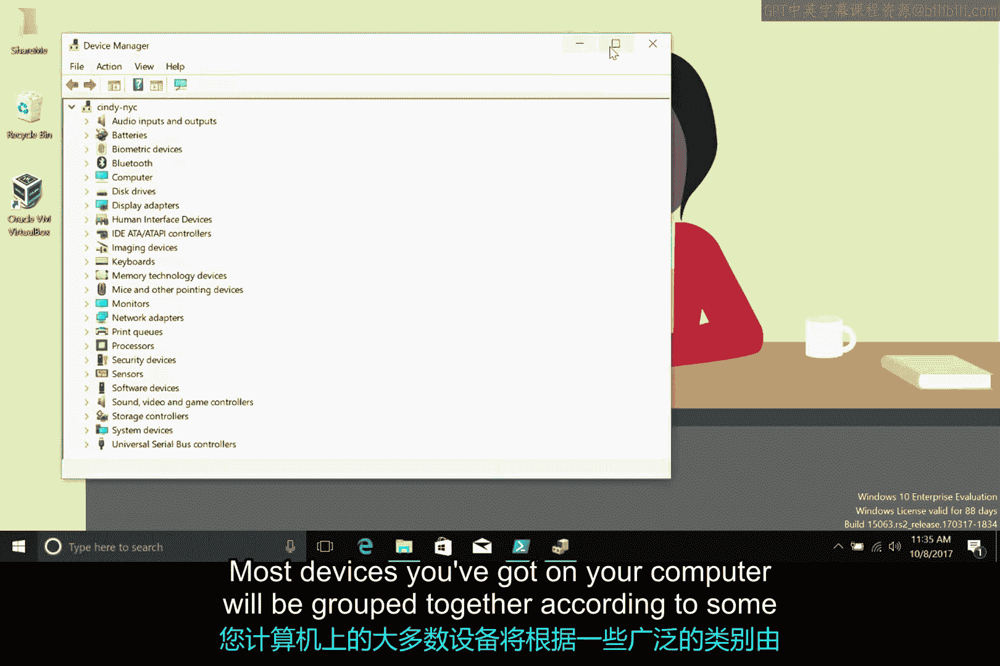
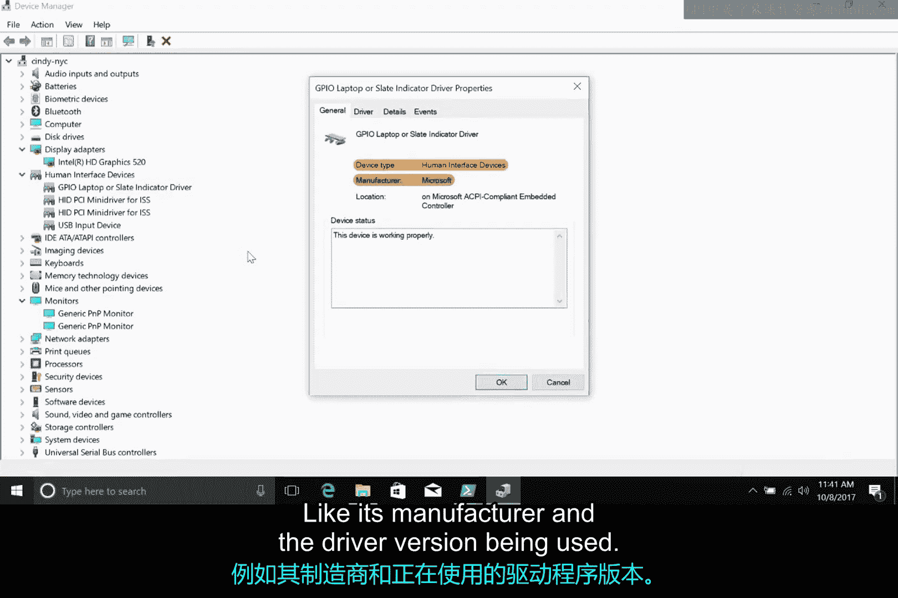

# 154：Windows设备与驱动管理 🖥️🔧

在本节课中，我们将学习Windows操作系统中的设备与驱动程序管理。我们将了解驱动程序的作用，探索如何使用设备管理器查看和管理计算机上的硬件设备，并理解Windows如何自动检测和安装新设备的驱动程序。

## 什么是驱动程序？

上一节我们提到了驱动程序的概念，现在我们来具体看看它的作用。驱动程序是一种特殊的软件，它帮助计算机的硬件设备与操作系统进行通信和交互。没有正确的驱动程序，操作系统就无法识别或使用硬件设备。

## 访问设备管理器

要管理设备和驱动程序，我们首先需要知道如何访问设备管理器。Windows将所有设备和驱动程序集中在一个名为“设备管理器”的微软管理控制台中。

以下是访问设备管理器的两种常用方法：
*   打开“运行”对话框（Win + R），输入 `devmgmt.msc` 并按回车。
*   右键点击“此电脑”，选择“管理”，然后在左侧导航菜单中点击“设备管理器”。

## 设备分类与即插即用

打开设备管理器后，你会发现Windows已经根据广泛的类别对计算机上的大多数设备进行了分组。例如，所有显示器都会显示在“监视器”部分下。

这种分组通常是自动完成的，它是Windows“即插即用”系统的一部分。当您将新设备（如鼠标或键盘）插入计算机时，Windows会自动检测新硬件，识别它，并尝试安装合适的软件来管理它。

## Windows如何安装驱动程序？

现在，我们来深入了解Windows为新设备安装驱动程序的具体过程。这个过程主要包含以下几个步骤：

1.  **获取硬件ID**：硬件制造商为其设备分配一个特殊的字符串，称为硬件ID。Windows检测到新设备后，首先会向其索取这个ID。
2.  **搜索驱动程序**：操作系统获得硬件ID后，会用它来搜索匹配的驱动程序。搜索按以下顺序进行：
    *   本地已知驱动程序列表。
    *   Windows更新或驱动程序存储。
    *   设备自带的安装光盘（如果提供）。
3.  **安装驱动程序**：Windows找到正确的驱动程序软件后，会进行安装，之后您就可以使用新设备了。

## 使用设备管理器管理驱动

虽然上述过程大多是自动进行的，但我们也可以通过之前提到的设备管理器控制台直接与驱动程序交互。

您可以展开设备管理器中的任何类别来查看其中的设备。右键点击任意设备，会弹出一个功能菜单。

以下是右键菜单中的主要操作选项：
*   **卸载设备**：从系统中移除该设备及其驱动程序。
*   **禁用设备**：暂时停用该设备。
*   **更新驱动程序**：为设备搜索并安装更新的驱动程序。
*   **扫描检测硬件改动**：手动让Windows检查新连接的设备。
*   **属性**：查看设备的详细信息，如制造商和当前使用的驱动程序版本。

## 总结

本节课中，我们一起学习了Windows设备与驱动程序管理的核心知识。我们了解了驱动程序是连接硬件和操作系统的桥梁，掌握了通过设备管理器访问和管理设备的方法，并梳理了Windows即插即用系统自动安装驱动程序的流程。通过设备管理器，我们可以手动更新、禁用或卸载驱动程序，这对于解决硬件冲突或故障排查非常有用。