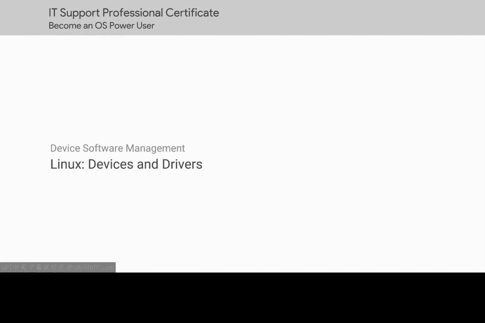
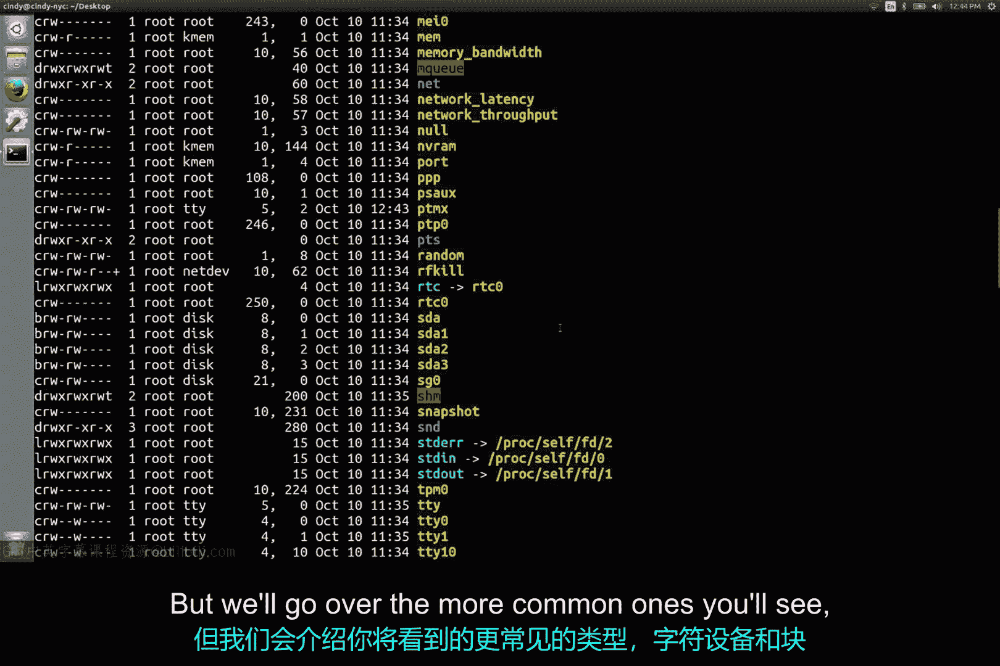
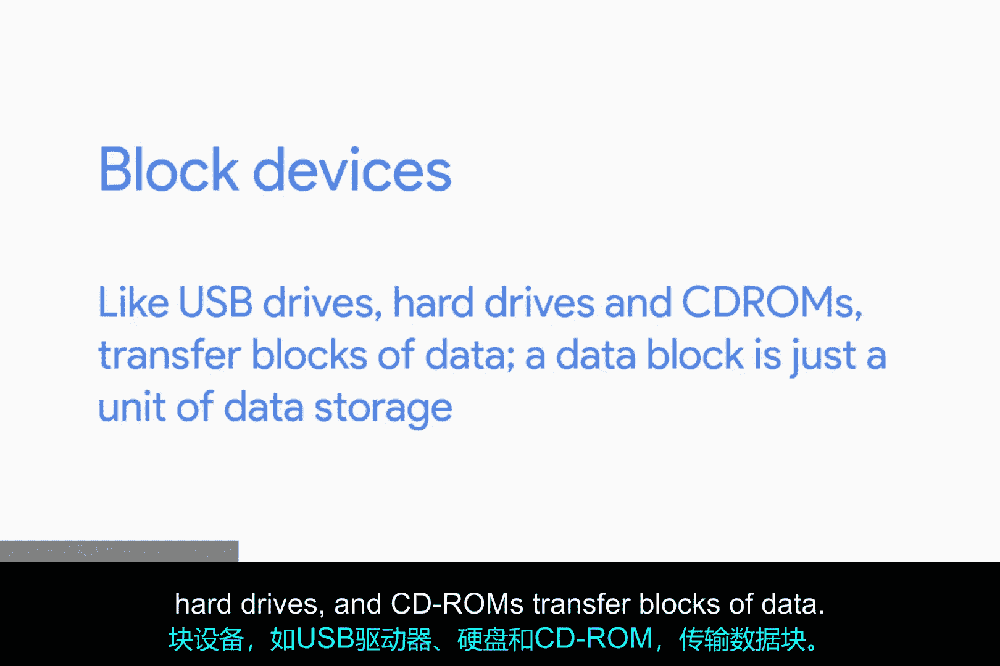
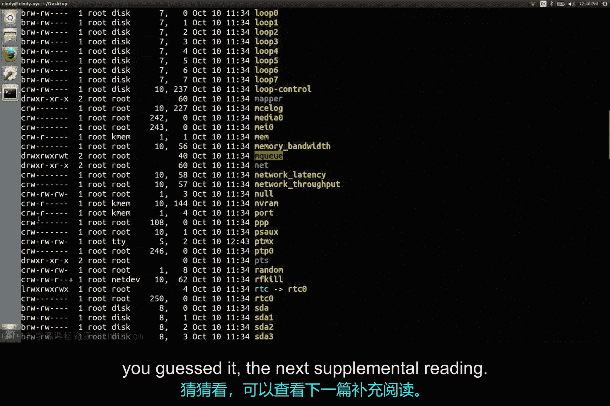

# 155：Linux设备与驱动管理



## 概述
在本节课中，我们将要学习Linux操作系统如何管理硬件设备。我们将了解设备在Linux中的表示方式，区分不同类型的设备文件，并简要介绍Linux设备驱动的工作原理。

## Linux中的设备文件
在Linux系统中，一切都被视为文件，硬件设备也不例外。当一个设备连接到计算机时，系统会在 `/dev` 目录下创建一个对应的设备文件。让我们查看这个目录。



以下是 `/dev` 目录的部分内容示例：
```
crw-rw-rw- 1 root root 1, 3 Jan 1 00:00 null
brw-rw---- 1 root disk 8, 0 Jan 1 00:00 sda
brw-rw---- 1 root disk 8, 1 Jan 1 00:00 sda1
crw-rw-rw- 1 root tty  5, 0 Jan 1 00:00 tty
```

这个目录包含许多设备文件，但并非所有文件都对应物理设备。例如，`/dev/null` 就是一个特殊的虚拟设备。Linux中有多种设备类型，我们不会全部介绍，但会讲解两种更常见的类型：字符设备和块设备。



## 字符设备与块设备
上一节我们介绍了设备文件的概念，本节中我们来看看两种主要的设备类型。

字符设备，如键盘或鼠标，以字符为单位传输数据。块设备，如U盘、硬盘和CD-ROM，则以数据块为单位传输数据。数据块是数据存储的一个单元。

以下是两种设备类型的核心区别：
*   **字符设备**：数据传输是流式的，一次一个字符。用字母 **`c`** 表示。
*   **块设备**：数据传输是块式的，一次一个数据块。用字母 **`b`** 表示。

## 识别设备文件类型
还记得在之前的课程中，`ls -l` 命令输出的第一个字符表示文件类型吗？到目前为止，我们见过 `-`（代表普通文件）和 `d`（代表目录）。但在 `/dev` 目录的输出中，我们可以看到其他文件类型。

有些文件以 `b` 开头，代表块设备；有些以 `c` 开头，代表字符设备。如果你想了解更多关于其他设备类型的知识，可以查看补充阅读材料。

让我们看看本课程中可能会接触到的一些块设备。你会看到一些以 `/dev/sda` 或 `/dev/sdb` 开头的文件。`sd` 设备是大容量存储设备，如我们的硬盘、U盘等。如果 `sd` 后面跟着字母 `a`，仅表示该设备是计算机检测到的第一个此类设备。因此，你可能会看到类似 `/dev/sda`、`/dev/sdb`、`/dev/sdc` 这样的序列。



回顾 `/dev/null` 设备，我们可以看到它被视为一个字符设备，因为它用于逐字符地传输数据。这是一个非常简单的设备文件概述，我省略了许多你现在不一定需要知道的内容。如果你想了解更多关于设备和Linux内部工作原理的知识，可以查看（你猜对了）下一份补充阅读材料。

## Linux设备驱动更新
上一节我们介绍了如何识别设备文件，本节中我们来谈谈如何为Linux更新设备驱动程序。

在Windows中，我们通常可以点击“更新驱动程序”，在大多数情况下这都有效。在Linux中，情况稍微复杂一些，但同时也相当简单。我并不是想让你困惑，你马上就会明白我的意思。

设备驱动程序并不存储在 `/dev` 目录中。有时，它们是Linux内核的一部分。请记住，我们机器的内核负责处理与硬件的交互。内核是一个非常庞大的软件，具有许多功能，包括对大量硬件的支持。

如今，许多硬件支持都已内置在内核中，因此当你插入一个设备时，它通常会自动工作。但是，如果某些设备的支持没有内置在内核中，它们很可能拥有一种叫做“内核模块”的东西。

那么，这个内核模块是做什么用的呢？对于许多开发者来说，直接修改像Linux内核这样庞大的软件是令人生畏的。相反，他们可以创建内核模块，这些模块可以在不实际修改内核代码的情况下扩展内核的功能。

因此，如果你需要为特定类型的设备安装内核模块，你可以按照我们在Linux中安装所有软件的方式来安装它。请记住，并非所有的内核模块都是驱动程序。我们不会深入探讨内核模块，但如果你想阅读更多相关内容，我也在下一份阅读材料中提供了链接。

由于我们只需要入门并动手操作操作系统，这些知识应该足够了。让我们继续前进。

## 总结
本节课中我们一起学习了Linux设备管理的基础知识。我们了解到在Linux中，硬件设备通过 `/dev` 目录下的文件来表示。我们区分了**字符设备**（如键盘）和**块设备**（如硬盘），并学会了通过 `ls -l` 命令输出首字母的 **`c`** 或 **`b`** 来识别它们。最后，我们简要了解了Linux设备驱动通常以内核模块形式存在，许多现代硬件的驱动已内置在内核中，实现了即插即用。