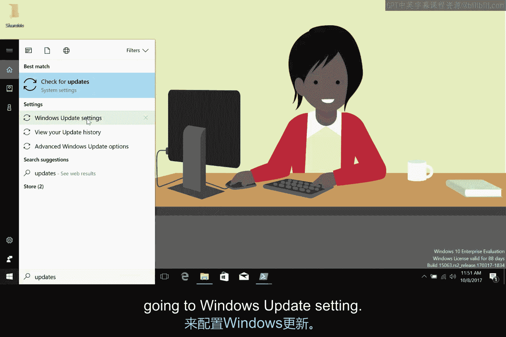
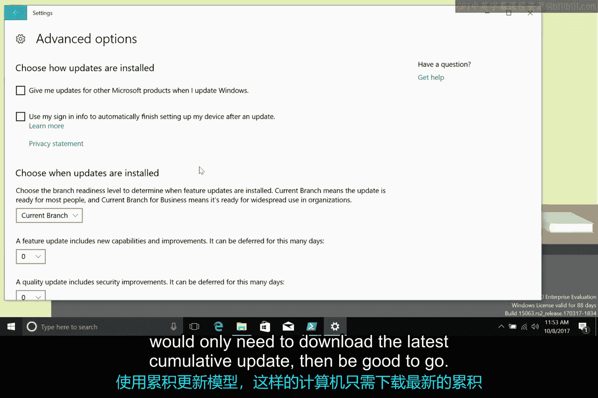

# 156：操作系统更新 🖥️

在本节课中，我们将要学习操作系统更新的重要性、工作原理以及如何在Windows系统中进行配置。操作系统是计算机上最重要的软件，保持其更新对于获取新功能和安全补丁至关重要。

## 为什么需要更新操作系统？

上一节我们介绍了应用程序和设备驱动的安装与维护，本节中我们来看看操作系统的核心更新。保持操作系统更新有多种原因。

*   你希望获得操作系统提供的最新功能。
*   你需要操作系统所必需的安全更新。

当操作系统制造商发现系统中的安全漏洞时，他们会尽力为此漏洞创建补丁。**安全补丁**是用于修复安全漏洞的软件。当你收到包含安全补丁的操作系统更新时，立即安装这些补丁至关重要。等待的时间越长，受到安全漏洞影响的风险就越高。

作为IT支持专家，定期安装操作系统更新以保持系统最新和安全是非常常见的做法。

## Windows更新如何工作？

Windows通常在需要安装更新时会很好地通知你。**Windows更新客户端服务**在计算机后台运行，负责下载和安装操作系统的更新与补丁。其工作原理是定期与微软的Windows更新服务器进行通信检查。

如果发现适用于你计算机的更新，它就会下载它们。下载完成后，根据你的Windows更新设置，Windows更新客户端会询问你是否同意安装更新，或者直接自动安装。此过程通常需要重启计算机，客户端会在请求许可后执行重启。

## 如何配置Windows更新？

在Windows 10之前的版本中，你可以通过几种不同的方式让Windows管理更新。

以下是可选的配置方式：

*   你可以让Windows更新客户端自动安装微软发布的更新和补丁。
*   你可以让Windows更新通知你，由你决定是否下载和安装它们。
*   你甚至可以完全关闭更新，但出于我们讨论过的安全原因，这可能不是一个好主意。

你可以通过在搜索框中搜索“更新”并进入“Windows更新设置”来配置Windows更新。

从那里，你可以让Windows更新客户端检查新更新、查看已安装更新的历史记录，或者通过点击设置部分来更改下载和应用补丁的方式。在那里，你可以告诉更新客户端你希望如何管理更新，甚至可以设置你希望安装更新的时间。

## Windows 10的更新有何不同？

Windows 10的做法有所不同。它不再下载一堆独立的、你可以选择是否应用到计算机的更新，而是采用**累积更新**。这意味着每个月会发布一个包含所有更新和补丁的包，它会取代上个月的更新。

这种设计背后的理念是，计算机为了保持最新状态需要下载的内容会更少。举个例子，设想一台Windows电脑关闭了一段时间。当它在长时间不活动后再次启动时，它需要下载并应用所有错过的更新。如果它关闭了很长时间，这可能意味着需要下载和应用数百个更新。而在累积更新模型下，这样的计算机只需要下载最新的累积更新，然后就可以正常使用了。

这种模式的一个缺点是，在Windows 10中，安装更新不再是可选的。你也不能挑选想要应用的更新，因为它们都被整合进了一个月度发布中。微软已宣布，Windows 7和8的更新模型也将朝着这个累积包的方向发展，所以Windows 10用户不会孤单。

## 总结

本节课中我们一起学习了操作系统更新的核心知识。我们了解了保持系统更新的重要性，特别是为了安全补丁。我们探讨了Windows更新客户端服务的工作原理，以及如何在旧版Windows中配置更新选项。最后，我们重点介绍了Windows 10采用的累积更新模型及其优缺点。记住，定期更新操作系统是维护计算机安全和性能的关键任务。